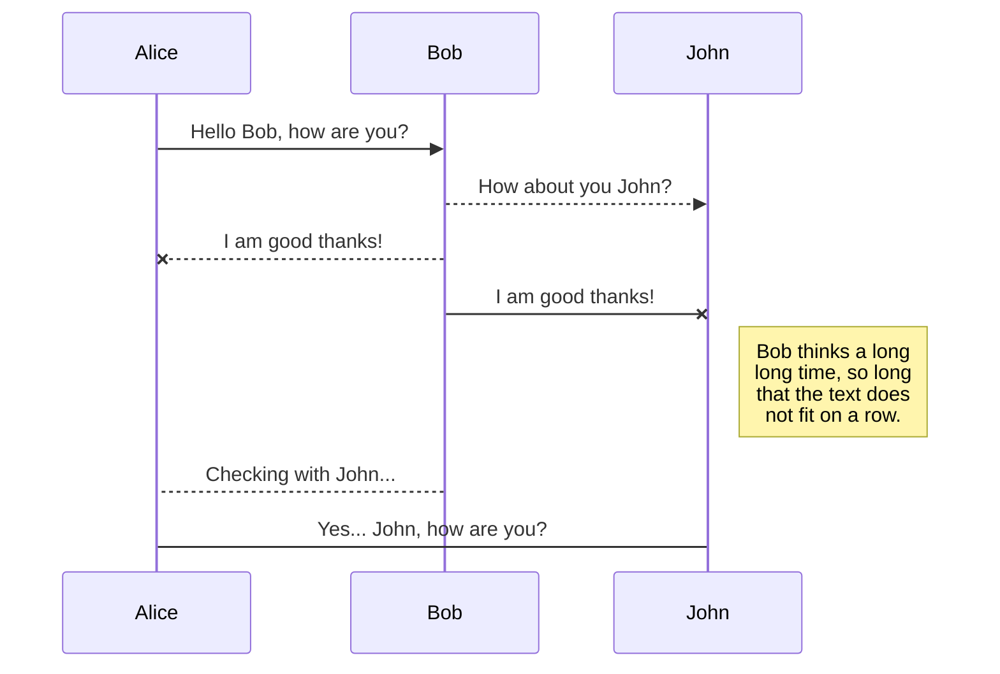

# Welcome to StackEdit!
Ultimo aggiornamento 12/8/24 - h. 17:47
Hi! I'm your first Markdown file in **StackEdit**. If you want to learn about StackEdit, you can read me. If you want to play with Markdown, you can edit me. Once you have finished with me, you can create new files by opening the **file explorer** on the left corner of the navigation bar.


# Files

StackEdit stores your files in your browser, which means all your files are automatically saved locally and are accessible **offline!**

## Create files and folders

The file explorer is accessible using the button in left corner of the navigation bar. You can create a new file by clicking the **New file** button in the file explorer. You can also create folders by clicking the **New folder** button.

## Switch to another file

All your files and folders are presented as a tree in the file explorer. You can switch from one to another by clicking a file in the tree.

## Rename a file

You can rename the current file by clicking the file name in the navigation bar or by clicking the **Rename** button in the file explorer.

## Delete a file

You can delete the current file by clicking the **Remove** button in the file explorer. The file will be moved into the **Trash** folder and automatically deleted after 7 days of inactivity.

## Export a file

You can export the current file by clicking **Export to disk** in the menu. You can choose to export the file as plain Markdown, as HTML using a Handlebars template or as a PDF.


# Synchronization

Synchronization is one of the biggest features of StackEdit. It enables you to synchronize any file in your workspace with other files stored in your **Google Drive**, your **Dropbox** and your **GitHub** accounts. This allows you to keep writing on other devices, collaborate with people you share the file with, integrate easily into your workflow... The synchronization mechanism takes place every minute in the background, downloading, merging, and uploading file modifications.

There are two types of synchronization and they can complement each other:

- The workspace synchronization will sync all your files, folders and settings automatically. This will allow you to fetch your workspace on any other device.
	> To start syncing your workspace, just sign in with Google in the menu.

- The file synchronization will keep one file of the workspace synced with one or multiple files in **Google Drive**, **Dropbox** or **GitHub**.
	> Before starting to sync files, you must link an account in the **Synchronize** sub-menu.

## Open a file

You can open a file from **Google Drive**, **Dropbox** or **GitHub** by opening the **Synchronize** sub-menu and clicking **Open from**. Once opened in the workspace, any modification in the file will be automatically synced.

## Save a file

You can save any file of the workspace to **Google Drive**, **Dropbox** or **GitHub** by opening the **Synchronize** sub-menu and clicking **Save on**. Even if a file in the workspace is already synced, you can save it to another location. StackEdit can sync one file with multiple locations and accounts.

## Synchronize a file

Once your file is linked to a synchronized location, StackEdit will periodically synchronize it by downloading/uploading any modification. A merge will be performed if necessary and conflicts will be resolved.

If you just have modified your file and you want to force syncing, click the **Synchronize now** button in the navigation bar.

> **Note:** The **Synchronize now** button is disabled if you have no file to synchronize.

## Manage file synchronization

Since one file can be synced with multiple locations, you can list and manage synchronized locations by clicking **File synchronization** in the **Synchronize** sub-menu. This allows you to list and remove synchronized locations that are linked to your file.


# Publication

Publishing in StackEdit makes it simple for you to publish online your files. Once you're happy with a file, you can publish it to different hosting platforms like **Blogger**, **Dropbox**, **Gist**, **GitHub**, **Google Drive**, **WordPress** and **Zendesk**. With [Handlebars templates](http://handlebarsjs.com/), you have full control over what you export.

> Before starting to publish, you must link an account in the **Publish** sub-menu.

## Publish a File

You can publish your file by opening the **Publish** sub-menu and by clicking **Publish to**. For some locations, you can choose between the following formats:

- Markdown: publish the Markdown text on a website that can interpret it (**GitHub** for instance),
- HTML: publish the file converted to HTML via a Handlebars template (on a blog for example).

## Update a publication

After publishing, StackEdit keeps your file linked to that publication which makes it easy for you to re-publish it. Once you have modified your file and you want to update your publication, click on the **Publish now** button in the navigation bar.

> **Note:** The **Publish now** button is disabled if your file has not been published yet.

## Manage file publication

Since one file can be published to multiple locations, you can list and manage publish locations by clicking **File publication** in the **Publish** sub-menu. This allows you to list and remove publication locations that are linked to your file.


# Markdown extensions

StackEdit extends the standard Markdown syntax by adding extra **Markdown extensions**, providing you with some nice features.

> **ProTip:** You can disable any **Markdown extension** in the **File properties** dialog.


## SmartyPants

SmartyPants converts ASCII punctuation characters into "smart" typographic punctuation HTML entities. For example:

|                |ASCII                          |HTML                         |
|----------------|-------------------------------|-----------------------------|
|Single backticks|`'Isn't this fun?'`            |'Isn't this fun?'            |
|Quotes          |`"Isn't this fun?"`            |"Isn't this fun?"            |
|Dashes          |`-- is en-dash, --- is em-dash`|-- is en-dash, --- is em-dash|


## KaTeX

You can render LaTeX mathematical expressions using [KaTeX](https://khan.github.io/KaTeX/):

The *Gamma function* satisfying $\Gamma(n) = (n-1)!\quad\forall n\in\mathbb N$ is via the Euler integral

$$
\Gamma(z) = \int_0^\infty t^{z-1}e^{-t}dt\,.
$$

> You can find more information about **LaTeX** mathematical expressions [here](http://meta.math.stackexchange.com/questions/5020/mathjax-basic-tutorial-and-quick-reference).


## UML diagrams

You can render UML diagrams using [Mermaid](https://mermaidjs.github.io/). For example, this will produce a sequence diagram:



And this will produce a flow chart:

```mermaid
graph LR
A[Square Rect] -- Link text --> B((Circle))
A --> C(Round Rect)
B --> D{Rhombus}
C --> D
```[toc]


# MARKUP HINTS
By Mauro alle h. 06 12 maggio 24
I have my README.md inside my project. Here are a method to work with your README.md separately while working on your vsc local project: Use an external Markdown editor like 

[Typora]: (https://typora.io/#feature)

** (a minimal markdown editor and reader) **. These editors provide a live preview feature by default. 

# BASH

- trovare la oporta occupata:
  - `lsof -i :8000`
  
- chiudere la porta occupata forzatamente:
  - `kill -9 32394(esempio)`
  
- vedere i comandi che iniziano per una determinata strina effettuati in precedenza:
  -  `history | grep "kill (esempio)"`

- trovare la porta occupata:
  - `lsof -i :8000`
  
- chiudere la porta occupata forzatamente:
  - `kill -9 32394(esempio)`
  
- vedere i comandi che iniziano per una determinata strina effettuati in precedenza:
  -  `history | grep "kill (esempio)"`
  
- Azione Bash - Quello che segue è uno script molto importante che permette nell'ordine di 1) verificare se la porta 8000 (che viene utilizzata normalmente in fase di sviluppo) è occupata ed eventualmente chiuderla; 2) aprire Django 3) aprire hugo. Al momento sono presenti due file separati per una migliore comprensione:
```bash
- check_ports.sh

  \#!/bin/bash

  \# Check if any process is listening on port 8000

  if lsof -i :8000 >/dev/null 2>&1; then

  ​    echo "Port 8000 is in use."

  ​    \# Get the PID of the process using port 8000

  ​    pid=$(lsof -ti :8000)

  ​    \# Kill the process

  ​    echo "Killing process with PID $pid"

  ​    kill -9 "$pid"

  ​    echo "Process killed."

  else

  ​    echo "Port 8000 is not in use."

  fi
```


- ```bash
  run_project.sh
  #!/bin/bash
  
  # Navigate to the Django project directory and run the server
  # cd /progetto_api
  python3 manage.py runserver &
  
  # Navigate to the Hugo project directory and run the server
  cd ./sgb_start/
  hugo server -D
  

Per cui lo script generare **APRIRE I DUE PROGRAMMI**  DJANGO E HUGO è il seguente (ADA PERFEZIONARE!!):

```bash
#!/bin/bash

# Check if any process is listening on port 8000
if lsof -i :8000 >/dev/null 2>&1; then
    echo "Port 8000 is in use."

    # Get the PID of the process using port 8000
    pid=$(lsof -ti :8000)

    # Kill the process
    echo "Killing process with PID $pid"
    kill -9 "$pid"

    echo "Process killed."
else
    echo "Port 8000 is not in use."
fi


# Navigate to the Django project directory and run the server
# cd /progetto_api
python3 manage.py runserver &

# Navigate to the Hugo project directory and run the server
cd ./sgb_start/
hugo server -D
```

Mentre il codice per chiudere i due programmi DJANGO e HUGO è il seguente (da perfezionare)!!!:

```bash
# Find Django PID and send SIGTERM signal
django_pid=$(pidof python) && kill "$django_pid" && echo "Django process terminated"

# Find Hugo PID and send SIGTERM signal
hugo_pid=$(pidof hugo) && kill "$hugo_pid" && echo "Hugo process terminated"
ps aux | grep "python manage.py runserver"; reset


```


# GIT & GITHUB

Riferimenti [Mastering MarkDown](https://docs.github.com/en/get-started/writing-on-github/getting-started-with-writing-and-formatting-on-github/basic-writing-and-formatting-syntax)
### Ricordarsi di aggiungere .gitgnore
**- git add .gitignore**
**- git commit -m "Add .gitignore to exclude compiled Python files"**
### Per effettuare il push da origine a remoto 
**- git push origin implementazione-pagina**
### Switch to the New Branch:
**- git checkout new-branch-name**

### Creare una nuova branch e posizionarsi sulla stessa
- git checkout -b new-branch-name *(Il comando può essere visto come la sintesi dei due seguenti comandi:)*

**- git branch new-branch-name  # Create a new branch**
**- git checkout new-branch-name  # Switch to the new branch**

## You've created a new branch (template-tutorial) without committing changes on your existing branch (implementazione-pagina) ##

To address this, you'll need to follow these steps to commit your changes on the implementazione-pagina branch and then switch back to the template-tutorial branch. Here's a step-by-step guide:

- Commit Changes on implementazione-pagina:
Assuming you are currently on the template-tutorial branch, ** switch back to the implementazione-pagina branch:**

`git checkout implementazione-pagina`

Now, add and commit your changes:

`git add .`
`git commit -m "Your commit message here"`

- **Push Changes to Remote (implementazione-pagina):**
Assuming the remote branch is named implementazione-pagina:

`git push origin implementazione-pagina`

- ** Switch Back to template-tutorial:**
Now, switch back to the template-tutorial branch:

`git checkout template-tutorial`


**If you haven't pushed the template-tutorial branch yet, you can push it to the remote repository when you're ready:**

`git push origin template-tutorial`

**How can see from my vsc local if a git branch is present also in the remote github?**

`git fetch --all
git branch -a
`
This fetches all branches from the remote repository and lists both local and remote branches. Remote branches are prefixed with "remotes/origin/". Check if your branch is listed among the remotes.

**Come posso creare una nuova branch in local, e poi crearla anche in Github, poi effettuare il push e rendere questa branch principale?**

Create a new branch locally and switch to it (chimiamo la nuova branch template-tutorial):
`git checkout -b template-tutorial`

Push the new branch to GitHub:

`git push origin template-tutorial`

Set the upstream for the new branch:

`git branch --set-upstream-to=origin/template-tutorial template-tutorial`

Now, further pushes can be simplified to:

`git push`

To revert the changes and go back to the original commit before the changes, you can use the following commands:
`git reset --hard HEAD
git clean -fd`


The first command (git reset --hard HEAD) resets your branch to the latest commit, discarding changes. The second command (git clean -fd) removes untracked files and directories. Use them with caution, as they are not reversible.

-fd stands for what?
In the context of the git clean command:

-f stands for force.
-d stands for directory.
Together, -fd means force removal of untracked directories. This option is used to remove untracked files and directories forcefully.

## delete a local branch and also delete it on the remote repository on GitHub 

Delete the local branch:

`git branch -d branch_name`

Replace branch_name with the name of the branch you want to delete.

If the branch contains unmerged changes, you might need to force delete it:

`git branch -D branch_name`

Delete the remote branch:

`git push origin --delete branch_name`

This will delete the branch on the remote repository (GitHub).

Update your local repository to reflect the changes on the remote:

`git fetch --prune`

The --prune flag removes any remote tracking branches that no longer exist on the remote.

## I want to synch another an oldest branch named "template-tutorial" with a newest branch named template-sheetlike and after delete this last one (template-sheetlike)

Switch to the template-tutorial branch:
`git switch template-tutorial`

Rebase template-sheetlike onto template-tutorial:
`git rebase template-sheetlike`

Push the changes to the remote repository:
`git push origin template-tutorial --force`
Note: Force-pushing after a rebase rewrites the commit history. Use it with caution, especially if the branch has already been shared with others

Delete the template-sheetlike branch:
`git branch -d template-sheetlike`
`git push origin --delete template-sheetlike`


## Automate the copy of a file from a repo to another when pushing the commit 

So let's say that i have cheatsheet.md that i update regularly as it would be a wiki page. This file with the same name is present on different local repo. Let's say that i am working into my local repo named /home/mauro/Scrivania/dJANGO_apI/progetto_api/cheatsheet.md.md. When I do a commit adn after a push into github repo https://github.com/progettazionemauro/django-api I want automatically copy this file and update the commit also into my https://github.com/progettazionemauro/wiki-wag How can do that automatically?


To automatically copy and update the `cheatsheet.md` file in another GitHub repository whenever you push changes to the first repository, you can use GitHub Actions. GitHub Actions allows you to define workflows that run in response to various events, such as pushing to a repository. Here's a simple example:

## Theory

1. ### **Create a GitHub Actions Workflow:**

   In your Django API repository (`https://github.com/progettazionemauro/django-api`), create a directory named `.github/workflows` if it doesn't already exist.

   Inside this directory, create a file named, for example, `sync_cheatsheet.yml` with the following content:

   ```
   name: Sync Cheatsheet
   
   on:
     push:
       branches:
         - main
   
   jobs:
     sync:
       runs-on: ubuntu-latest
   
       steps:
       - name: Checkout repository
         uses: actions/checkout@v2
   
       - name: Copy cheatsheet to other repository
         run: |
           cp cheatsheet.md /path/to/wiki-wag-repo
           cd /path/to/wiki-wag-repo
           git config user.email "your-email@example.com"
           git config user.name "Your Name"
           git add cheatsheet.md
           git commit -m "Sync cheatsheet from django-api repository"
           git push origin main
   ```

   Replace `/path/to/wiki-wag-repo` with the actual path to your local `wiki-wag` repository.

2. **Commit and Push Workflow:**

   Commit the changes and push them to your Django API repository:

   ```bash
   git add .github/workflows/sync_cheatsheet.yml
   git commit -m "Add sync cheatsheet workflow"
   git push origin main
   ```

3. **Run the Workflow:**

   The workflow will run automatically when you push changes to the `main` branch. It will copy the `cheatsheet.md` file to the specified path in the `wiki-wag` repository and commit the changes there.

Make sure to replace the placeholder values in the workflow file (`your-email@example.com`, `Your Name`, and `/path/to/wiki-wag-repo`) with your actual email, name, and the path to the `wiki-wag` repository.


Here are step-by-step instructions to set up the GitHub Actions workflow for syncing the `cheatsheet.md` file from the Django API repository to the `wiki-wag` repository:

#### Step 1: Create the Workflow File

1. Open your Django API repository in your code editor or on GitHub.

2. Inside the `.github/workflows` directory (create it if it doesn't exist), create a new file named, for example, `sync_cheatsheet.yml`.

3. Copy and paste the following content into `sync_cheatsheet.yml`:

   ```
   yamlCopy codename: Sync Cheatsheet
   
   on:
     push:
       branches:
         - main
   
   jobs:
     sync:
       runs-on: ubuntu-latest
   
       steps:
       - name: Checkout repository
         uses: actions/checkout@v2
   
       - name: Copy cheatsheet to other repository
         run: |
           cp cheatsheet.md /path/to/wiki-wag-repo
           cd /path/to/wiki-wag-repo
           git config user.email "your-email@example.com"
           git config user.name "Your Name"
           git add cheatsheet.md
           git commit -m "Sync cheatsheet from django-api repository"
           git push origin main
   ```

   Replace `/path/to/wiki-wag-repo`, `"your-email@example.com"`, and `"Your Name"` with the actual path to your local `wiki-wag` repository, your email, and your GitHub username.

#### Step 2: Commit and Push Workflow File

1. In your terminal, navigate to the Django API repository.

2. Run the following commands to stage, commit, and push the workflow file:

   ```
   bashCopy codegit add .github/workflows/sync_cheatsheet.yml
   git commit -m "Add sync cheatsheet workflow"
   git push origin main
   ```

#### Step 3: Run the Workflow

1. Visit the Actions tab on your GitHub repository to see the status of your workflow. You should see the "Sync Cheatsheet" workflow running or completed.

#### Step 4: Verify Changes in the `wiki-wag` Repository

1. After the workflow completes, check your `wiki-wag` repository for the synced changes to the `cheatsheet.md` file.

   If there are any issues or changes are not reflected as expected, review the GitHub Actions logs for the workflow to identify potential errors.

That's it! You've set up a GitHub Actions workflow to automatically sync the `cheatsheet.md` file from the Django API repository to the `wiki-wag` repository on each push to the `main` branch.


##### Break down the content of the GitHub Actions workflow file step by step:

```yaml
name: Sync Cheatsheet
```

- This line sets the name of the GitHub Actions workflow to "Sync Cheatsheet."

```yaml
  push:
    branches:
      - main
```

- This section specifies the trigger for the workflow. The workflow will be triggered on each push to the `main` branch.

```yaml
  sync:
    runs-on: ubuntu-latest
```

- Here, we define a job named "sync" that will run on the latest version of the Ubuntu operating system.

```yaml
steps:
    - name: Checkout repository
      uses: actions/checkout@v2
```

- This step checks out the code from the repository, allowing subsequent steps to operate on the repository's contents.
- `uses: actions/checkout@v2`: This part specifies the action that will be used for this step. In GitHub Actions, an action is a reusable unit of code. The `actions/checkout` action is provided by GitHub and is commonly used to check out the source code of the repository.
  - `@v2`: This refers to the version of the `actions/checkout` action to use. In this case, it's version 2 of the action. The `@v2` is a version tag that indicates a specific release or version of the action. Using a version tag ensures that the workflow is using a stable and known version of the action, making it less prone to unexpected changes.

```yaml
- name: Copy cheatsheet to other repository
      run: |
        cp cheatsheet.md /path/to/wiki-wag-repo
        cd /path/to/wiki-wag-repo
```

- In this step, the `cheatsheet.md` file is copied from the current repository to the specified path (`/path/to/wiki-wag-repo`). The subsequent commands are executed within the `wiki-wag` repository.

```yaml
git config user.email "your-email@example.com"
        git config user.name "Your Name"
```

- These commands set the global Git configuration for the user's email and name in the `wiki-wag` repository.

```bash
        git add cheatsheet.md
```

- This command stages the changes to the `cheatsheet.md` file for the next commit.

```bash
        git commit -m "Sync cheatsheet from django-api repository"
```

- This command creates a new commit with a commit message indicating that the `cheatsheet.md` file is being synced from the `django-api` repository.

```bash
        git push origin main
```

- Finally, this command pushes the changes to the remote repository (`origin`) on the `main` branch.

  ## Real Case: If I have another branch othe then main in repo2 I can do it:

  ```yaml
  name: Sync Cheatsheet 
  on:  
  	push:    
  		branches:      
  			- main 
  jobs:  
  	sync:    
  		runs-on: ubuntu-latest     
  		steps:    
  		- name: Checkout repository      
  		uses: actions/checkout@v2      
  		with:        
  		ref: opzione-pagina  # Specify the branch you want to sync
  ```

  

### Summary

The GitHub Actions workflow automates the process of syncing the `cheatsheet.md` file from the `django-api` repository to the `wiki-wag` repository. It does so by copying the file, committing the changes, and pushing the commit to the `main` branch of the `wiki-wag` repository whenever changes are pushed to the `main` branch of the `django-api` repository.

### Some useful notes 

Merge:
Creates Merge Commits: When you merge one branch into another, Git creates a new merge commit that has two parent commits: **one from the branch you're merging and another from the branch you're merging into.
This results in a non-linear history with multiple branches merging into each other**
Preserves Original History:

The original commits from both branches remain unchanged. This approach keeps a clear record of when changes were made on each branch.

Rebase:
Linearizes History:

Rebase is used to linearize the commit history. It moves or combines a sequence of commits to a new base commit.
When you rebase one branch onto another, it effectively transplants the entire branch onto the tip of the other branch, creating a linear history.
No Merge Commits:

Unlike merge, rebase doesn't create additional merge commits.
It can result in a cleaner, more linear history.
When to Choose Each Approach:
Merge:

Use merge when you want to preserve the original commit history, especially when collaborating with others.
Good for feature branches and when you want to maintain a clear record of branch integration points.
Rebase:

Use rebase when you want a clean, linear history and don't mind rewriting commits.
Useful for feature branches before merging into a shared branch to avoid unnecessary merge commits.
Switch vs. Checkout:
git switch is a more modern and user-friendly command introduced in recent versions of Git. It is designed specifically for branch switching. If you're using a version of Git that supports git switch, you can replace git checkout with git switch:

Switching Branch:
git switch template-tutorial
Both commands essentially do the same thing in this context, but git switch provides a clearer and more explicit syntax for branch-related operations. If your Git version supports it, feel free to use git switch instead of git checkout.

## GIT CHEATSHEET

git command to see the last 3 commit with oneline : 

```bash
git log --oneline -n 3
```
## HOOKS
### Hook per sincronizzare un file di testo da stckbit con l'intera directory proveniente dal local. Questo script è molto potente in quanto selettivamente recupera dal remote il file di interesse lo sovrascrive forzatamente nella locale e poi qualsiasi cambio in local sul file non viene considerato

   ```bash
## Mauro 1/5/24 - h. 13:11

#!/bin/bash

  

# Fetch latest changes from the remote repository

git fetch origin

  

# Pull the latest version of cheatsheet.md from the remote and overwrite local changes

git pull origin main --force

  

# Remove any local changes to cheatsheet.md

git checkout -- cheatsheet.md

  

# Continue with the rest of the script

# Add all changes to the staging area

git add .

  

# Commit all staged changes

git commit -m "Auto-commit before pushing changes"

  

# Push the commit to the remote repository

git push origin main
```

# WAGTAIL
### [How to use StreamField for mixed content](https://docs.wagtail.org/en/v5.2.1/topics/streamfield.html)

---
### [StreamField block reference](https://docs.wagtail.org/en/v5.2.1/reference/streamfield/blocks.html#streamfield-block-reference) ### 

### [Templating - Jinja](https://docs.wagtail.org/en/v5.2.2/reference/jinja2.html)

#### [Wrinting Templates](https://docs.wagtail.org/en/v5.2.2/topics/writing_templates.html#writing-templates)

La regola da seguire è questa:

 

<span style="background-color: #FFFFCC; color: #000000; padding: 5px;">`code: class wagtail.fields.StreamField(blocks, use_json_field=None, blank=False, min_num=None, max_num=None, block_counts=None, collapsed=False)`</span>

E questa la spiegazione:

**class wagtail.fields.StreamField**: This line defines a class named StreamField in the wagtail.fields module.

**(blocks, use_json_field=None, blank=False, min_num=None, max_num=None, block_counts=None, collapsed=False)**: These are the parameters that the StreamField class constructor (__init__ method) accepts. Let's go through each one:

**blocks**: This is a required parameter. It represents the blocks that can be used in the stream. It seems like it should be provided when creating an instance of StreamField.

**use_json_field**=None: This is an optional parameter with a default value of None. It allows you to specify whether to use a JSON field for storage. If not provided, it defaults to None.

**blank**=False: This is an optional parameter with a default value of False. It indicates whether the field is allowed to be blank when used in a form. If not provided, it defaults to False.

**min_num**=None: This is an optional parameter with a default value of None. It specifies the minimum number of blocks required. If not provided, it defaults to None.

**max_num**=None: This is an optional parameter with a default value of None. It specifies the maximum number of blocks allowed. If not provided, it defaults to None.

**block_counts**=None: This is an optional parameter with a default value of None. It seems related to counting blocks. If not provided, it defaults to None.

**collapsed**=False: This is an optional parameter with a default value of False. It indicates whether the blocks should be collapsed in the Wagtail admin interface. If not provided, it defaults to False

Così ad esempio per questo codice. Possiamo effettuare il breakdown di questo codice in base alla regola definita:

`class BlogPage(Page):
    author = models.CharField(max_length=255, default='Default Author')
    date = models.DateField("Post date")
    
    body = StreamField(
        [
            ('heading', blocks.CharBlock(form_classname="title")),
            ('paragraph', blocks.RichTextBlock()),
            ('image', ImageChooserBlock()),
            ('code', CodeBlock()),
            ('raw_html', RawHTMLBlock()),
        ],
        use_json_field=True
    )
    
    content_panels = Page.content_panels + [
        FieldPanel('author'),
        FieldPanel('date'),
        FieldPanel('body'),
    ]
`

**author** = models.CharField(max_length=255, default='Default Author'): This line defines a character field named author in the BlogPage class. It has a maximum length of 255 characters and a default value of 'Default Author'.

**date** = models.DateField("Post date"): This line defines a date field named date in the BlogPage class with a human-readable name "Post date".

**body** = StreamField([...], use_json_field=True): This line defines a stream field named body in the BlogPage class. It allows the inclusion of different block types, such as CharBlock, RichTextBlock, ImageChooserBlock, CodeBlock, and RawHTMLBlock. **The use_json_field parameter is set to True, indicating that a JSON field will be used for storage.**

**content_panels** = Page.content_panels + [...]: This line defines the content panels for the Wagtail admin interface. It includes panels for 'author', 'date', and 'body'.

Poi in particolare:
## content_panels definition in the BlogPage class:

`content_panels = Page.content_panels + [
    FieldPanel('author'),
    FieldPanel('date'),
    FieldPanel('body'),
]`

**Page.content_panels**: This part includes the content panels defined in the parent Page class. It allows the inclusion of standard page fields, such as title, slug, publish date, etc.

**FieldPanel('author')**: This adds a panel for the author field to the content panels. It's likely a simple text input for the author's name.

**FieldPanel('date')**: This adds a panel for the date field, probably a date picker for selecting the post date.

**FieldPanel('body')**: This adds a panel for the body field. Since it's a StreamField, it might include a dynamic set of blocks like headings, paragraphs, images, code blocks, and raw HTML.

## Uso dello StructBox in Wagtail

Example Model with StructBlock
Consider a simple model for a page with a StreamField containing a StructBlock named 'person':

<span style="background-color: #FFFFCC; color: #000000; padding: 5px;">` # models.py
from django.db import models
from wagtail.core.fields import StreamField
from wagtail.core import blocks
from wagtail.images.blocks import ImageChooserBlock
from wagtail.core.models import Page
from wagtail.admin.edit_handlers import FieldPanel, StreamFieldPanel

class BlogPage(Page):
    body = StreamField([
        ('person', blocks.StructBlock([
            ('first_name', blocks.CharBlock()),
            ('surname', blocks.CharBlock()),
            ('photo', ImageChooserBlock(required=False)),
            ('biography', blocks.RichTextBlock()),
        ])),
        ('heading', blocks.CharBlock(form_classname="title")),
        ('paragraph', blocks.RichTextBlock()),
        ('image', ImageChooserBlock()),
    ], use_json_field=True)

    content_panels = Page.content_panels + [
        StreamFieldPanel('body'),
    ] `</span>
Diagram Explanation
Blog Page with StreamField and StructBlock:

A BlogPage contains a StreamField named 'body'.
'body' includes various block types, one of which is a StructBlock named 'person'.
Person StructBlock:

The 'person' block is a StructBlock containing fields like 'first_name', 'surname', 'photo', and 'biography'.
Block Instances:

When editing a BlogPage, you can add multiple instances of different block types, including 'person'. Each 'person' block instance can have its own 'first_name', 'surname', 'photo', and 'biography' 

***Template Implementation***

To render this in a template, you can use the following:
```
`<!-- templates/blog_page.html -->



    <article>
        
            
                <div class="person">
                    
                        
                    
                    <h2>{{ block.value.first_name }} {{ block.value.surname }}</h2>
                    {{ block.value.biography }}
                </div>
            
                {# Rendering for other block types #}
                <section class="{{ block.block_type }}">
                    
                </section>
            
        
    </article>
 
```

---

***Database Initialization***

When you run makemigrations and migrate after adding the StructBlock to your model, the necessary database tables and fields are created. The use_json_field=True parameter in the StreamField indicates that the data for the StreamField will be stored as JSON in the database.

Here's how you perform the migration:

bash
Copy code
python manage.py makemigrations
python manage.py migrate
After migration, you can create or edit a BlogPage instance through the Wagtail admin interface. The StructBlock fields will be part of the form for each 'person' block within the 'body' StreamField.

### Riferimenti Rapidi Wagtail
 - [Caso Studio web page](https://www.outreachy.org/docs/internship/)
 - [How to use Streamfield for mixed content](https://docs.wagtail.org/en/v5.2.1/topics/streamfield.html)
 - [StreamFieldBlock Reference](https://docs.wagtail.org/en/v5.2.1/reference/streamfield/blocks.html#streamfield-block-reference)
- 


## Caratteristiche avanzate di Diango - Wagtail
Uno dei porblemi che si incontrano effettuando delle tabelle all'interno di wagtail ma in generale anche in Django è il caso pratico della renderizzazione degli headers di una tabella se si vogliono recuperare ad esempio i dati all'interno delle celle della tabella.

Questo codice di esempio effettua il debug su ciò che è successo:

`<thead>
    <tr>
        
            <th>
                {{ column.header|default:"Column Header" }}
                
                <!-- Debugging statements -->
                <p>block.value.rows: {{ block.value.rows|list }}</p>
                <p>block.value.rows.1: {{ block.value.rows|list.1|default:"" }}</p>
                
                
                    {{ row_values.0|default:"" }}
                
            </th>
        
    </tr>
</thead>
`
Un estratto di codice generato è questo 
`   <div class="table-wrapper">
                    <input type="text" id="search_1" placeholder="Search Table">
                    <table id="datatable_1" class="display nowrap datatable">
                        <thead>
                            <tr>
                                
                                    <th>
                                        Column Header
                                        
                                        <!-- Debugging statements -->
                                        <p>block.value.rows: &lt;generator object TypedTable.rows at 0x7f08958de2e0&gt;</p>
                                        <p>block.value.rows.1: </p> `

Approfondendo la ricerca si artriva a tale indicazione
:::caution
The issue seems to be related to the fact that block.value.rows is a generator object. In Python, generators are lazy and can be consumed only once. If you try to iterate through the generator more than once, you will get an empty result on subsequent iterations.

In your case, it seems like the generator has been consumed once, which is why when you try to access block.value.rows.1, it doesn't contain any values.

To address this issue, you might want to convert the generator to a list so that you can iterate through it multiple times. However, since you are using the TypedTableBlock from wagtail.contrib.typed_table_block, you might need to adjust how you access the rows.

Here is a modification that converts the generator to a list before using it:

django
Copy code
<thead>
    <tr>
        
            <th>
                {{ column.header|default:"Column Header" }}
                
                <!-- Debugging statements -->
                <p>block.value.rows: {{ block.value.rows|list }}</p>
                <p>block.value.rows.1: {{ block.value.rows|list.1|default:"" }}</p>
                
                
                    {{ row_values.0|default:"" }}
                
            </th>
        
    </tr>
</thead>
This uses the |list filter to convert the generator to a list before accessing the second row. Please note that this might not be the most efficient solution, especially if your table has a large number of rows. If efficiency is a concern, you may want to explore other ways to handle this situation.
:::

## WAGTAIL Upgrade process
We recommend upgrading one feature release at a time, even if your project is several versions behind the current one. This has a number of advantages over skipping directly to the newest release:

If anything breaks as a result of the upgrade, you will know which version caused it, and will be able to troubleshoot accordingly;

Deprecation warnings shown in the console output will notify you of any code changes you need to make before upgrading to the following version;

Some releases make database schema changes that need to be reflected on your project by running ./manage.py makemigrations - this is liable to fail if too many schema changes happen in one go.

Before upgrading to a new feature release:

Check your project’s console output for any deprecation warnings, and fix them where necessary;

Check the new version’s release notes, and the Compatible Django / Python versions table below, for any dependencies that need upgrading first;

Make a backup of your database.

To upgrade:

Update the wagtail line in your project’s requirements.txt file to specify the latest patch release of the version you wish to install. For example, to upgrade to version 1.8.x, the line should read:
`wagtail>=1.8,<1.9
Run:

pip install -r requirements.txt
./manage.py makemigrations
./manage.py migrate`

Make any necessary code changes as directed in the “Upgrade considerations” section of the release notes.

Test that your project is working as expected.

Remember that the JavaScript and CSS files used in the Wagtail admin may have changed between releases - if you encounter erratic behaviour on upgrading, ensure that you have cleared your browser cache. When deploying the upgrade to a production server, be sure to run ./manage.py collectstatic to make the updated static files available to the web server. In production, we recommend enabling ManifestStaticFilesStorage in the STATICFILES_STORAGE setting - this ensures that different versions of files are assigned distinct URLs.


### WAGTAIL COMPATIBILITY WITH DJANGO - [link](https://docs.wagtail.org/en/latest/releases/upgrading.html)


# PYTHON

## Spiegazione attraverso codice di __init__, __getattribute__ e super 
Spesso nei moduli di wagtail si fa riferimento alla classazione e subclassazione. Avere chiri alcuni termini è necessario. Questa è la breve sintesi attraverso un sempio


`class Vehicle:
    def `__init__(self, brand):
        self.brand = brand

    def start(self):
        print(f"{self.brand} vehicle started.")`

This is a simple class representing a vehicle with a brand.
It has an __init__ method that initializes the brand attribute and a start method to print a message when the vehicle starts.
Car (inherits from Vehicle):

python
Copy code
class Car(Vehicle):
    def __init__(self, brand, model):
        # No use of super()
​        self.model = model

    def start(self):
        print(f"{self.brand} {self.model} car started.")
This class represents a specific type of vehicle, a Car, inheriting from the Vehicle class.
It has its own __init__ method, but it doesn't use super(), and it has a start method that overrides the start method in the Vehicle class.
CarWithSuper (inherits from Car):

class CarWithSuper(Car):
    def __init__(self, brand, model, color):
        super().__init__(brand, model)
        self.color = color

    def start(self):
        super().start()
        print(f"The {self.color} car is ready to go.")
    
    def __getattribute__(self, name):
        # Modifying __getattribute__ to add a prefix to the brand attribute
        if name == "brand":
            return "Awesome " + super().__getattribute__(name)
        else:
            return super().__getattribute__(name)

This class inherits from Car and introduces a new attribute color.
It uses super() in the __init__ method to call the __init__ method of the parent class (Car).
It overrides the start method, calls the parent's start method using super(), and adds an additional message.
It also modifies __getattribute__ to add a prefix ("Awesome") to the brand attribute.
Examples:
Example without super(), __init__, and __getattribute__:

` car_without_super = Car(brand="Toyota", model="Camry")
print(car_without_super.model)  # Output: Camry
An instance of Car is created without using super().
__init__ in Car is called, but __init__ of the parent (Vehicle) is not called.
start method from Vehicle is not available in car_without_super.
Example with super(), __init__, and __getattribute__:
car_with_super = CarWithSuper(brand="Ford", model="Mustang", color="red")
print(car_with_super.brand)  # Output: Awesome Ford
car_with_super.start()  # Output: Ford Mustang car started. The red car is ready to go.
`

An instance of CarWithSuper is created using super() to call __init__ of the parent (Car).
__getattribute__ is modified to add a prefix to the brand attribute.
start method calls the parent's (Car) start method using super() and adds an additional message.
Roles:

***__init__:*** 
Used for initializing the attributes of an object.
In the inheritance chain, it's common to use super().__init__(...) to call the initializer of the parent class.

***__getattribute__:*** Called whenever an attribute of an object is accessed.
Can be modified to customize attribute access.
Used here to modify the behavior of accessing the brand attribute.

***super():*** Used to refer to the parent class.
In __init__, it's used to call the initializer of the parent class.
In methods, it's used to call methods from the parent class.
In the provided example, super() helps maintain the hierarchy in inheritance, ensuring that the methods of the parent classes are appropriately called. __init__ is used for object initialization, and __getattribute__ is modified to customize attribute access.

### Vediamo ora cosa succede se non utilizziamo i metodi 

### Assenza di __init__ 

If you don't use the __init__ method in the Vehicle class, the class will still be valid, but instances of the class won't have a constructor to initialize their state. The __init__ method is a special method in Python classes that is automatically called when an object is created. It is used for initializing the attributes of the object.

Here's what happens when you don't include __init__:

python
Copy code
class Vehicle:
    def start(self):
        print("Vehicle started.")

### Creating an instance without __init__
vehicle_instance = Vehicle()

### This will not raise an error, but the instance won't have a 'brand' attribute.
### If you try to access 'brand', it will result in an AttributeError.
print(vehicle_instance.start())  # Output: Vehicle started.
print(vehicle_instance.brand)  # AttributeError: 'Vehicle' object has no attribute 'brand'
In the example above, creating an instance of Vehicle without an __init__ method is allowed. However, without an __init__ method, instances won't have any attributes initialized during instantiation. If you try to access an attribute that hasn't been defined, you will get an AttributeError.

Including the __init__ method allows you to initialize the state of an object when it is created. For example:

python
Copy code
class Vehicle:
    def __init__(self, brand):
        self.brand = brand

    def start(self):
        print(f"{self.brand} vehicle started.")

### Creating an instance with __init__
vehicle_instance = Vehicle(brand="Toyota")

`Now, the 'brand' attribute is initialized during instantiation.`
print(vehicle_instance.start())  # Output: Toyota vehicle started.
print(vehicle_instance.brand)  # Output: Toyota
In the second example, the __init__ method is used to initialize the brand attribute when a Vehicle instance is created. This ensures that the instance has a properly initialized state from the beginning.

## Ed ora quando posso usare e non usare __getattribute__?
If you don't define the __getattribute__ method in a class, Python will use the default behavior for attribute access. The default behavior involves looking up the attribute in the object's dictionary and returning its value if found. If the attribute is not found in the object's dictionary, Python looks for the attribute in the class hierarchy.

Here's what happens if you don't use __getattribute__:

python
Copy code
class Vehicle:
    def __init__(self, brand):
        self.brand = brand

    def start(self):
        print(f"{self.brand} vehicle started.")

## Creating an instance without __getattribute__
vehicle_instance = Vehicle(brand="Toyota")

### Accessing the 'brand' attribute without a custom __getattribute__
print(vehicle_instance.brand)  # Output: Toyota

### The default behavior is used, and there is no need for a custom __getattribute__ in this case.
In the example above, we create a Vehicle class with an __init__ method to initialize the brand attribute. When we access the brand attribute, the default attribute access behavior is used, and there is no need for a custom __getattribute__. The attribute is found in the instance's dictionary, and its value is returned.

The __getattribute__ method is a powerful tool for customizing attribute access, and it allows you to intercept attribute access calls and customize the behavior. However, in many cases, you may not need to override it, and the default behavior is sufficient for basic attribute access. Only when you need to customize the attribute access behavior should you consider defining a __getattribute__ method.


In the example provided, the __getattribute__ method is used to customize the behavior of accessing the brand attribute in the CarWithSuper class. Specifically, it adds a prefix ("Awesome") to the value of the brand attribute before returning it.

Here's the relevant part of the code:

python
Copy code
class CarWithSuper(Car):
    # ...

    def __getattribute__(self, name):
        # Modifying __getattribute__ to add a prefix to the brand attribute
        if name == "brand":
            return "Awesome " + super().__getattribute__(name)
        else:
            return super().__getattribute__(name)
In this case, the __getattribute__ method is modifying the behavior of accessing the brand attribute. Without this customization, accessing car_with_super.brand would simply return the value of the brand attribute. With the custom __getattribute__, it returns the value with the added prefix.

So, you might need to use __getattribute__ when you want to customize or intercept attribute access calls and modify the behavior based on your specific requirements. It's a powerful tool, but it should be used judiciously, as unnecessary or incorrect use may lead to unexpected behavior and potential issues.

## MIXIN
L'esempio esposto e che di seguito si ripropone risulta anche un ottimo esempio di mixin

Yes, the provided example with Vehicle, Car, and CarWithSuper can be considered an example of mixin-like behavior. Let me break it down:

Vehicle Class:

python
Copy code
class Vehicle:
    def __init__(self, brand):
        self.brand = brand

    def start(self):
        print(f"{self.brand} vehicle started.")
This is the base class representing a generic vehicle. It has an __init__ method to initialize the brand attribute and a start method.

Car Class (Inherits from Vehicle):

python
Copy code
class Car(Vehicle):
    def __init__(self, brand, model):
        super().__init__(brand)
        self.model = model

    def start(self):
        print(f"{self.brand} {self.model} car started.")
The Car class inherits from Vehicle. It has its own __init__ method but uses super() to call the __init__ method of the parent class (Vehicle). It also has its own start method, overriding the start method of Vehicle.

CarWithSuper Class (Inherits from Car):

python
Copy code
class CarWithSuper(Car):
    def __init__(self, brand, model, color):
        super().__init__(brand, model)
        self.color = color

    def start(self):
        super().start()
        print(f"The {self.color} car is ready to go.")
    
    def __getattribute__(self, name):
        if name == "brand":
            return "Awesome " + super().__getattribute__('brand')
        else:
            return super().__getattribute__(name)
The CarWithSuper class inherits from Car and introduces a new attribute (color). It uses super() to call the __init__ method of the parent class (Car). It also overrides the start method, calling the parent's (Car) start method using super() and adding an additional message. Additionally, it modifies __getattribute__ to add a prefix ("Awesome") to the brand attribute.

So, in this example, the classes are organized in a way that exhibits mixin-like behavior. The CarWithSuper class enhances the behavior of the Car class by adding attributes and modifying methods, and it uses super() to maintain the hierarchy and call methods from parent classes. While it may not strictly adhere to the classic definition of a mixin, it shares some characteristics of mixin-like behavior.

### Definizione di mixin ##


In object-oriented programming, a mixin is a class that provides a certain functionality to be inherited by a subclass, but is not meant to stand alone. Mixins are used to enhance the functionality of a class without the need for multiple inheritance.

Here are some key characteristics and features of mixins:

Purpose-Specific Functionality: Mixins are designed to provide a specific set of functionalities or behaviors that can be easily added to other classes. They encapsulate a piece of behavior.

Reusability: Mixins promote code reuse. Instead of duplicating code in multiple classes, you can create a mixin and include it in various classes that need that particular behavior.

No Standalone Use: Mixins are not meant to be instantiated or used independently. They lack the complete implementation to be used as standalone classes. They are intended to be combined with other classes.

Flexible Composition: Since a class can inherit from multiple mixins, it allows for flexible composition of functionalities. This is in contrast to languages that do not support multiple inheritance directly.

Avoids Diamond Problem: Mixins can help avoid the "diamond problem" that arises in languages with multiple inheritance, where a class inherits from two classes that have a common ancestor.

Small and Focused: Mixins are typically small and focused on a specific task. This makes them easy to understand, maintain, and reuse.

## THE subprocess Module: Wrapping Programs With Python
If you’ve ever wanted to simplify your command-line scripting or use Python alongside command-line applications—or any applications for that matter—then the Python `subprocess` module can help. From running shell commands and command-line applications to launching applications, the Python `subprocess` module can help.

### Processes and Subprocesses
First off, you might be wondering why there’s a  `sub`  in the Python  `subprocess`  module name. And what exactly is a process, anyway? 
Whenever you use a computer, you’ll always be interacting with programs. A  **process**  is the operating system’s abstraction of a running program. So, using a computer always involve processes. Start menus, app bars, command-line interpreters, text editors, browsers, and more—every application comprises one or more processes.

A typical operating system will report hundreds or even thousands of running processes. However, central  _processing_  units (CPUs) typically only have a handful of cores, which means that they can only run a handful of instructions simultaneously. So, you may wonder how thousands of processes can appear to run at the same time.

In short, the operating system is a marvelous multitasker—as it has to be. The CPU is the brain of a computer, but it operates at the  timescale. Most other components of a computer are far slower than the CPU. For instance, a magnetic hard disk read takes thousands of times longer than a typical CPU operation.

If a process needs to write something to the hard drive, or wait for a response from a remote server, then the CPU would sit idle  _most of the time_. Multitasking keeps the CPU busy.

Part of what makes the operating system so great at multitasking is that it’s fantastically organized too. The operating system keeps track of processes in a process table or  [process control block](https://en.wikipedia.org/wiki/Process_control_block). In this table, you’ll find the process’s  [file handles](https://realpython.com/why-close-file-python/#in-short-files-are-resources-limited-by-the-operating-system), security context, references to its  [address spaces](https://en.wikipedia.org/wiki/Address_space), and more.

The process table allows the operating system to abandon a particular process at will, because it has all the information it needs to come back and continue with the process at a later time. A process may be interrupted many thousands of times during execution, but the operating system always finds the exact point where it left off upon returning.

An operating system doesn’t boot up with thousands of processes, though. Many of the processes you’re familiar with are started by you. In the next section, you’ll look into the lifetime of a process.

### Process Lifetime

Think of how you might start a Python application from the command line. This is an instance of your command-line  _process_  starting a Python  _process_:

[](https://files.realpython.com/media/Peek_2022-05-06_11-31.b24eb35f6ed0.gif)

The process that starts another process is referred to as the  **parent**, and the new process is referred to as the  **child**. The parent and child processes run mostly independently. Sometimes the child inherits specific resources or contexts from the parentand nformation about processes is kept in a table. Each process keeps track of its parents, which allows the process hierarchy to be represented as a tree.

###  Process Creation Mechanism on Unix-based Systems

Here's a breakdown of the process creation mechanism on Unix-based systems, focusing on the key concepts and functionalities:

**1. fork() System Call:**

-   The foundation of process creation in Unix systems is the `fork()` system call.
-   When a process calls `fork()`, the kernel creates a **copy** of the calling process. This copy is called the **child process**, while the original process becomes the **parent process**.
-   Both parent and child processes share the same memory space initially. This might seem inefficient, but it allows for quick process creation and efficient memory sharing when needed.

**2. Process Identifier (PID):**

-   The kernel assigns a unique identifier, called a **Process Identifier (PID)**, to each process. This PID helps the system differentiate between processes and manage their resources.
-   After the `fork()` call, both the parent and child process receive the PID of the child process as the return value. However, they can distinguish their own identity using functions like `getpid()`.

**3. The Exec Family of Functions:**

-   Once a child process is created with `fork()`, it typically doesn't continue executing the original program's code.
-   The child process usually replaces its code and data space with a new program using functions like `execve()`, `execvp()`, or others from the `exec` family.
-   These functions take the path to the executable file and optional arguments as input.
-   By replacing its code with the new program, the child process essentially starts executing a completely different program.

**4. Memory Management:**

-   After `fork()`, the parent and child processes share the same memory space. However, any changes made by one process are not reflected immediately in the other's memory.
-   When either process modifies memory, a technique called **copy-on-write** is employed. The kernel creates a copy of the modified memory page for the modifying process, allowing them to have independent memory regions for further changes.

**5. Resource Inheritance:**

-   The child process inherits most resources from the parent process, including file descriptors, open files, signal handlers (with some exceptions), and environment variables. This inheritance simplifies program execution as the child process inherits a ready-made environment.

**Overall Flow:**

1.  Parent process calls `fork()`.
2.  Kernel creates a copy of the parent process (child process).
3.  Both parent and child receive the child's PID.
4.  Child process usually replaces its code with a new program using `exec` functions.
5.  Memory management employs copy-on-write to maintain independent memory spaces for parent and child.
6.  Child process inherits most resources from the parent.

**Additional Notes:**

-   This explanation provides a basic overview. There are additional details and complexities involved in process creation, like process states, scheduling, and signals.
-   The `wait()` system call allows the parent process to wait for the child process to finish execution.
-   Inter-process communication (IPC) mechanisms enable processes to communicate and share data after creation.

This knowledge should provide a solid foundation for understanding process creation on Unix-based systems. You can explore further details in resources like the Unix man pages for `fork()`, `exec`, and related functions.

### Interaction with fork() with user / application /OS/Hardware

`fork` system call interacts with these components on a Unix-based system:

**1. User Initiates Action:**

-   The process starts with a user initiating an action. This could involve launching an application or performing some task within an existing application.

**2. Application Requests New Process (Optional):**

-   The application itself might not directly call `fork`. However, in some cases, an application might request the creation of a new process to handle a specific subtask within the application. This would involve the application making a system call (not directly `fork` itself) to the operating system to create a new process.

**3. Operating System Kernel and fork():**

-   The core interaction happens at the operating system kernel level. When `fork()` is called (either by the application or the kernel itself for some reason), the kernel creates a copy of the existing process. This copied process is called the child process, and the original process becomes the parent process.

**4. Memory and Resource Management:**

-   The kernel needs to manage resources for both the parent and child processes. This includes memory, CPU time, and access to devices.
-   Initially, both parent and child processes share the same memory space. However, a technique called copy-on-write (COW) is often used to optimize memory usage. With COW, memory pages are only copied when either process tries to modify them.

**5. Hardware and Process Execution:**

-   The hardware itself (CPU, memory, devices) doesn't directly understand `fork`. It operates based on instructions provided by the kernel.
-   The kernel manages the context switching between the parent and child processes, ensuring each gets a slice of CPU time to execute instructions.

**Overall Interaction Summary:**

The `fork` system call primarily interacts with the operating system kernel. It triggers the creation of a new process and the kernel manages the resource allocation (including memory) for both parent and child processes. The hardware executes instructions provided by the kernel for both processes, and the kernel employs context switching to ensure efficient CPU utilization.

**Important Note:**

The diagram you sent depicts a high-level view of system components. The `fork` system call and process creation happen within the operating system kernel, which is not explicitly shown in the diagram.
 
 ### Flow representing the `fork` system call at the kernel level on Unix-based systems:

**Components:**

1.  **Parent Process:** This represents the existing process before calling `fork`. It has its own memory space, registers, and program counter (PC) holding the current instruction.
2.  **Kernel (Fork System Call):** This symbolizes the core of the operating system responsible for handling `fork`.
3.  **Process Descriptor Table (PDT):** This table maintains information about all processes in the system, including the parent process.
4.  **Memory Management Unit (MMU):** This hardware component translates virtual addresses used by processes to physical memory addresses.
5.  **Memory (Code, Data, Stack):** This represents the memory space containing the program code, data, and stack of the parent process.

**Process of `fork`:**

1.  **`fork` System Call:** The parent process initiates the `fork` system call through a system call interface.
2.  **Kernel Creates Child Process Descriptor:** The kernel allocates a new entry in the Process Descriptor Table (PDT) for the child process. This entry will hold information about the child process, including its state and resources.
3.  **Memory Space Copying (Logical):** The kernel doesn't physically copy the entire memory space of the parent process initially. Instead, it creates a copy of the memory mappings for the child process in the MMU. Both parent and child processes share the same physical memory pages until one of them tries to modify the data.
4.  **Registers and Program Counter Copying:** The kernel copies the values of all CPU registers from the parent process to the child process. This ensures the child process starts execution at the same instruction point as the parent process when it called `fork`.
5.  **New File Descriptors and Resources:** The kernel allocates new file descriptors and other resources (like open network connections) for the child process. These resources might be shared or duplicated depending on the specific resource type.

**Post-`fork` State:**

-   The parent and child processes now exist as independent entities with their own process descriptors, memory mappings, and registers.
-   They share the same physical memory pages initially (through copy-on-write), but any modifications by either process will trigger a copy of the modified page for that specific process.
-   Both processes are typically in a "ready" state, waiting to be scheduled for CPU execution by the kernel.

**Additional Notes:**

-   This is a simplified diagram, and the actual implementation of `fork` can vary depending on the specific operating system.
-   The diagram doesn't show the hardware itself (CPU, memory) but represents the interaction through the MMU.
-   Context switching between parent and child processes is managed by the kernel after `fork`.

I hope this visual representation provides a clearer understanding of how `fork` works at the kernel level. Feel free to ask if you have any further questions about specific details in the diagram.

The parent-child relationship between a process and its subprocess isn’t always the same. Sometimes the two processes will share specific resources, like inputs and outputs, but sometimes they won’t. Sometimes child processes live longer than the parent. A child outliving the parent can lead to  [orphaned](https://en.wikipedia.org/wiki/Orphan_process)  or  [zombie](https://en.wikipedia.org/wiki/Zombie_process)  processes, though more discussion about those is outside the scope of this tutorial.

When a process has finished running, it’ll usually end. Every process, on exit, should return an integer. This integer is referred to as the  **return code**  or  [exit status](https://en.wikipedia.org/wiki/Exit_status). Zero is synonymous with success, while any other value is considered a failure. Different integers can be used to indicate the reason why a process has failed.

In the same way that you can return a value from a function in Python, the operating system expects an integer return value from a process once it exits. This is why the canonical  [C](https://en.wikipedia.org/wiki/C_(programming_language))  `main()`  function usually returns an integer:

    C
    
    `// minimal_program.c
    
    int  main(){
      return  0;
    }` 

This example shows a minimal amount of C code necessary for the file to compile with  [`gcc`](https://gcc.gnu.org/)  without any warnings. It has a  `main()`  function that returns an integer. When this program runs, the operating system will interpret its execution as successful since it returns zero.

### Active Processes on Your System[](https://realpython.com/python-subprocess/#active-processes-on-your-system "Permanent link")

You may be curious to see what processes are running on your system right now. To do that, you can use platform-specific utilities to track them:

-   [Windows](https://realpython.com/python-subprocess/#windows-1)
-   [Linux + macOS](https://realpython.com/python-subprocess/#linux-macos-1)

For UNIX-based systems, there are many command-line utilities to choose from:

-   [`top`](https://man7.org/linux/man-pages/man1/top.1.html): The classic process and resource monitor, often installed by default. Once it’s running, to see the tree view, also called the forest view, press  Shift+V. The forest view may not work on the default macOS  `top`.
-   [`htop`](https://htop.dev/): More advanced and user-friendly version of  `top`.
-   [`atop`](https://man7.org/linux/man-pages/man1/pcp-atop.1.html): Another version of  `top`  with more information, but more technical.
-   [`bpytop`](https://pypi.org/project/bpytop/): A Python implementation of  `top`  with nice visuals.
-   [`pstree`](https://en.wikipedia.org/wiki/Pstree): A utility specifically to explore the process tree.

On macOS, you also have the  [Activity Monitor](https://support.apple.com/guide/activity-monitor/welcome/mac)  application in your utilities. In the View menu, if you select  _All Processes, Hierarchically_, you should be able to see your process tree.

You can also explore the Python  [psutil](https://github.com/giampaolo/psutil)  library, which allows you to retrieve running process information on both Windows and UNIX-based systems.

One universal attribute of process tracking across systems is that each process has a  **process identification number**, or  **PID**, which is a unique integer to identify the process within the context of the operating system. You’ll see this number on most of the utilities listed above.

Along with the PID, it’s typical to see the resource usage, such as  [CPU](https://en.wikipedia.org/wiki/Central_processing_unit)  percentage and amount of  [RAM](https://en.wikipedia.org/wiki/Random-access_memory)  that a particular process is using. This is the information that you look for if a program is hogging all your resources.

The resource utilization of processes can be useful for developing or debugging scripts that use the  `subprocess`  module, even though you don’t need the PID, or any information about what resources processes are using in the code itself. While playing with the examples that are coming up, consider leaving a representation of the process tree open to see the new processes pop up.

You now have a bird’s-eye view of processes. You’ll deepen your mental model throughout the tutorial, but now it’s time to see how to start your own processes with the Python  `subprocess`  module.

## Overview of the Python  `subprocess`  Module

The Python  `subprocess`  module is for launching child processes. These processes can be anything from GUI applications to the shell. The parent-child relationship of processes is where the  **sub**  in the  `subprocess`  name comes from. When you use  `subprocess`, Python is the parent that creates a new child process. What that new child process is, is up to you.

Python  `subprocess`  was  [originally proposed and accepted](https://peps.python.org/pep-0324/)  for Python 2.4 as an alternative to using the  [`os`  module](https://docs.python.org/3/library/os.html). Some documented changes have happened as late as 3.8. The examples in this article were tested with Python 3.10.4, but you only need 3.8+ to follow along with this tutorial.

Most of your interaction with the Python  `subprocess`  module will be via the  [`run()`](https://docs.python.org/3/library/subprocess.html#subprocess.run)  function. This  [blocking](https://en.wikipedia.org/wiki/Blocking_(computing))  function will start a process and  _wait_  until the new process exits before moving on.

The  [documentation](https://docs.python.org/3/library/subprocess.html#using-the-subprocess-module)  recommends using  `run()`  for all cases that it can handle. For edge cases where you need more control, the  [`Popen`](https://docs.python.org/3/library/subprocess.html#subprocess.Popen)  class can be used.  `Popen`  is the underlying class for the whole  `subprocess`  module. All functions in the  `subprocess`  module are convenience wrappers around the  `Popen()`  constructor and its instance methods. Near the end of this tutorial, you’ll  [dive into](https://realpython.com/python-subprocess/#the-popen-class)  the  `Popen`  class.
You may come across other functions like  [`call()`](https://docs.python.org/3/library/subprocess.html#subprocess.call),  [`check_call()`](https://docs.python.org/3/library/subprocess.html#subprocess.check_call), and  [`check_output()`](https://docs.python.org/3/library/subprocess.html#subprocess.check_output), but these belong to the older  `subprocess`  [API](https://en.wikipedia.org/wiki/API)  from Python 3.5 and earlier. Everything these three functions do can be replicated with the newer  `run()`  function. The older API is mainly still there for backwards compatibility, and you won’t cover it in this tutorial.

There’s also a fair amount of redundancy in the  `subprocess`  module, meaning that there are various ways to achieve the same end goal. You won’t be exploring all variations in this tutorial. What you will find, though, are robust techniques that should keep you on the right path.

## Basic Usage of the Python  `subprocess`  Module

In this section, you’ll take a look at some of the most basic examples demonstrating the usage of the  `subprocess`  module. You’ll start by exploring a bare-bones command-line timer program with the  `run()`  function.

## Basic Usage of the Python  `subprocess`  
In this section, you’ll take a look at some of the most basic examples demonstrating the usage of the  `subprocess`  module. You’ll start by exploring a bare-bones command-line timer program with the  `run()`  function.

### The Timer Example

To come to grips with the Python  `subprocess`  module, you’ll want a bare-bones program to run and experiment with. For this, you’ll use a program written in Python:


```python
from  argparse  import  ArgumentParser

from  time  import  sleep

  

parser  =  ArgumentParser()

parser.add_argument("duration", type=int) # Changed argument name to "duration"

args  =  parser.parse_args()

print(f"Starting timer of {args.duration} seconds")

for  _  in  range(args.duration):

print("**", end="", flush=True)

sleep(1)

print("Bravo Mauuro!") ```
```


enter code hereThe timer program uses  to accept an integer as an argument. The integer represents the number of seconds that the timer should wait until exiting, which the program uses  [`sleep()`](https://realpython.com/python-sleep/)  to achieve. It’ll play a small animation representing each passing second until it exits:

It’s not much, but the key is that it serves as a cross-platform process that runs for a few seconds and which you can easily tinker with. You’ll be calling it with  `subprocess`  as if it were a separate executable.

Each item in the sequence represents a  [token](https://en.wikipedia.org/wiki/Lexical_analysis#Token)  which is used for a system call to start a new process.

### The Use of  `subprocess`  to Run Any App[](https://realpython.com/python-subprocess/#the-use-of-subprocess-to-run-any-app "Permanent link")

With  `subprocess`, you aren’t limited to text-based applications like the shell. You can call any application that you can with the Start menu or app bar, as long as you know the precise name or path of the program that you want to run:


Python

`>>> subprocess.run(["gedit"])
CompletedProcess(args=['gedit'], returncode=0)` 

Depending on your Linux distribution, you may have a different text editor, such as  `kate`,  `leafpad`,  `kwrite`, or  `enki`.

These commands should open up a text editor window. Usually  `CompletedProcess`  won’t get returned until you close the editor window. Yet in the case of macOS, since you need to run the launcher process  [`open`](https://ss64.com/osx/open.html)  to launch  [TextEdit](https://support.apple.com/guide/textedit/welcome/mac), the  `CompletedProcess`  gets returned straight away.

Launcher processes are in charge of launching a specific process and then ending. Sometimes programs, such as web browsers, have them built in. The mechanics of launcher processes is out of the scope of this tutorial, but suffice to say that they’re able to manipulate the operating system’s process tree to reassign parent-child relationships.

**Note:**  There are many problems that you might initially reach for  `subprocess`  to solve, but then you’ll find a specific module or library that solves it for you. This tends to be a theme with  `subprocess`  since it is quite a low-level utility.

An example of something that you might want to do with  `subprocess`  is to open a web browser to a specific page. However, for that, it’s probably best to use the Python module  [`webbrowser`](https://docs.python.org/3/library/webbrowser.html). The  `webbrowser`  module uses  `subprocess`  [under the hood](https://github.com/python/cpython/blob/3.10/Lib/webbrowser.py#L9)  but handles all the finicky cross-platform and browser differences that you might encounter.

Then again,  `subprocess`  can be a remarkably useful tool to get something done quickly. If you don’t need a full-fledged library, then  `subprocess`  can be your  [Swiss Army knife](https://en.wikipedia.org/wiki/Swiss_Army_knife). It all depends on your use case. More discussion on this topic will come  [later](https://realpython.com/python-subprocess/#use-cases-for-the-shell-and-subprocess).

You’ve successfully started new processes using Python! That’s  `subprocess`  at its most basic. Next up, you’ll take a closer look at the  `CompletedProcess`  object that’s returned from  `run()`.

### The  `CompletedProcess`  Object[](https://realpython.com/python-subprocess/#the-completedprocess-object "Permanent link")

When you use  `run()`, the return value is an instance of the  `CompletedProcess`  class. As the name suggests,  `run()`  returns the object only once the child process has ended. It has various attributes that can be helpful, such as the  `args`  that were used for the process and the  `returncode`.

To see this clearly, you can assign the result of  `run()`  to a variable, and then access its attributes such as  `.returncode`:

Python

`>>> import subprocess
>>> completed_process = subprocess.run(["python", "timer.py"])
usage: timer.py [-h] time
timer.py: error: the following arguments are required: time

>>> completed_process.returncode
2` 

The process has a return code that indicates failure, but it  **doesn’t raise an  [exception](https://realpython.com/python-exceptions/)**. Typically, when a  `subprocess`  process fails, you’ll always want an exception to be raised, which you can do by passing in a  `check=True`  argument:

Python

`>>> completed_process = subprocess.run(
...     ["python", "timer.py"],
...     check=True ... )
...
usage: timer.py [-h] time
timer.py: error: the following arguments are required: time
Traceback (most recent call last):
  ...
subprocess.CalledProcessError: Command '['python', 'timer.py']' returned
 non-zero exit status 2.` 

There are various ways to deal with failures, some of which will be covered in the next section. The important point to note for now is that  `run()`  won’t necessarily raise an exception if the process fails unless you’ve passed in a  `check=True`  argument.

The  `CompletedProcess`  also has a few attributes relating to  [input/output (I/O)](https://en.wikipedia.org/wiki/Input/output), which you’ll cover in more detail in the  [communicating with processes](https://realpython.com/python-subprocess/#communication-with-processes)  section. Before communicating with processes, though, you’ll learn how to handle errors when coding with  `subprocess`.

## `subprocess`  Exceptions[](https://realpython.com/python-subprocess/#subprocess-exceptions "Permanent link")

As you saw earlier, even if a process exits with a return code that represents failure, Python won’t raise an exception. For most use cases of the  `subprocess`  module, this isn’t ideal. If a process fails, you’ll usually want to handle it somehow, not just carry on.

A lot of  `subprocess`  use cases involve short personal scripts that you might not spend much time on, or at least  [shouldn’t spend much time on](https://xkcd.com/1319/). If you’re tinkering with a script like this, then you’ll want  `subprocess`  to fail early and loudly.

### `CalledProcessError`  for Non-Zero Exit Code[](https://realpython.com/python-subprocess/#calledprocesserror-for-non-zero-exit-code "Permanent link")

If a process returns an exit code that isn’t zero, you should interpret that as a failed process. Contrary to what you might expect, the Python  `subprocess`  module does  _not_  automatically raise an exception on a non-zero exit code. A failing process is typically not something you want your program to pass over silently, so you can pass a  `check=True`  argument to  `run()`  to raise an exception:

Python

`>>> completed_process = subprocess.run(
...     ["python", "timer.py"],
...     check=True ... )
...
usage: timer.py [-h] time
timer.py: error: the following arguments are required: time
Traceback (most recent call last):
  ...
subprocess.CalledProcessError: Command '['python', 'timer.py']' returned
 non-zero exit status 2.` 

The  `CalledProcessError`  is raised as soon as the subprocess runs into a non-zero return code. If you’re developing a short personal script, then perhaps this is good enough for you. If you want to handle errors more gracefully, then read on to the section on  [exception handling](https://realpython.com/python-subprocess/#an-example-of-exception-handling).

One thing to bear in mind is that the  `CalledProcessError`  does not apply to processes that may hang and block your execution indefinitely. To guard against that, you’d want to take advantage of the  `timeout`  parameter.

### `TimeoutExpired`  for Processes That Take Too Long[](https://realpython.com/python-subprocess/#timeoutexpired-for-processes-that-take-too-long "Permanent link")

Sometimes processes aren’t well behaved, and they might take too long or just hang indefinitely. To handle those situations, it’s always a good idea to use the  `timeout`  parameter of the  `run()`  function.

Passing a  `timeout=1`  argument to  `run()`  will cause the function to shut down the process and raise a  `TimeoutExpired`  error after one second:

Python

`>>> import subprocess
>>> subprocess.run(["python", "timer.py", "5"], timeout=1)
Starting timer of 5 seconds
.Traceback (most recent call last):
 ...
subprocess.TimeoutExpired: Command '['python', 'timer.py', '5']' timed out
 after 1.0 seconds` 

In this example, the first dot of the timer animation was output, but the subprocess was shut down before being able to complete.

The other type of error that might happen is if the program doesn’t exist on that particular system, which raises one final type of error.


### `FileNotFoundError`  for Programs That Don’t Exist[](https://realpython.com/python-subprocess/#filenotfounderror-for-programs-that-dont-exist "Permanent link")

The final type of exception you’ll be looking at is the  `FileNotFoundError`, which is raised if you try and call a program that doesn’t exist on the target system:

Python

`>>> import subprocess
>>> subprocess.run(["now_you_see_me"])
Traceback (most recent call last):
  ...
FileNotFoundError: The system cannot find the file specified` 

This type of error is raised no matter what, so you don’t need to pass in any arguments for the  `FileNotFoundError`.

Those are the main exceptions that you’ll run into when using the Python  `subprocess`  module. For many use cases, knowing the exceptions and making sure that you use  `timeout`  and  `check`  arguments will be enough. That’s because if the subprocess fails, then that usually means that your script has failed.

However, if you have a more complex program, then you may want to handle errors more gracefully. For instance, you may need to call many processes over a long period of time. For this, you can use the  [`try`  …  `except`](https://realpython.com/python-exceptions/#the-try-and-except-block-handling-exceptions)  construct.

### An Example of Exception Handling[](https://realpython.com/python-subprocess/#an-example-of-exception-handling "Permanent link")

Here’s a code snippet that shows the main exceptions that you’ll want to handle when using  `subprocess`:

```Python

`import subprocess

try:
    subprocess.run(
        ["python", "timer.py", "5"], timeout=10, check=True
    )
except FileNotFoundError as exc:
    print(f"Process failed because the executable could not be found.\n{exc}")
except subprocess.CalledProcessError as exc:
    print(
        f"Process failed because did not return a successful return code. "
        f"Returned {exc.returncode}\n{exc}"
    )
except subprocess.TimeoutExpired as exc:
    print(f"Process timed out.\n{exc}")` 
```
This snippet shows you an example of how you might handle the three main exceptions raised by the  `subprocess`  module.

Now that you’ve used  `subprocess`  in its basic form and handled some exceptions, it’s time to get familiar with what it takes to interact with the shell.

## Introduction to the Shell and Text-Based Programs With  `subprocess`[](https://realpython.com/python-subprocess/#introduction-to-the-shell-and-text-based-programs-with-subprocess "Permanent link")

Some of the most popular use cases of the  `subprocess`  module are to interact with text-based programs, typically available on the shell. That’s why in this section, you’ll start to explore all the moving parts involved when interacting with text-based programs, and perhaps question if you need the shell at all!

The shell is typically synonymous with the  [command-line interface](https://en.wikipedia.org/wiki/Command-line_interface)  or CLI, but this terminology isn’t entirely accurate. There are actually two separate processes that make up the typical command-line experience:

1.  **The interpreter**, which is typically thought of as the whole CLI. Common interpreters are Bash on Linux, Zsh on macOS, or PowerShell on Windows. In this tutorial, the interpreter will be referred to as the shell.
2.  **The interface**, which displays the output of the interpreter in a window and sends user keystrokes to the interpreter. The interface is a separate process from the shell, sometimes called a  [terminal emulator](https://en.wikipedia.org/wiki/Terminal_emulator).

When on the command line, it’s common to think that you’re interacting directly with the shell, but you’re really interacting with the  _interface_. The interface takes care of sending your commands to the shell and displaying the shell’s output back to you.

With this important distinction in mind, it’s time to turn your attention to what  `run()`  is actually doing. It’s common to think that calling  `run()`  is somehow the same as typing a command in a terminal interface, but there are important differences.

While all new process are created with the same  [system calls](https://en.wikipedia.org/wiki/System_call), the context from which the system call is made is different. The  `run()`  function can make a system call directly and doesn’t need to go through the shell to do so:

In fact, many programs that are thought of as shell programs, such as  [Git](https://git-scm.com/), are really just  _text-based_  programs that don’t need a shell to run. This is especially true of UNIX environments, where all of the familiar utilities like  `ls`,  `rm`,  `grep`, and  `cat`  are actually separate executables that can be called directly:

Python

`>>> # Linux or macOS
>>> import subprocess
>>> subprocess.run(["ls"])
timer.py
CompletedProcess(args=['ls'], returncode=0)` 

There are some tools that are specific to shells, though. Finding tools embedded within the shell is far more common on Windows shells like PowerShell, where commands like  `ls`  are  _part of the shell itself_  and not separate executables like they are in a UNIX environment:

Python

`>>> # Windows
>>> import subprocess
>>> subprocess.run(["ls"])
Traceback (most recent call last):
  ...
FileNotFoundError: [WinError 2] The system cannot find the file specified` 

In PowerShell,  `ls`  is the default alias for  `Get-ChildItem`, but calling that won’t work either because  `Get-ChildItem`  isn’t a separate executable—it’s  _part of PowerShell_  itself.

The fact that many text-based programs can operate independently from the shell may make you wonder if you can cut out the middle process—namely, the shell—and use  `subprocess`  directly with the text-based programs typically associated with the shell.

### Use Cases for the Shell and  `subprocess`[](https://realpython.com/python-subprocess/#use-cases-for-the-shell-and-subprocess "Permanent link")

There are a few common reasons why you might want to call the shell with the  `Python`  subprocess module:

-   When you know certain commands are only available via the shell, which is more common in Windows
-   When you’re experienced in writing shell scripts with a particular shell, so you want to leverage your ability there to do certain tasks while still working primarily in Python
-   When you’ve inherited a large shell script that might do nothing that Python couldn’t do, but would take a long time to reimplement in Python

This isn’t an exhaustive list!

You might use the shell to wrap programs or to do some text processing. However, the syntax can be very cryptic when compared to Python. With Python, text processing workflows are easier to write, easier to maintain,  [generally more performant](https://stackoverflow.com/a/4493209/10445017), and cross-platform to boot. So it’s well worth considering going without the shell.

What often happens, though, is that you just don’t have the time or it’s not worth the effort to reimplement existing shell scripts in Python. In those cases, using  `subprocess`  for some  [sloppy Python](https://www.youtube.com/watch?v=Jd8ulMb6_ls)  isn’t a bad thing!

Common reasons for using  `subprocess`  itself are similar in nature to using the shell with  `subprocess`:

-   When you have to use or analyze a  [black box](https://en.wikipedia.org/wiki/Black_box), or even a  [white box](https://en.wikipedia.org/wiki/White_box_(software_engineering))
-   When you want a wrapper for an application
-   When you need to launch another application
-   As an alternative to basic shell scripts

**Note:**  A  [black box](https://en.wikipedia.org/wiki/Black_box)  could be a program that can be freely used but whose source code isn’t available, so there’s no way to know exactly what it does and no way to modify its internals.

Similarly, a  [white box](https://en.wikipedia.org/wiki/White_box_(software_engineering))  could be a program whose source code is available but can’t be changed. It could also be a program whose source code you could change, but its complexity means that it would take you a long time to get your head around it to be able to change it.

In these cases, you can use  `subprocess`  to wrap your boxes of varying opacity, bypassing any need to change or reimplement things in Python.

Often you’ll find that for  `subprocess`  use cases, there will be a dedicated library for that task. Later in the tutorial, you’ll examine a  [script that creates a Python project](https://realpython.com/python-subprocess/#creating-a-new-project-an-example), complete with a  [virtual environment](https://realpython.com/python-virtual-environments-a-primer/)  and a fully initialized  [Git](https://realpython.com/python-git-github-intro/)  repository. However, the  [Cookiecutter](https://github.com/cookiecutter/cookiecutter)  and  [Copier](https://copier.readthedocs.io/)  libraries already exist for that purpose.

Even though specific libraries might be able to do your task, it may still be worth doing things with  `subprocess`. For one, it might be much faster for you to execute what you already know how to do, rather than learning a new library.

Additionally, if you’re sharing this script with friends or colleagues, it’s convenient if your script is pure Python without any other dependencies, especially if your script needs to go on minimal environments like servers or embedded systems.

However, if you’re using  `subprocess`  instead of  `pathlib`  to read and write a few files with Bash, you might want to consider learning how to  [read and write](https://realpython.com/read-write-files-python/)  with Python. Learning how to read and write files doesn’t take long, and it’ll definitely be worth it for such a common task.

With that out of the way, it’s time to get familiar with the shell environments on both Windows and UNIX-based systems.

### Basic Usage of  `subprocess`  With UNIX-Based Shells[](https://realpython.com/python-subprocess/#basic-usage-of-subprocess-with-unix-based-shells "Permanent link")

To run a shell command using  `run()`, the  `args`  should contain the shell that you want to use, the flag to indicate that you want it to run a specific command, and the command that you’re passing in:

Python

`>>> import subprocess
>>> subprocess.run(["bash", "-c", "ls /usr/bin | grep pycode"])
pycodestyle
pycodestyle-3
pycodestyle-3.10
CompletedProcess(args=['bash', '-c', 'ls /usr/bin | grep pycode'], returncode=0)` 

Here a common shell command is demonstrated. It uses  `ls`  piped into  `grep`  to filter some of the entries. The shell is handy for this kind of operation because you can take advantage of the pipe operator (`|`). You’ll cover pipes in more detail  [later](https://realpython.com/python-subprocess/#pipes-and-the-shell).

You can replace  `bash`  with the shell of your choice. The  `-c`  flag stands for  _command_, but may be different depending on the shell that you’re using. This is almost the exact equivalent of what happens when you add the  `shell=True`  argument:

Python

`>>> subprocess.run(["ls /usr/bin | grep pycode"], shell=True)
pycodestyle
pycodestyle-3
pycodestyle-3.10
CompletedProcess(args=['ls /usr/bin | grep pycode'], returncode=0)` 

The  `shell=True`  argument uses  `["sh", "-c", ...]`  behind the scenes, so it’s almost the equivalent of the previous example.

**Note:**  On UNIX-based systems, the  `sh`  shell was traditionally the  [Bourne shell](https://en.wikipedia.org/wiki/Bourne_shell). That said, the Bourne shell is now quite old, so many operating systems use  `sh`  as a link to  [Bash](https://www.gnu.org/software/bash/)  or  [Dash](https://en.wikipedia.org/wiki/Almquist_shell#dash).

This can often be different from the shell used with the terminal interface that you interact with. For instance, since macOS Catalina, the default shell that you’ll find on the command-line app has changed from Bash to  [Zsh](https://www.zsh.org/), yet  `sh`  often still points to Bash. Likewise, on Ubuntu,  `sh`  points to Dash, but the default that you typically interact with on the command-line application is still Bash.

So, calling  `sh`  on your system may result in a different shell than what is found in this tutorial. Nevertheless, the examples should all still work.

You’ll note that the token after  `"-c"`  should be one single token, with all the spaces included. Here you’re giving control to the shell to parse the command. If you were to include more tokens, this would be interpreted as more options to pass to the shell executable, not as additional commands to run inside the shell.

### A Security Warning[](https://realpython.com/python-subprocess/#a-security-warning "Permanent link")

If at any point you plan to get user input and somehow translate that to a call to  `subprocess`, then you have to be very careful of  [injection](https://en.wikipedia.org/wiki/Code_injection)  attacks. That is, take into account potential malicious actors. There are many ways to cause havoc if you just let people run code on your machine.

To use a very simplistic example, where you take user input and send it, unfiltered, to subprocess to run on the shell:
```
-   [Windows](https://realpython.com/python-subprocess/#windows-3)
-   [Linux + macOS](https://realpython.com/python-subprocess/#linux-macos-3)

Python

`# unsafe_program.py

import subprocess

# ...

subprocess.run(["bash", "-c", f"ls {input()}"])

# ...` 
```
You can imagine the intended use case is to wrap  `ls`  and add something to it. So the expected user behavior is to provide a path like  `"/home/realpython/"`. However, if a malicious actor realized what was happening, they could execute almost any code they wanted. Take the following, for instance, but  **be careful with this**:


> `/home/realpython/; echo 'You could've been hacked: rm -rf /*'`

Again,  **beware**! These innocent-looking lines could try and delete everything on the system! In this case the malicious part is in quotes, so it won’t run, but if the quotes were not there, you’d be in trouble. The key part that does this is the call to  `rm`  with the relevant flags to recursively delete all files, folders, and subfolders, and it’ll work to force the deletion through. It can run the  `echo`  and potentially the  `rm`  as entirely separate commands by adding semicolons, which act as command separators allowing what would usually be multiple lines of code to run on one line.

Running these malicious commands would cause irreparable damage to the file system, and would require reinstalling the operating system. So, beware!

Luckily, the operating system wouldn’t let you do this to some particularly important files. The  `rm`  command would need to use  [`sudo`](https://en.wikipedia.org/wiki/Sudo)  in UNIX-based systems, or be run as an administrator in Windows to be completely successful in its mayhem. The command would probably delete a lot of important stuff before stopping, though.

So, make sure that if you’re dynamically building user inputs to feed into a  `subprocess`  call, then you’re very careful! With that warning, coming up you’ll be covering using the outputs of commands and chaining commands together—in short, how to communicate with processes once they’ve started.
## Communication With Processes

You’ve used the  `subprocess`  module to execute programs and send basic commands to the shell. But something important is still missing. For many tasks that you might want to use  `subprocess`  for, you might want to dynamically send inputs or use the outputs in your Python code later.

To communicate with your process, you first should understand a little bit about how processes communicate in general, and then you’ll take a look at two examples to come to grips with the concepts.

### The Standard I/O Streams[](https://realpython.com/python-subprocess/#the-standard-io-streams "Permanent link")

A  [stream](https://en.wikipedia.org/wiki/Stream_(computing))  at its most basic represents a sequence of elements that aren’t available all at once. When you  [read characters and lines from a file](https://realpython.com/working-with-files-in-python/), you’re working with a stream in the form of a file object, which at its most basic is a  [file descriptor](https://realpython.com/why-close-file-python/#in-short-files-are-resources-limited-by-the-operating-system). File descriptors are often used for streams. So, it’s not uncommon to see the terms  _stream_,  _file_, and  _file-like_  used interchangeably.

When processes are initialized, there are three special streams that a process makes use of. A process does the following:

1.  Reads  `stdin`  for input
2.  Writes to  `stdout`  for general output
3.  Writes to  `stderr`  for error reporting

These are the  [standard streams](https://en.wikipedia.org/wiki/Standard_streams)—a cross-platform pattern for process communication.

Sometimes the child process inherits these streams from the parent. This is what’s happening when you use  `subprocess.run()`  in the REPL and are able to see the output of the command. The  `stdout`  of the Python interpreter is inherited by the subprocess.

When you’re in a REPL environment, you’re looking at a command-line interface process, complete with the three standard I/O streams. The interface has a shell process as a child process, which itself has a Python REPL as a child. In this situation, unless you specify otherwise,  `stdin`  comes from the keyboard, while  `stdout`  and  `stderr`  are displayed on-screen. The interface, the shell, and the REPL share the streams:

[](https://files.realpython.com/media/2022-05-31_17_26_47-process__Figma.f98ed0f101b2.png)

You can think of the standard I/O streams as byte dispensers. The subprocess fills up  `stdout`  and  `stderr`, and you fill up  `stdin`. Then you read the bytes in  `stdout`  and  `stderr`, and the subprocess reads from  `stdin`.

As with a dispenser, you can stock  `stdin`  before it gets linked up to a child process. The child process will then read from  `stdin`  as and when it needs to. Once a process has read from a stream, though, the bytes are dispensed. You can’t go back and read them again:

These three streams, or files, are the basis for communicating with your process. In the next section, you’ll start to see this in action by getting the output of a magic number generator program.

### The Magic Number Generator Example[](https://realpython.com/python-subprocess/#the-magic-number-generator-example "Permanent link")

Often, when using the  `subprocess`  module, you’ll want to use the output for something and not just display the output as you have been doing so far. In this section, you’ll use a magic number generator that outputs, well, a magic number.

Imagine that the magic number generator is some obscure program, a black box, inherited across generations of  [sysadmins](https://xkcd.com/705/)  at your job. It outputs a magic number that you need for your secret calculations. You’ll read from the  `stdout`  of  `subprocess`  and use it in your wrapper Python program:

Python

`# magic_number.py

from random import randint

print(randint(0, 1000))` 

Okay, not really so magical. That said, it’s not the magic number generator that you’re interested in—it’s interacting with a hypothetical black box with  `subprocess`  that’s interesting. To grab the number generator’s output to use later, you can pass in a  `capture_output=True`  argument to  `run()`:

Python

`>>> import subprocess
>>> magic_number_process = subprocess.run(
...     ["python", "magic_number.py"], capture_output=True
... )
>>> magic_number_process.stdout
b'769\n'` 

Passing a  `capture_output`  argument of  `True`  to  `run()`  makes the output of the process available at the  `.stdout`  attribute of the completed process object. You’ll note that it’s returned as a  [bytes object](https://docs.python.org/3/library/stdtypes.html#bytes-objects), so you need to be mindful of  [encodings](https://realpython.com/python-subprocess/#the-decoding-of-standard-streams)  when reading it.

Also note that the  `.stdout`  attribute of the  `CompletedProcess`  is no longer a stream. The stream has been read, and it’s stored as a bytes object in the  `.stdout`  attribute.

With the output available, you can use more than one subprocess to grab values and operate on them in your code:

    Python
    
    `>>> import subprocess
    >>> sum(
    ...     int(
    ...         subprocess.run(
    ...             ["python", "magic_number.py"], capture_output=True
    ...         ).stdout
    ...     )
    ...     for _ in range(2)
    ... )
    1085` 

In this example, you start two magic number processes that fetch two magic numbers and then add them together. For now, you rely on the automatic decoding of the bytes object by the  `int()`  constructor. In the next section, though, you’ll learn how to decode and encode explicitly.

### The Decoding of Standard Streams[](https://realpython.com/python-subprocess/#the-decoding-of-standard-streams "Permanent link")

Processes communicate in bytes, and you have a few different ways to deal with  [encoding and decoding](https://realpython.com/python-encodings-guide/)  these bytes. Beneath the surface,  `subprocess`  has a few ways of getting into  [_text mode_](https://github.com/python/cpython/blob/3.10/Lib/subprocess.py#L849).

_Text mode_  means that  `subprocess`  will try to take care of encoding itself. To do that, it needs to know what character encoding to use. Most of the options for doing this in  `subprocess`  will try to use the default encoding. However, you generally  [want to be explicit about what encoding to use](https://peps.python.org/pep-0597/#using-the-default-encoding-is-a-common-mistake)  to prevent a bug that would be hard to find in the future.

You can pass a  `text=True`  argument for Python to take care of encodings using the default encoding. But, as mentioned, it’s always safer to specify the encodings explicitly using the  `encoding`  argument, as not all systems work with the  _nearly_  universal  [UTF-8](https://en.wikipedia.org/wiki/UTF-8):

Python

`>>> magic_number_process = subprocess.run(
...     ["python", "magic_number.py"], capture_output=True, encoding="utf-8"
... )
...
>>> magic_number_process.stdout
'647\n'` 

If in  _text mode_, the  `.stdout`  attribute on a  `CompletedProcess`  is now a string and not a bytes object.

You can also decode the bytes returned by calling the  `.decode()`  method on the  `stdout`  attribute directly, without requiring  _text mode_  at all:

Python

`>>> magic_number_process = subprocess.run(
...     ["python", "magic_number.py"], capture_output=True
... )
...
>>> magic_number_process.stdout.decode("utf-8")
'72\n'` 

There are other ways to put  `run()`  into  _text mode_. You can also set a  `True`  value for  `errors`  or  `universal_newlines`, which will also put  `run()`  into  _text mode_. This may seem redundant, but much of this is kept for backwards compatibility, seeing as the  `subprocess`  module has changed over the years.

Now that you know how to read and decode the output of a process, it’s time to take a look at writing to the input of a process.

### Reaction Game Example[](https://realpython.com/python-subprocess/#reaction-game-example "Permanent link")

In this section, you’ll use  `subprocess`  to interact with a command-line game. It’s a basic program that’s designed to test a human’s reaction time. With your knowledge of standard I/O streams, though, you’ll be able to hack it! The source code of the game makes use of the  [`time`](https://realpython.com/python-time-module/)  and  [`random`](https://realpython.com/python-random/)  module:

Python

`# reaction_game.py

from time import perf_counter, sleep
from random import random

print("Press enter to play")
input()
print("Ok, get ready!")
sleep(random() * 5 + 1)
print("go!")
start = perf_counter()
input()
end = perf_counter()
print(f"You reacted in {(end  -  start)  *  1000:.0f} milliseconds!\nGoodbye!")` 

The program starts, asks for the user to press enter, and then after a random amount of time will ask the user to press enter again. It  [measures](https://realpython.com/python-timer/)  from the time the message appears to the time the user presses enter, or at least that’s what the game developer thinks:

The  `input()`  function will read from  `stdin`  until it reaches a newline, which means an  Enter  keystroke in this context. It returns everything it consumed from  `stdin`  except the newline. With that knowledge, you can use  `subprocess`  to interact with this game:

Python

`>>> import subprocess
>>> process = subprocess.run(
...     ["python", "reaction_game.py"], input="\n\n", encoding="utf-8"
... )
...
Press enter to play
Ok, get ready!
go!
You reacted in 0 milliseconds!
Goodbye!` 

A reaction time of 0 milliseconds! Not bad! Considering the  [average human reaction time](https://humanbenchmark.com/tests/reactiontime/statistics)  is around 270 milliseconds, your program is definitely superhuman. Note that the game rounds its output, so 0 milliseconds doesn’t mean it’s instantaneous.

The  `input`  argument passed to  `run()`  is a string consisting of two newlines. The  `encoding`  parameter is set to  `utf-8`, which puts  `run()`  into  _text mode_. This sets up the process for it to receive the input you that give it.

Before the program starts,  `stdin`  is stocked, waiting for the program to consume the newlines it contains. One newline is consumed to start the game, and the next newline is consumed to react to  `go!`.

Now that you know what’s happening—namely that  `stdin`  can be  _stocked_, as it were—you can hack the program yourself without  `subprocess`. If you start the game and then press  Enter  a few times, that’ll stock up  `stdin`  with a few newlines that the program will automatically consume once it gets to the  `input()`  line. So your reaction time is really only the time it takes for the reaction game to execute  `start = time()`  and consume an input:

The game developer gets wise to this, though, and vows to release another version, which will guard against this exploit. In the meantime, you’ll peek a bit further under the hood of  `subprocess`  and learn about how it wires up the standard I/O streams.

## Pipes and the Shell[](https://realpython.com/python-subprocess/#pipes-and-the-shell "Permanent link")

To really understand subprocesses and the redirection of streams, you really need to understand pipes and what they are. This is especially true if you want to wire up two processes together, feeding one  `stdout`  into another process’s  `stdin`, for instance. In this section, you’ll be coming to grips with pipes and how to use them with the  `subprocess`  module.

### Introduction to Pipes[](https://realpython.com/python-subprocess/#introduction-to-pipes "Permanent link")

A pipe, or  [pipeline](https://en.wikipedia.org/wiki/Pipeline_(computing)), is a special stream that, instead of having one file handle as most files do, has two. One handle is read-only, and the other is write-only. The name is very descriptive—a pipe serves to pipe a byte stream from one process to another. It’s also buffered, so a process can write to it, and it’ll hold onto those bytes until it’s read, like a dispenser.

You may be used to seeing pipes on the command line, as you did in the  [section on shells](https://realpython.com/python-subprocess/#introduction-to-the-shell-and-text-based-programs-with-subprocess):

Shell

`$ ls  /usr/bin  |  grep  python` 

This command tells the shell to create an  `ls`  process to list all the files in  `/usr/bin`. The pipe operator (`|`) tells the shell to create a pipe from the  `stdout`  of the  `ls`  process and feed it into the  `stdin`  of the  `grep`  process. The  `grep`  process filters out all the lines that don’t contain the string  `python`.

Windows doesn’t have  `grep`, but a rough equivalent of the same command would be as follows:

Windows PowerShell

`PS> ls "C:\Program Files" | Out-String -stream | Select-String windows` 

However, on Windows PowerShell, things work very differently. As you learned in the  [Windows shell section](https://realpython.com/python-subprocess/#basic-usage-of-subprocess-with-windows-shells)  of this tutorial, the different commands are not separate executables. Therefore, PowerShell is internally redirecting the output of one command into another without starting new processes.

**Note:**  If you don’t have access to a UNIX-based operating system but have Windows 10 or above, then you actually  _do_  have access to a UNIX-based operating system! Check out  [Windows Subsystem for Linux](https://docs.microsoft.com/en-us/windows/wsl/install), which will give you access to a fully featured Linux shell.

You can use pipes for different processes on PowerShell, though getting into the intricacies of which ones is outside the scope of this tutorial. For more information on PowerShell pipes, check out the  [documentation](https://docs.microsoft.com/en-us/powershell/module/microsoft.powershell.core/about/about_pipelines). So, for the rest of the pipe examples, only UNIX-based examples will be used, as the basic mechanism is the same for both systems. They’re not nearly as common on Windows, anyway.

If you want to let the shell take care of piping processes into one another, then you can just pass the whole string as a command into  `subprocess`:

Python

`>>> import subprocess
>>> subprocess.run(["sh" , "-c", "ls /usr/bin | grep python"])
python3
python3-config
python3.8
python3.8-config
...
CompletedProcess(...)` 

This way, you can let your chosen shell take care of piping one process into another, instead of trying to reimplement things in Python. This is a perfectly valid choice in certain situations.

[Later in the tutorial](https://realpython.com/python-subprocess/#pipe-simulation-with-run), you’ll also come to see that you  _can’t_  pipe processes directly with  `run()`. For that, you’ll need the more complicated  `Popen()`. Actual piping is demonstrated in  [Connecting Two Porcesses Together With Pipes](https://realpython.com/python-subprocess/#connecting-two-processes-together-with-pipes), near the end of the tutorial.

Whether you mean to pipe one process into another with the  `subprocess`  module or not, the  `subprocess`  module makes extensive use of pipes behind the scenes.

### The Pipes of  `subprocess`[](https://realpython.com/python-subprocess/#the-pipes-of-subprocess "Permanent link")

The Python  `subprocess`  module uses pipes extensively to interact with the processes that it starts. In a previous example, you used the  `capture_output`  parameter to be able to access  `stdout`:

Python

`>>> import subprocess
>>> magic_number_process = subprocess.run(
...     ["python", "magic_number.py"], capture_output=True
... )
>>> magic_number_process.stdout
b'769\n'` 

`capture_output=True`  is equivalent to explicitly setting the  `stdout`  and  `stderr`  parameters to the  `subprocess.PIPE`  constant:

Python

`>>> import subprocess
>>> magic_number_process = subprocess.run(
...     ["python", "magic_number.py"],
...     stdout=subprocess.PIPE,
...     stderr=subprocess.PIPE
... )
...
>>> magic_number_process.stdout
b'769\n'` 

The  `PIPE`  constant is nothing special. It’s just a number that indicates to  `subprocess`  that a pipe should be created. The function then creates a pipe to link up to the  `stdout`  of the subprocess, which the function then reads into the  `CompletedProcess`  object’s  `stdout`  attribute. By the time it’s a  `CompletedProcess`, it’s no longer a pipe, but a bytes object that can be accessed multiple times.

**Note:**  Pipe buffers have a limited capacity. Depending on the system you are running on, you may easily run into that limit if you plan on holding large quantities of data in the buffer. To work around this limit, you can use normal files.

You can also pass a  [file object](https://realpython.com/working-with-files-in-python/#pythons-with-open-as-pattern)  to any of the standard stream parameters:

Python

`>>> from tempfile import TemporaryFile
>>> with TemporaryFile() as f:
...     ls_process = subprocess.run(["python", "magic_number.py"], stdout=f)
...     f.seek(0)
...     print(f.read().decode("utf-8"))
...
0
554` 

You  _can’t_  pass a bytes object or a string directly to the  `stdin`  argument, though. It needs to be something file-like.

Note that the  `0`  that gets returned first is from the call to  [`seek()`](https://docs.python.org/3/library/io.html?highlight=seek#io.IOBase.seek)  which returns the new stream position, which in this case is the start of the stream.

The  `input`  parameter is similar to the  `capture_output`  parameter in that it’s a shortcut. Using the  `input`  parameter will create a buffer to store the contents of  `input`, and then link the file up to the new process to serve as its  `stdin`.

To actually link up two processes with a pipe from within  `subprocess`  is something that you  _can’t_  do with  `run()`. Instead, you can delegate the plumbing to the shell, as you did earlier in the  [Introduction to the Shell and Text Based Programs with  `subprocess`](https://realpython.com/python-subprocess/#introduction-to-the-shell-and-text-based-programs-with-subprocess)  section.

If you needed to link up different processes without delegating any of the work to the shell, then you  [could do that with the underlying  `Popen()`  constructor](https://realpython.com/python-subprocess/#connecting-two-processes-together-with-pipes). You’ll cover  `Popen()`  in a later  [section](https://realpython.com/python-subprocess/#the-popen-class). In the next section, though, you’ll be  _simulating_  a pipe with  `run()`  because in most cases, it’s not vital for processes to be linked up directly.

### Pipe Simulation With  `run()`[](https://realpython.com/python-subprocess/#pipe-simulation-with-run "Permanent link")

Though you can’t actually link up two processes together with a pipe by using the  `run()`  function, at least not without delegating it to the shell, you can simulate piping by judicious use of the  `stdout`  attribute.

If you’re on a UNIX-based system where almost all typical shell commands are separate executables, then you can just set the  `input`  of the second process to the  `.stdout`  attribute of the first  `CompletedProcess`:

Python

`>>> import subprocess
>>> ls_process = subprocess.run(["ls", "/usr/bin"], stdout=subprocess.PIPE)
>>> grep_process = subprocess.run(
...     ["grep", "python"], input=ls_process.stdout, stdout=subprocess.PIPE
... )
>>> print(grep_process.stdout.decode("utf-8"))
python3
python3-config
python3.8
python3.8-config
...` 

Here the  `.stdout`  attribute of the  `CompletedProcess`  object of  `ls`  is set to the  `input`  of the  `grep_process`. It’s important that it’s set to  `input`  rather than  `stdin`. This is because the  `.stdout`  attribute isn’t a file-like object. It’s a bytes object, so it can’t be used as an argument to  `stdin`.

As an alternative, you can operate directly with files too, setting them to the standard stream parameters. When using files, you set the file object as the argument to  `stdin`, instead of using the  `input`  parameter:

Python

`>>> import subprocess
>>> from tempfile import TemporaryFile
>>> with TemporaryFile() as f:
...     ls_process = subprocess.run(["ls", "/usr/bin"], stdout=f)
...     f.seek(0)
...     grep_process = subprocess.run(
...         ["grep", "python"], stdin=f, stdout=subprocess.PIPE
...     )
...
0 # from f.seek(0)
>>> print(grep_process.stdout.decode("utf-8"))
python3
python3-config
python3.8
python3.8-config
...` 

As you learned in the previous section, for Windows PowerShell, doing something like this doesn’t make a whole lot of sense because most of the time, these utilities are part of PowerShell itself. Because you aren’t dealing with separate executables, piping becomes less of a necessity. However, the pattern for piping is still the same if something like this needs to be done.

With most of the tools out the way, it’s now time to think about some practical applications for  `subprocess`.

## Practical Ideas[](https://realpython.com/python-subprocess/#practical-ideas "Permanent link")

When you have an issue that you want to solve with Python, sometimes the  `subprocess`  module is the easiest way to go, even though it may not be the most correct.

Using  `subprocess`  is often tricky to get working across different platforms, and it has inherent  [dangers](https://realpython.com/python-subprocess/#a-security-warning). But even though it may involve some  [sloppy Python](https://www.youtube.com/watch?v=Jd8ulMb6_ls), using  `subprocess`  can be a very quick and efficient way to solve a problem.

As mentioned, for most tasks you can imagine doing with  `subprocess`, there’s usually a library out there that’s dedicated to that specific task. The library will almost certainly use  `subprocess`, and the developers will have worked hard to make the code reliable and to cover all the corner cases that can make using  `subprocess`  difficult.

So, even though dedicated libraries exist, it can often be simpler to just use  `subprocess`, especially if you’re in an environment where you need to limit your dependencies.

In the following sections, you’ll be exploring a couple of practical ideas.

### Creating a New Project: An Example[](https://realpython.com/python-subprocess/#creating-a-new-project-an-example "Permanent link")

Say you often need to create new local projects, each complete with a  [virtual environment](https://realpython.com/python-virtual-environments-a-primer/)  and initialized as a  [Git repository](https://realpython.com/python-git-github-intro/). You could reach for the  [Cookiecutter](https://github.com/cookiecutter/cookiecutter)  library, which is dedicated to that task, and that wouldn’t be a bad idea.

However, using Cookiecutter would mean learning Cookiecutter. Imagine you didn’t have much time, and your environment was extremely minimal anyway—all you could really count on was Git and Python. In these cases,  `subprocess`  can quickly set up your project for you:

Python

`# create_project.py

from argparse import ArgumentParser
from pathlib import Path
import subprocess

def create_new_project(name):
    project_folder = Path.cwd().absolute() / name
    project_folder.mkdir()
    (project_folder / "README.md").touch()
    with open(project_folder / ".gitignore", mode="w") as f:
        f.write("\n".join(["venv", "__pycache__"]))
    commands = [
        [
            "python",
            "-m",
            "venv",
            f"{project_folder}/venv",
        ],
        ["git", "-C", project_folder, "init"],
        ["git", "-C", project_folder, "add", "."],
        ["git", "-C", project_folder, "commit", "-m", "Initial commit"],
    ]
    for command in commands:
        try:
            subprocess.run(command, check=True, timeout=60)
        except FileNotFoundError as exc:
            print(
                f"Command {command} failed because the process "
                f"could not be found.\n{exc}"
            )
        except subprocess.CalledProcessError as exc:
            print(
                f"Command {command} failed because the process "
                f"did not return a successful return code.\n{exc}"
            )
        except subprocess.TimeoutExpired as exc:
            print(f"Command {command} timed out.\n  {exc}")

if __name__ == "__main__":
    parser = ArgumentParser()
    parser.add_argument("project_name", type=str)
    args = parser.parse_args()
    create_new_project(args.project_name)` 

This is a command-line tool that you can call to start a project. It’ll take care of creating a  `README.md`  file and a  `.gitignore`  file, and then it’ll run a few commands to create a virtual environment, initialize a git repository, and perform your first commit. It’s even cross-platform, opting to use  `pathlib`  to create the files and folders, which abstracts away the operating system differences.

Could this be done with Cookiecutter? Could you use  [GitPython](https://github.com/gitpython-developers/GitPython)  for the  `git`  part? Could you use the  `venv`  module to create the virtual environment? Yes to all. But if you just need something quick and dirty, using commands you already know, then just using  `subprocess`  can be a great option.

### Changing Extended Attributes[](https://realpython.com/python-subprocess/#changing-extended-attributes "Permanent link")

If you use Dropbox, you may not know that there’s a way to ignore files when syncing. For example, you can keep virtual environments in your project folder and use Dropbox to sync the code, but keep the virtual environment local.

That said, it’s not as easy as adding a  `.dropboxignore`  file. Rather, it involves adding special attributes to files, which can be done from the command line. These attributes are different between UNIX-like systems and Windows:

-   [Windows](https://realpython.com/python-subprocess/#windows-5)
-   [Linux](https://realpython.com/python-subprocess/#linux-5)
-   [macOS](https://realpython.com/python-subprocess/#macos-5)

Shell

`$ attr  -s  com.dropbox.ignored  -V  1  \
  /home/yourname/Dropbox/YourFileName.pdf` 

There are some UNIX-based projects, like  [dropboxignore](https://github.com/sp1thas/dropboxignore), that use shell scripts to make it easier to ignore files and folders. The code is relatively complex, and it won’t work on Windows.

With the  `subprocess`  module, you can wrap the different shell commands quite easily to come up with your own utility:

Python

``# dropbox_ignore.py

import platform
from pathlib import Path
from subprocess import run, DEVNULL

def init_shell():
    print("initializing shell")
    system = platform.system()
    print(f"{system} detected")
    if system == "Linux":
        return Bash_shell()
    elif system == "Windows":
        return Pwsh_shell()
    elif system == "Darwin":
        raise NotImplementedError

class Pwsh_shell():
    def __init__(self) -> None:
        try:
            run(["pwsh", "-V"], stdout=DEVNULL, stderr=DEVNULL)
            self.shell = "pwsh"
        except FileNotFoundError as exc:
            print("Powershell Core not installed, falling back to PowerShell")
            self.shell = "powershell"

    @staticmethod
    def _make_string_path_list(paths: list[Path]) -> str:
        return "', '".join(str(path).replace("'", "`'") for path in paths)

    def ignore_folders(self, paths: list[Path]) -> None:
        path_list = self._make_string_path_list(paths)
        command = (
            f"Set-Content -Path '{path_list}' "
            f"-Stream com.dropbox.ignored -Value 1"
        )
        run([self.shell, "-NoProfile", "-Command", command], check=True)
        print("Done!")

class Bash_shell():
    @staticmethod
    def _make_string_path_list(paths: list[Path]) -> str:
        return "' '".join(str(path).replace("'", "\\'") for path in paths)

    def ignore_folders(self, paths: list[Path]) -> None:
        path_list = self._make_string_path_list(paths)
        command = (
            f"for f in '{path_list}'\n do\n "
            f"attr -s com.dropbox.ignored -V 1 $f\ndone"
        )
        run(["bash", "-c", command], check=True)
        print("Done!")`` 

This is a simplified snippet from the author’s  [dotDropboxIgnore](https://github.com/iansedano/dot_dropbox_ignore)  repository. The  `init_shell()`  function detects the operating system with the  [`platform`](https://docs.python.org/3/library/platform.html)  module and returns an object that’s an abstraction around the system-specific shell. The code hasn’t implemented the behavior on macOS, so it raises a  `NotImplementedError`  if it detects it’s running on macOS.

The shell object allows you to call an  `.ignore_folders()`  method with a list of  [`pathlib`](https://realpython.com/python-pathlib/)  [`Path`](https://docs.python.org/3/library/pathlib.html#pathlib.Path)  objects to set Dropbox to ignore those files.

On the  `Pwsh_shell`  class, the constructor tests to see if PowerShell Core is available, and if not, will fall back to the older Windows PowerShell, which is installed by default on Windows 10.

In the next section, you’ll review some of the other modules that might be interesting to keep in mind when deciding whether to use  `subprocess`.

## Python Modules Associated With  `subprocess`[](https://realpython.com/python-subprocess/#python-modules-associated-with-subprocess "Permanent link")

When deciding whether a certain task is a good fit for  `subprocess`, there are some associated modules that you may want to be aware of.

Before  `subprocess`  existed, you could use  `os.system()`  to run commands. However, as with many things that  `os`  was used for before, standard library modules have come to replace  `os`, so it’s mostly used internally. There are hardly any use cases for using  `os`  yourself.

There’s an  [official documentation page](https://docs.python.org/3/library/subprocess.html#replacing-older-functions-with-the-subprocess-module)  where you can examine some of the old ways to accomplish tasks with  `os`  and learn how you might do the same with  `subprocess`.

It might be tempting to think that  `subprocess`  can be used for  [concurrency](https://realpython.com/python-concurrency/), and in simple cases, it can be. But, in line with the sloppy Python philosophy, it’s probably only going to be to hack something together quickly. If you want something more robust, then you’ll probably want to start looking at the  `multiprocessing`  module.

Depending on the task that you’re attempting, you may be able to accomplish it with the  [`asyncio`](https://realpython.com/async-io-python/)  or  [`threading`](https://realpython.com/intro-to-python-threading/)  modules. If everything is written in Python, then these modules are likely your best bet.

The  `asyncio`  module has a  [high-level API](https://docs.python.org/3/library/asyncio-subprocess.html)  to create and manage subprocesses too, so if you want more control over non-Python parallel processes, that might be one to check out.

Now it’s time to get deep into  `subprocess`  and explore the underlying  `Popen`  class and its constructor.

## The  `Popen`  Class[](https://realpython.com/python-subprocess/#the-popen-class "Permanent link")

As mentioned, the underlying class for the whole  `subprocess`  module is the  `Popen`  class and the  `Popen()`  constructor. Each function in  `subprocess`  calls the  `Popen()`  constructor under the hood. Using the  `Popen()`  constructor gives you lots of control over the newly started subprocesses.

As a quick summary,  `run()`  is basically the  `Popen()`  class constructor, some setup, and then a call to the  [`.communicate()`](https://docs.python.org/3/library/subprocess.html#subprocess.Popen.communicate)  method on the newly initialized  `Popen`  object. The  `.communicate()`  method is a blocking method that returns the  `stdout`  and  `stderr`  data once the process has ended.

The name of  `Popen`  comes from a similar  [UNIX command](https://man7.org/linux/man-pages/man3/popen.3.html)  that stands for  _pipe open_. The command creates a pipe and then starts a new process that invokes the shell. The  `subprocess`  module, though, doesn’t automatically invoke the shell.

The  `run()`  function is a  **blocking function**, which means that interacting dynamically with a process isn’t possible with it. However, the  `Popen()`  constructor starts a new process and continues, leaving the process running in  _parallel_.

The developer of the reaction game that you were hacking earlier has released a new version of their game, one in which you can’t cheat by loading  `stdin`  with newlines:

Python

`# reaction_game_v2.py

from random import choice, random
from string import ascii_lowercase
from time import perf_counter, sleep

print(
    "A letter will appear on screen after a random amount of time,\n"
    "when it appears, type the letter as fast as possible "
    "and then press enter\n"
)
print("Press enter when you are ready")
input()
print("Ok, get ready!")
sleep(random() * 5 + 2)
target_letter = choice(ascii_lowercase)
print(f"=====\n= {target_letter} =\n=====\n")

start = perf_counter()
while True:
    if input() == target_letter:
        break
    else:
        print("Nope! Try again.")
end = perf_counter()

print(f"You reacted in {(end  -  start)  *  1000:.0f} milliseconds!\nGoodbye!")` 

Now the program will display a random character, and you need to press that exact character to have the game register your reaction time:

What’s to be done? First, you’ll need to come to grips with using  `Popen()`  with basic commands, and then you’ll find another way to exploit the reaction game.

### Using  `Popen()`[](https://realpython.com/python-subprocess/#using-popen "Permanent link")

Using the  `Popen()`  constructor is very similar in appearance to using  `run()`. If there’s an argument that you can pass to  `run()`, then you’ll generally be able to pass it to  `Popen()`. The fundamental difference is that it’s not a  [blocking](https://en.wikipedia.org/wiki/Blocking_(computing))  call—rather than waiting until the process is finished, it’ll run the process in parallel. So you need to take this non-blocking nature into account if you want to read the new process’s output:

Python

`# popen_timer.py

import subprocess
from time import sleep

with subprocess.Popen(
    ["python", "timer.py", "5"], stdout=subprocess.PIPE
) as process:

    def poll_and_read():
        print(f"Output from poll: {process.poll()}")
        print(f"Output from stdout: {process.stdout.read1().decode('utf-8')}")

    poll_and_read()
    sleep(3)
    poll_and_read()
    sleep(3)
    poll_and_read()` 

This program calls the timer process in a  [context manager](https://realpython.com/python-with-statement/)  and assigns  `stdout`  to a pipe. Then it runs the  [`.poll()`](https://docs.python.org/3/library/subprocess.html#subprocess.Popen.poll)  method on the  `Popen`  object and reads its  `stdout`.

The  `.poll()`  method is a basic method to check if a process is still running. If it is, then  `.poll()`  returns  `None`. Otherwise, it’ll return the process’s exit code.

Then the program uses  [`.read1()`](https://docs.python.org/3/library/io.html#io.BufferedIOBase.read1)  to try and read as many bytes as are available at  `.stdout`.

**Note:**  If you put the  `Popen`  object into  _text mode_  and then called  `.read()`  on  `.stdout`, the call to  `.read()`  would be  _blocking_  until it reached a newline. In this case, a newline would coincide with the end of the timer program. This behavior isn’t desired in this situation.

To read as many bytes as are available at that time, disregarding newlines, you need to read with  `.read1()`. It’s important to note that  `.read1()`  is only available on byte streams, so you need to make sure to deal with encodings manually and not use  _text mode_.

The output of this program first prints  `None`  because the process hasn’t yet finished. The program then prints what is available in  `stdout`  so far, which is the starting message and the first character of the animation.

After three seconds, the timer hasn’t finished, so you get  `None`  again, along with two more characters of the animation. After another three seconds, the process has ended, so  `.poll()`  produces  `0`, and you get the final characters of the animation and  `Done!`:

Text

`Output from poll: None
Output from stdout: Starting timer of 5 seconds
.
Output from poll: None
Output from stdout: ..
Output from poll: 0
Output from stdout: ..Done!` 

In this example, you’ve seen how the  `Popen()`  constructor works very differently from  `run()`. In most cases, you don’t need this kind of fine-grained control. That said, in the next sections, you’ll see how you can pipe one process into another, and how you can hack the new reaction game.

### Connecting Two Processes Together With Pipes[](https://realpython.com/python-subprocess/#connecting-two-processes-together-with-pipes "Permanent link")

As mentioned in a  [previous section](https://realpython.com/python-subprocess/#pipe-simulation-with-run), if you need to connect processes together with pipes, you need to use the  `Popen()`  constructor. This is mainly because  `run()`  is a blocking call, so by the time the next process starts, the first one has ended, meaning that you can’t directly link up to its  `stdout`.

This procedure will only be demonstrated for UNIX systems, because piping in Windows is far less common, as mentioned in the  [simulating a pipe](https://realpython.com/python-subprocess/#pipe-simulation-with-run)  section:

Python

`# popen_pipe.py

import subprocess

ls_process = subprocess.Popen(["ls", "/usr/bin"], stdout=subprocess.PIPE)
grep_process = subprocess.Popen(
    ["grep", "python"], stdin=ls_process.stdout, stdout=subprocess.PIPE
)

for line in grep_process.stdout:
    print(line.decode("utf-8").strip())` 

In this example, the two processes are started in parallel. They are joined with a common pipe, and the  `for`  loop takes care of reading the pipe at  `stdout`  to output the lines.

A key point to note is that in contrast to  `run()`, which returns a  `CompletedProcess`  object, the  `Popen()`  constructor returns a  `Popen`  object. The standard stream attributes of a  `CompletedProcess`  point to  _bytes objects or strings_, but the same attributes of a  `Popen`  object point to the  _actual streams_. This allows you to communicate with processes as they’re running.

Whether you really need to pipe processes into one another, though, is another matter. Ask yourself if there’s much to be lost by mediating the process with Python and using  `run()`  exclusively. There are some situations in which you really need  `Popen`, though, such as hacking the new version of the reaction time game.

### Interacting Dynamically With a Process[](https://realpython.com/python-subprocess/#interacting-dynamically-with-a-process "Permanent link")

Now that you know you can use  `Popen()`  to interact with a process dynamically as it runs, it’s time to turn that knowledge toward exploiting the reaction time game again:

Python

`# reaction_game_v2_hack.py

import subprocess

def get_char(process):
    character = process.stdout.read1(1)
    print(
        character.decode("utf-8"),
        end="",
        flush=True,  # Unbuffered print
    )
    return character.decode("utf-8")

def search_for_output(strings, process):
    buffer = ""
    while not any(string in buffer for string in strings):
        buffer = buffer + get_char(process)

with subprocess.Popen(
    [
        "python",
        "-u",  # Unbuffered stdout and stderr
        "reaction_game_v2.py",
    ],
    stdin=subprocess.PIPE,
    stdout=subprocess.PIPE,
) as process:
    process.stdin.write(b"\n")
    process.stdin.flush()
    search_for_output(["==\n= ", "==\r\n= "], process)
    target_char = get_char(process)
    stdout, stderr = process.communicate(
        input=f"{target_char}\n".encode("utf-8"), timeout=10
    )
    print(stdout.decode("utf-8"))` 

With this script, you’re taking complete control of the buffering of a process, which is why you pass in arguments such as  `-u`  to the Python process and  [`flush=True`  to  `print()`](https://realpython.com/python-flush-print-output/). These arguments are to ensure that no extra buffering is taking place.

The script works by using a function that’ll search for one of a list of strings by grabbing one character at a time from the process’s  `stdout`. As each character comes through, the script will search for the string.

**Note:**  To make this work on both Windows and UNIX-based systems, two strings are searched for: either  `"==\n= "`  or  `"==\r\n= "`. The Windows-style  [carriage return](https://en.wikipedia.org/wiki/Carriage_return)  along with the typical newline is required on Windows systems.

After the script has found one of the target strings, which in this case is the sequence of characters before the target letter, it’ll then grab the next character and write that letter to the process’s  `stdin`  followed by a newline:

At one millisecond, it’s not quite as good as the original hack, but it’s still very much superhuman. Well done!

With all this fun aside, interacting with processes using  `Popen`  can be very tricky and is prone to errors. First, see if you can use  `run()`  exclusively before resorting to the  `Popen()`  constructor.

If you really need to interact with processes at this level, the  [`asyncio`](https://realpython.com/async-io-python/)  module has a  [high-level API](https://docs.python.org/3/library/asyncio-subprocess.html)  to create and manage subprocesses.

The  `asyncio`  subprocess functionality is intended for more complex uses of  `subprocess`  where you may need to orchestrate various processes. This might be the case if you’re performing complex processing of many image, video, or audio files, for example. If you’re using  `subprocess`  at this level, then you’re probably building a library.

## Conclusion[](https://realpython.com/python-subprocess/#conclusion "Permanent link")

You’ve completed your journey into the Python  `subprocess`  module. You should now be able to decide whether  `subprocess`  is a good fit for your problem. You should also be able to decide whether you need to invoke the shell. Aside from that, you should be able to run subprocesses and interact with their inputs and outputs.

You should also be able to start exploring the possibilities of process manipulation with the  `Popen()`  constructor.

Along the way, you’ve:

-   Learned about  **processes in general**
-   Gone from basic to advanced  **usage of  `subprocess`**
-   Understood how to  **raise and handle errors**  when using  `run()`
-   Gotten familiar with  **shells**  and their intricacies on both  **Windows and UNIX-like systems**
-   Explored the  **use cases for  `subprocess`**  through  **practical examples**
-   Understood the standard  **I/O streams**  and how to  **interact with them**
-   Come to grips with  **pipes**, both in the shell and with  `subprocess`
-   Looked at the  **`Popen()`  constructor**  and used it for some advanced process communication

You’re now ready to bring a variety of executables into your Pythonic sphere of influence!


####
# STANDARD COMMANDS IN DJANGO INSTALLATION#

1) python3 -m venv venv

# USEFUL PROPERTY AND METHOD IN DJANGO #

## L'uso di Queryset ##

Django querysets have several notable properties and methods that provide flexibility and ease of use when interacting with the database. Here are some key properties and methods of querysets:

Chaining:

Querysets are lazy, meaning they don't hit the database until an action is performed.
Multiple filters and operations can be chained together to build complex queries.
Example:

python
Copy code
queryset = Model.objects.filter(field1=value1).exclude(field2=value2).order_by('-date_created')
Slicing:

Querysets can be sliced to retrieve a specific range of objects.
Example:

python
Copy code
queryset = Model.objects.all()
result_slice = queryset[5:10]  # Retrieve objects 5 through 9
Count:

The count method returns the number of objects in the queryset without fetching the actual objects.
Example:

python
Copy code
count = queryset.count()
Distinct:

The distinct method eliminates duplicate rows from the queryset.
Example:

python
Copy code
distinct_values = Model.objects.values('field').distinct()
Aggregate:

The aggregate method allows for the calculation of aggregate values (e.g., sum, average) on the queryset.
Example:

python
Copy code
from django.db.models import Avg
average_value = Model.objects.aggregate(avg_value=Avg('numeric_field'))
Values and ValuesList:

The values method returns a queryset of dictionaries representing the values of specific fields.
The values_list method returns a queryset of tuples representing the values of specific fields.
Example:

python
Copy code
values_queryset = Model.objects.values('field1', 'field2')
values_list_queryset = Model.objects.values_list('field1', 'field2')
Exists:

The exists method checks if there are any records in the queryset.
Example:


queryset_exists = Model.objects.filter(field=value).exists()
Update and Delete:

The update method modifies multiple records in the database without fetching them.
The delete method deletes records from the database without fetching them.
Example:

python
Copy code
Model.objects.filter(field=value).update(status='new_status')
Model.objects.filter(field=value).delete()
These are just a few of the many properties and methods provided by Django querysets. They offer a powerful and expressive way to interact with the database.

### Esempio in wagtail ###

from datetime import datetime, timedelta, timezone
from django.shortcuts import render
from wagtail.core.models import Page
from your_app.models import RoundPage  # Replace 'your_app' with the actual name of your app
from path.to.get_deadline_date_for import get_deadline_date_for  # Replace 'path.to' with the actual path

def docs_internship(request):
    now = datetime.now(timezone.utc)
    today = get_deadline_date_for(now)
    five_weeks_ago = today - timedelta(days=7 * 5)

    applicant_round = RoundPage.objects.filter(
        pingnew__lte=today,
        internannounce__gt=today,
    ).first()
    
    intern_round = RoundPage.objects.filter(
        internannounce__lte=today,
        internends__gt=five_weeks_ago,
    ).first()
    
    return render(request, 'home/docs/internship_guide.html', {
        'applicant_round': applicant_round,
        'intern_round': intern_round,
    })


# GIT & GITHUB
Riferimenti [Mastering MarkDown](https://docs.github.com/en/get-started/writing-on-github/getting-started-with-writing-and-formatting-on-github/basic-writing-and-formatting-syntax)
### Ricordarsi di aggiungere .gitgnore
**- git add .gitignore**
**- git commit -m "Add .gitignore to exclude compiled Python files"**
### Per effettuare il push da origine a remoto 
**- git push origin implementazione-pagina**
### Switch to the New Branch:
**- git checkout new-branch-name**
### Creare una nuova branch e posizionarsi sulla stessa
**- git checkout -b new-branch-name**
---
*Il comando può essere visto come la sintesi dei due seguenti comandi:*
---
**- git branch new-branch-name  # Create a new branch**
**- git checkout new-branch-name  # Switch to the new branch**

## You've created a new branch (template-tutorial) without committing changes on your existing branch (implementazione-pagina) ##

To address this, you'll need to follow these steps to commit your changes on the implementazione-pagina branch and then switch back to the template-tutorial branch. Here's a step-by-step guide:

- Commit Changes on implementazione-pagina:
Assuming you are currently on the template-tutorial branch, ** switch back to the implementazione-pagina branch:**

`git checkout implementazione-pagina`

Now, add and commit your changes:

`git add .`
`git commit -m "Your commit message here"`

- **Push Changes to Remote (implementazione-pagina):**
Assuming the remote branch is named implementazione-pagina:

`git push origin implementazione-pagina`

- ** Switch Back to template-tutorial:**
Now, switch back to the template-tutorial branch:

`git checkout template-tutorial`


*** If you haven't pushed the template-tutorial branch yet, you can push it to the remote repository when you're ready:***

`git push origin template-tutorial`

*** How can see from my vsc local if a git branch is present also in the remote github? ***

`git fetch --all
git branch -a
`
This fetches all branches from the remote repository and lists both local and remote branches. Remote branches are prefixed with "remotes/origin/". Check if your branch is listed among the remotes.

*** Come posso creare una nuova branch in local, e poi crearla anche in Github, poi effettuare il push e rendere questa branch principale? ***

Create a new branch locally and switch to it (chimiamo la nuova branch template-tutorial):
`git checkout -b template-tutorial`

Push the new branch to GitHub - *** If you want to make sure that the new branch on GitHub exactly matches your local branch, you can use the -u (or --set-upstream) option when pushing for the first time ***

`git push -u origin template-tutorial`

Set the upstream for the new branch:

`git branch --set-upstream-to=origin/template-tutorial template-tutorial`

Now, further pushes can be simplified to:

`git push`

To revert the changes and go back to the original commit before the changes, you can use the following commands:
`git reset --hard HEAD
git clean -fd`


The first command (git reset --hard HEAD) resets your branch to the latest commit, discarding changes. The second command (git clean -fd) removes untracked files and directories. Use them with caution, as they are not reversible.

-fd stands for what?
In the context of the git clean command:

-f stands for force.
-d stands for directory.
Together, -fd means force removal of untracked directories. This option is used to remove untracked files and directories forcefully.

## delete a local branch and also delete it on the remote repository on GitHub #

Delete the local branch:

`git branch -d branch_name`

Replace branch_name with the name of the branch you want to delete.

If the branch contains unmerged changes, you might need to force delete it:

`git branch -D branch_name`

Delete the remote branch:

`git push origin --delete branch_name`

This will delete the branch on the remote repository (GitHub).

Update your local repository to reflect the changes on the remote:

`git fetch --prune`

The --prune flag removes any remote tracking branches that no longer exist on the remote.

## I want to synch another an oldest branch named "template-tutorial" with a newest branch named template-sheetlike and after delete this last one (template-sheetlike) ## 

Switch to the template-tutorial branch:
`git switch template-tutorial`

Rebase template-sheetlike onto template-tutorial:
`git rebase template-sheetlike`

Push the changes to the remote repository:
`git push origin template-tutorial --force`
Note: Force-pushing after a rebase rewrites the commit history. Use it with caution, especially if the branch has already been shared with others

Delete the template-sheetlike branch:
`git branch -d template-sheetlike`
`git push origin --delete template-sheetlike`

### some useful notes ###

Merge:
Creates Merge Commits: When you merge one branch into another, Git creates a new merge commit that has two parent commits: **one from the branch you're merging and another from the branch you're merging into.
This results in a non-linear history with multiple branches merging into each other**
Preserves Original History:

The original commits from both branches remain unchanged. This approach keeps a clear record of when changes were made on each branch.

###### Rebase:

Linearizes History:

Rebase is used to linearize the commit history. It moves or combines a sequence of commits to a new base commit.
When you rebase one branch onto another, it effectively transplants the entire branch onto the tip of the other branch, creating a linear history.
No Merge Commits:

Unlike merge, rebase doesn't create additional merge commits.
It can result in a cleaner, more linear history.
When to Choose Each Approach:

###### Merge:

Use merge when you want to preserve the original commit history, especially when collaborating with others.
Good for feature branches and when you want to maintain a clear record of branch integration points.
Rebase:

Use rebase when you want a clean, linear history and don't mind rewriting commits.
Useful for feature branches before merging into a shared branch to avoid unnecessary merge commits.
Switch vs. Checkout:
git switch is a more modern and user-friendly command introduced in recent versions of Git. It is designed specifically for branch switching. If you're using a version of Git that supports git switch, you can replace git checkout with git switch:

###### Switching Branch:

git switch template-tutorial
Both commands essentially do the same thing in this context, but git switch provides a clearer and more explicit syntax for branch-related operations. If your Git version supports it, feel free to use git switch instead of git checkout.

# YAML PROTOCOL

YAML (YAML Ain't Markup Language) is a human-readable data serialization format that is often used for configuration files and data exchange between languages with different data structures. In a YAML file, indentation is crucial, as it determines the structure of the data. Here are some details on writing YAML files:

### 1. **Indentation:**

- YAML uses indentation to represent the structure of the data. Spaces are recommended for indentation (not tabs), and the number of spaces is significant. Typically, two spaces or four spaces are used for each level of indentation.

```yaml
codekey1:
  key2: value
  key3:
    - item1
    - item2 
 ### 2. **Key-Value Pairs:**

- YAML uses a simple key-value format. Keys and values are separated by a colon, and the key-value pair is represented on a new line.

```yaml
codename: John Doe
age: 30
```

### 3. **Lists:**

- Lists are represented using a hyphen followed by a space (`- `). Lists can contain any combination of values, and each item is indented under the list key.

```yaml
codefruits:
  - apple
  - banana
  - orange
```

### 4. **Dictionaries (Mappings):**

- Dictionaries or mappings are represented using key-value pairs, and the key-value pairs are indented under the dictionary key.

```yaml
  name: John Doe
  age: 30
```

### 5. **Strings:**

- Strings can be written without quotes. However, quotes are used when a string contains special characters or reserved words.

```yaml
message: Hello, World!
```

### 6. **Multiline Strings:**

- Multiline strings can be represented using the `|` or `>` characters. The `|` preserves newlines, while `>` folds newlines.

```yaml
codemultiline: |
  This is a multiline
  string in YAML.
```

### 7. **Comments:**

- Comments start with the `#` character and continue to the end of the line.

```yaml
code# This is a comment
key: value
```

### 8. **Anchors and Aliases:**

- YAML supports anchors (`&`) and aliases (`*`) for creating references to the same data in multiple places.

```yaml
codefirst: &anchor_name John Doe
second: *anchor_name
```

These are some basic conventions for writing YAML files. Ensure that you are consistent with indentation, use proper syntax for key-value pairs, lists, and dictionaries, and pay attention to the structure of your YAML documents. Many programming languages and tools use YAML, and understanding its syntax is beneficial for working with various configurations and data files.


# WAGTAIL
### [How to use StreamField for mixed content](https://docs.wagtail.org/en/v5.2.1/topics/streamfield.html) ###

---
### [StreamField block reference](https://docs.wagtail.org/en/v5.2.1/reference/streamfield/blocks.html#streamfield-block-reference) ### 

### [Templating - Jinja](https://docs.wagtail.org/en/v5.2.2/reference/jinja2.html)

#### [Wrinting Templates](https://docs.wagtail.org/en/v5.2.2/topics/writing_templates.html#writing-templates)

La regola da seguire è questa:

 

<span style="background-color: #FFFFCC; color: #000000; padding: 5px;">`code: class wagtail.fields.StreamField(blocks, use_json_field=None, blank=False, min_num=None, max_num=None, block_counts=None, collapsed=False)`</span>

E questa la spiegazione:

**class wagtail.fields.StreamField**: This line defines a class named StreamField in the wagtail.fields module.

**(blocks, use_json_field=None, blank=False, min_num=None, max_num=None, block_counts=None, collapsed=False)**: These are the parameters that the StreamField class constructor (__init__ method) accepts. Let's go through each one:

**blocks**: This is a required parameter. It represents the blocks that can be used in the stream. It seems like it should be provided when creating an instance of StreamField.

**use_json_field**=None: This is an optional parameter with a default value of None. It allows you to specify whether to use a JSON field for storage. If not provided, it defaults to None.

**blank**=False: This is an optional parameter with a default value of False. It indicates whether the field is allowed to be blank when used in a form. If not provided, it defaults to False.

**min_num**=None: This is an optional parameter with a default value of None. It specifies the minimum number of blocks required. If not provided, it defaults to None.

**max_num**=None: This is an optional parameter with a default value of None. It specifies the maximum number of blocks allowed. If not provided, it defaults to None.

**block_counts**=None: This is an optional parameter with a default value of None. It seems related to counting blocks. If not provided, it defaults to None.

**collapsed**=False: This is an optional parameter with a default value of False. It indicates whether the blocks should be collapsed in the Wagtail admin interface. If not provided, it defaults to False

Così ad esempio per questo codice. Possiamo effettuare il breakdown di questo codice in base alla regola definita:

`class BlogPage(Page):
    author = models.CharField(max_length=255, default='Default Author')
    date = models.DateField("Post date")
    
    body = StreamField(
        [
            ('heading', blocks.CharBlock(form_classname="title")),
            ('paragraph', blocks.RichTextBlock()),
            ('image', ImageChooserBlock()),
            ('code', CodeBlock()),
            ('raw_html', RawHTMLBlock()),
        ],
        use_json_field=True
    )
    
    content_panels = Page.content_panels + [
        FieldPanel('author'),
        FieldPanel('date'),
        FieldPanel('body'),
    ]
`

**author** = models.CharField(max_length=255, default='Default Author'): This line defines a character field named author in the BlogPage class. It has a maximum length of 255 characters and a default value of 'Default Author'.

**date** = models.DateField("Post date"): This line defines a date field named date in the BlogPage class with a human-readable name "Post date".

**body** = StreamField([...], use_json_field=True): This line defines a stream field named body in the BlogPage class. It allows the inclusion of different block types, such as CharBlock, RichTextBlock, ImageChooserBlock, CodeBlock, and RawHTMLBlock. **The use_json_field parameter is set to True, indicating that a JSON field will be used for storage.**

**content_panels** = Page.content_panels + [...]: This line defines the content panels for the Wagtail admin interface. It includes panels for 'author', 'date', and 'body'.

Poi in particolare:
#### content_panels definition in the BlogPage class:####

`content_panels = Page.content_panels + [
    FieldPanel('author'),
    FieldPanel('date'),
    FieldPanel('body'),
]`

**Page.content_panels**: This part includes the content panels defined in the parent Page class. It allows the inclusion of standard page fields, such as title, slug, publish date, etc.

**FieldPanel('author')**: This adds a panel for the author field to the content panels. It's likely a simple text input for the author's name.

**FieldPanel('date')**: This adds a panel for the date field, probably a date picker for selecting the post date.

**FieldPanel('body')**: This adds a panel for the body field. Since it's a StreamField, it might include a dynamic set of blocks like headings, paragraphs, images, code blocks, and raw HTML.

## Uso dello StructBox in Wagtail ##

Example Model with StructBlock
Consider a simple model for a page with a StreamField containing a StructBlock named 'person':

<span style="background-color: #FFFFCC; color: #000000; padding: 5px;">` # models.py
from django.db import models
from wagtail.core.fields import StreamField
from wagtail.core import blocks
from wagtail.images.blocks import ImageChooserBlock
from wagtail.core.models import Page
from wagtail.admin.edit_handlers import FieldPanel, StreamFieldPanel

class BlogPage(Page):
    body = StreamField([
        ('person', blocks.StructBlock([
            ('first_name', blocks.CharBlock()),
            ('surname', blocks.CharBlock()),
            ('photo', ImageChooserBlock(required=False)),
            ('biography', blocks.RichTextBlock()),
        ])),
        ('heading', blocks.CharBlock(form_classname="title")),
        ('paragraph', blocks.RichTextBlock()),
        ('image', ImageChooserBlock()),
    ], use_json_field=True)

    content_panels = Page.content_panels + [
        StreamFieldPanel('body'),
    ] `</span>
Diagram Explanation
Blog Page with StreamField and StructBlock:

A BlogPage contains a StreamField named 'body'.
'body' includes various block types, one of which is a StructBlock named 'person'.
Person StructBlock:

The 'person' block is a StructBlock containing fields like 'first_name', 'surname', 'photo', and 'biography'.
Block Instances:

When editing a BlogPage, you can add multiple instances of different block types, including 'person'. Each 'person' block instance can have its own 'first_name', 'surname', 'photo', and 'biography' 

***Template Implementation***

To render this in a template, you can use the following:
```
`<!-- templates/blog_page.html -->



    <article>
        
            
                <div class="person">
                    
                        
                    
                    <h2>{{ block.value.first_name }} {{ block.value.surname }}</h2>
                    {{ block.value.biography }}
                </div>
            
                {# Rendering for other block types #}
                <section class="{{ block.block_type }}">
                    
                </section>
            
        
    </article>
 
```

---

***Database Initialization***

When you run makemigrations and migrate after adding the StructBlock to your model, the necessary database tables and fields are created. The use_json_field=True parameter in the StreamField indicates that the data for the StreamField will be stored as JSON in the database.

Here's how you perform the migration:

bash
Copy code
python manage.py makemigrations
python manage.py migrate
After migration, you can create or edit a BlogPage instance through the Wagtail admin interface. The StructBlock fields will be part of the form for each 'person' block within the 'body' StreamField.

### Riferimenti Rapidi Wagtail ###
 - [Caso Studio web page](https://www.outreachy.org/docs/internship/)

 - [How to use Streamfield for mixed content](https://docs.wagtail.org/en/v5.2.1/topics/streamfield.html)

 - [StreamFieldBlock Reference](https://docs.wagtail.org/en/v5.2.1/reference/streamfield/blocks.html#streamfield-block-reference)

   


# Caratteristiche avanzate di Diango - Wagtail 
Uno dei porblemi che si incontrano effettuando delle tabelle all'interno di wagtail ma in generale anche in Django è il caso pratico della renderizzazione degli headers di una tabella se si vogliono recuperare ad esempio i dati all'interno delle celle della tabella.

**Attenzione!**: questo progetto è illustrato al solo fine didattico. Infatti nell'applicazione concreta vi sono notevoli problemi nell'effettuare il passaggio dei dati da Django a Wagtail. Per cui ai fini applicativi la via migliore per rendere i dati da Django a Wagtail è quella della costruzione di un API attraverso serializer (vedere capitolo)

Questo codice di esempio effettua il debug su ciò che è successo:

`<thead>
    <tr>
        
            <th>
                {{ column.header|default:"Column Header" }}
                

                <!-- Debugging statements -->
                <p>block.value.rows: {{ block.value.rows|list }}</p>
                <p>block.value.rows.1: {{ block.value.rows|list.1|default:"" }}</p>
                
                
                    {{ row_values.0|default:"" }}
                
            </th>
        
    </tr>
</thead>
`
Un estratto di codice generato è questo 
`   <div class="table-wrapper">
                    <input type="text" id="search_1" placeholder="Search Table">
                    <table id="datatable_1" class="display nowrap datatable">
                        <thead>
                            <tr>
                                
                                    <th>
                                        Column Header
                                        
                                        <!-- Debugging statements -->
                                        <p>block.value.rows: &lt;generator object TypedTable.rows at 0x7f08958de2e0&gt;</p>
                                        <p>block.value.rows.1: </p> `

Approfondendo la ricerca si artriva a tale indicazione
:::caution
The issue seems to be related to the fact that block.value.rows is a generator object. In Python, generators are lazy and can be consumed only once. If you try to iterate through the generator more than once, you will get an empty result on subsequent iterations.

In your case, it seems like the generator has been consumed once, which is why when you try to access block.value.rows.1, it doesn't contain any values.

To address this issue, you might want to convert the generator to a list so that you can iterate through it multiple times. However, since you are using the TypedTableBlock from wagtail.contrib.typed_table_block, you might need to adjust how you access the rows.

Here is a modification that converts the generator to a list before using it:

django
Copy code
<thead>
    <tr>
        
            <th>
                {{ column.header|default:"Column Header" }}
                
                <!-- Debugging statements -->
                <p>block.value.rows: {{ block.value.rows|list }}</p>
                <p>block.value.rows.1: {{ block.value.rows|list.1|default:"" }}</p>
                
                
                    {{ row_values.0|default:"" }}
                
            </th>
        
    </tr>
</thead>
This uses the |list filter to convert the generator to a list before accessing the second row. Please note that this might not be the most efficient solution, especially if your table has a large number of rows. If efficiency is a concern, you may want to explore other ways to handle this situation.
:::

## HOW TO FEED A TABLE FROM DJANGO ADMIN PANEL, OPEN IN AS BLOCK INTO WAGTAIL ADMIN PANEL AND RENDER IT INTO THE WAGTAIL FRONTEND 

Premessa: prima di effettuare questa complessa operazione va tenuto in conto che i due progetti uno django e l'altro wagtail derivano da due repository differenti. Quindi il problema iniziale sarà quello di renedere omogenei i file .git. Per fare ciò dunque di seguito si descrive il metodo migliore individuato:

If you want to consolidate both the Django and Wagtail projects into a single Git repository, and you've already initialized separate repositories in each project's directory, you have a couple of options:

Option 1: Delete Existing Git Repositories

1. **Delete Git repositories in directory and subdirectories:**

   - Navigate to each subdirectory (e.g., `django_general_template2` and `blog_wiki_wag/blog_page_wiki_wag/wiki-wag`) containing a Git repository.
   - Run `rm -rf .git` to delete the existing Git repository.

2. **Initialize a new Git repository in the root directory:**

   - Run `cd /path/to/django_general_template2` (replace `/path/to/django_general_template2` with your actual path).
   - Run `git init` to initialize a new Git repository.

3. **Add, commit, and push:**

   - Add all files with `git add .`.
   - Commit the changes with `git commit -m "Initial commit"`.
   - If you've already set up a remote repository, push the changes to it.

   Great! Since you've deleted the existing Git repositories and initialized a new one in the root directory, here are the steps to create a new GitHub repository (`django-wiki-wag`) and push your local changes to it:

   1. **Create a New GitHub Repository:**

      - Go to [GitHub](https://github.com/).
      - Log in to your account.
      - Click the "+" icon in the top right corner and select "New repository."
      - Fill in the repository name (e.g., `django-wiki-wag`), add a description if you want, and choose other repository settings.
      - Click "Create repository."

   2. **Set the Remote Origin for Your Local Repository:**

      - In your local terminal, navigate to the root directory of your project.

      - Run the following commands, replacing the repository URL with your newly created repository URL:

        ```
        bashCopy code
        git remote add origin https://github.com/your-username/django-wiki-wag.git
        ```

   3. **Add, Commit, and Push:**

      - Run the following commands to add all files, commit your changes, and push to GitHub:

        ```
        bashCopy codegit add .
        git commit -m "Initial commit"
        git push -u origin main
        ```

      - Note: Replace `main` with the name of the branch you are working on (it could be `master` or another branch).

   4. **Verify on GitHub:**

      - Visit your GitHub repository (`https://github.com/your-username/django-wiki-wag`).
      - Confirm that your files and project structure are visible.

   Now, your local project should be synchronized with the new GitHub repository. If you encounter any issues during the process, feel free to ask for further assistance!

To achieve your goal, you'll need to follow a series of steps. I'll provide you with a step-by-step guide to make the necessary changes and additions to your Django admin, Wagtail models, and HTML template.

- **Step 1: Adjust Wagtail Settings**

  In the `settings.py` of your Wagtail project (`wiki-wag`), ensure that the `ALLOWED_HOSTS` setting includes the appropriate values for your Django project. Update other settings if needed.

  ```python
  pythonCopy code# wiki-wag/settings/base.py
  
  ALLOWED_HOSTS = ['yourdjangoapp.com', 'localhost', '127.0.0.1']
  ```

- **Step 2: Add Wagtail settings to Django settings.py**
  
  In your Django project (`general_template 1), include the Wagtail settings by updating settings.py:
  
  ```python
  """
  Django settings for general_template1 project.
  
  Generated by 'django-admin startproject' using Django 4.2.2.
  
  For more information on this file, see
  https://docs.djangoproject.com/en/4.2/topics/settings/
  
  For the full list of settings and their values, see
  https://docs.djangoproject.com/en/4.2/ref/settings/
  """
  
  from pathlib import Path
  
  # Build paths inside the project like this: BASE_DIR / 'subdir'.
  BASE_DIR = Path(__file__).resolve().parent.parent
  
  
  # Quick-start development settings - unsuitable for production
  # See https://docs.djangoproject.com/en/4.2/howto/deployment/checklist/
  
  # SECURITY WARNING: keep the secret key used in production secret!
  SECRET_KEY = 'django-insecure-2-yc!0z!mcv#w$3vk6#s5i635l+bg#x3+24w2!26ikg4o-dj4u'
  
  # SECURITY WARNING: don't run with debug turned on in production!
  DEBUG = True
  
  # ALLOWED_HOSTS = ['127.0.0.1', 'localhost', '146.190.169.21'] # tiene conto delle attività su droplet
  ALLOWED_HOSTS = ['app.sgbh.org', 'www.sgbh.org', '127.0.0.1', 'localhost', '146.190.169.21']
  SECURE_PROXY_SSL_HEADER = ('HTTP_X_FORWARDED_PROTO', 'https')
  
  
  # Application definition
  
  INSTALLED_APPS = [
      
      'wagtail.contrib.forms',
      'wagtail.contrib.redirects',
      'wagtail.embeds',
      'wagtail.sites',
      'wagtail.users',
      'wagtail.snippets',
      'wagtail.documents',
      'wagtail.images',
      'wagtail.search',
      'wagtail.admin',
      
      'taggit',
      'modelcluster',
    
      'django.contrib.admin',
      'django.contrib.auth',
      'django.contrib.contenttypes',
      'django.contrib.sessions',
      'django.contrib.messages',
      'django.contrib.staticfiles',
      'sgq',
      'wagtail',
  ]
  
  MIDDLEWARE = [
      'django.middleware.security.SecurityMiddleware',
      'django.contrib.sessions.middleware.SessionMiddleware',
      'django.middleware.common.CommonMiddleware',
      'django.middleware.csrf.CsrfViewMiddleware',
      'django.contrib.auth.middleware.AuthenticationMiddleware',
      'django.contrib.messages.middleware.MessageMiddleware',
      'django.middleware.clickjacking.XFrameOptionsMiddleware',
      'wagtail.contrib.redirects.middleware.RedirectMiddleware',
  ]
  
  ROOT_URLCONF = 'general_template1.urls'
  
  TEMPLATES = [
      {
          'BACKEND': 'django.template.backends.django.DjangoTemplates',
          'DIRS': [],
          'APP_DIRS': True,
          'OPTIONS': {
              'context_processors': [
                  'django.template.context_processors.debug',
                  'django.template.context_processors.request',
                  'django.contrib.auth.context_processors.auth',
                  'django.contrib.messages.context_processors.messages',
              ],
          },
      },
  ]
  
  WSGI_APPLICATION = 'general_template1.wsgi.application'
  WSGI_SERVER_PORT = 443
  
  
  # Database
  # https://docs.djangoproject.com/en/4.2/ref/settings/#databases
  
  DATABASES = {
      'default': {
          'ENGINE': 'django.db.backends.sqlite3',
          'NAME': BASE_DIR / 'db.sqlite3',
      }
  }
  
  
  # Password validation
  # https://docs.djangoproject.com/en/4.2/ref/settings/#auth-password-validators
  
  AUTH_PASSWORD_VALIDATORS = [
      {
          'NAME': 'django.contrib.auth.password_validation.UserAttributeSimilarityValidator',
      },
      {
          'NAME': 'django.contrib.auth.password_validation.MinimumLengthValidator',
      },
      {
          'NAME': 'django.contrib.auth.password_validation.CommonPasswordValidator',
      },
      {
          'NAME': 'django.contrib.auth.password_validation.NumericPasswordValidator',
      },
  ]
  
  
  # Internationalization
  # https://docs.djangoproject.com/en/4.2/topics/i18n/
  
  LANGUAGE_CODE = 'en-us'
  
  TIME_ZONE = 'UTC'
  
  USE_I18N = True
  
  USE_TZ = True
  
  
  # Static files (CSS, JavaScript, Images)
  # https://docs.djangoproject.com/en/4.2/howto/static-files/
  
  STATIC_URL = 'static/'
  
  # Default primary key field type
  # https://docs.djangoproject.com/en/4.2/ref/settings/#default-auto-field
  
  DEFAULT_AUTO_FIELD = 'django.db.models.BigAutoField'
  ```
  
- **Step 3: Add Wagtail URLs to Django URLs**
  
  In your Django project (`general_template 1), include the Wagtail urls by updating urls.py:
  
  ```python
  from django.contrib import admin
  from django.urls import path, include
  from wagtail import urls as wagtail_urls
  
  urlpatterns = [
      path('', include('sgq.urls')),  # Include the app-level URLs
      path('admin/', admin.site.urls),
      # path('wagtail/', include('wagtail.core.urls')), # nuovo inserimento
      path('wagtail/', include(wagtail_urls)), # nuovo inserimento
     
  ]
  ```
  
- **Step 4: Add a Fixed Table Block to Your Models **and Update BlogPage Model **
  In your **blog/models.py**, add the FixedTableBlock to the list of available blocks. This block will represent the fixed table content. Include the FixedTableBlock in the StreamField of your BlogPage model.
  
  - The key changes here are adding the import for `FixedTableBlock` and including it in the `StreamField` under the name `'fixed_table'`.
  

```python

from wagtail.images.blocks import ImageChooserBlock
from wagtail.fields import StreamField, RichTextField
from wagtail.admin.panels import FieldPanel
from wagtail.documents.blocks import DocumentChooserBlock
from wagtail.models import Page
from wagtail import blocks
from wagtail.contrib.table_block.blocks import TableBlock
from wagtail.contrib.routable_page.models import RoutablePageMixin, path
from django.db import models
from wagtail.search import index
from modelcluster.fields import ParentalKey
from wagtail.contrib.forms.models import AbstractEmailForm, AbstractFormField

from .blocks import PublicationBlock # rif 1 - Adding in rendering get_absolute_url
from wagtail.contrib.typed_table_block.blocks import TypedTableBlock
from wagtail.images.blocks import ImageChooserBlock

class RawHTMLBlock(blocks.RawHTMLBlock):
    class Meta:
        icon = "code"  # Set a suitable icon from available Wagtail icons
        template = 'blog/raw_html_block.html'

class CodeBlock(blocks.StructBlock):
    code = blocks.TextBlock()
    class Meta:
        template = 'blog/code_block.html'

class FixedTableBlock(blocks.StructBlock):
    fixed_table_text = blocks.CharBlock()

    class Meta:
        icon = 'table'  # Set an icon for the block
        template = 'blog/fixed_table_block.html'  # Create this template for rendering the block

class BlogPage(Page):
    author = models.CharField(max_length=255, default='Default Author')
    date = models.DateField("Post date")
    
    # New field for content choice
    content_choice = models.CharField(
        max_length=20,
        choices=[
            ('choice_one', 'Choice One'),
            ('choice_two', 'Choice Two'),
        ],
        default='choice_one',  # Set a default choice
        help_text="Select the content to be displayed on the page."
    )
    
    body = StreamField([
        ('heading', blocks.CharBlock(form_classname="title")),
        ('paragraph', blocks.RichTextBlock()),
        ('image', ImageChooserBlock()),
        ('code', CodeBlock()),
        ('raw_html', RawHTMLBlock()),
        ('publication', PublicationBlock()), # rif 1 - Adding in rendering get_absolute_url
        ('table', TypedTableBlock([
            ('text', blocks.CharBlock()),
            ('numeric', blocks.FloatBlock()),
            ('rich_text', blocks.RichTextBlock()),
            ('image', ImageChooserBlock()),
            ('country', blocks.ChoiceBlock(choices=[
                ('be', 'Belgium'),
                ('fr', 'France'),
                ('de', 'Germany'),
                ('nl', 'Netherlands'),
                ('pl', 'Poland'),
                ('uk', 'United Kingdom'),
            ])),
        ])),
        ('fixed_table', FixedTableBlock()),  # Add the FixedTableBlock
    ], use_json_field=True)

    content_panels = Page.content_panels + [
        FieldPanel('author'),
        FieldPanel('date'),
        FieldPanel('content_choice'),
        FieldPanel('body'),
    ]

```
[^Removal of special-purpose field panel types]: Removal of special-purpose field panel typesThe panel types `StreamFieldPanel`, `RichTextFieldPanel`, `ImageChooserPanel`, `DocumentChooserPanel` and `SnippetChooserPanel` have been phased out, and can now be replaced with `FieldPanel`. Additionally, `PageChooserPanel` is only required when passing a `page_type` or `can_choose_root`, and can otherwise be replaced with `FieldPanel`. In all cases, `FieldPanel` will now automatically select the most appropriate form element. This feature was developed by Matt Westcott.

**Step 5: **Go in the **Wagtail manage.py level** and make sure to run migrations after making these changes:

```
python3 manage.py makemigrations
python3 manage.py migrate
```


Now you can use the Wagtail admin to add and edit the content for the `fixed_table` block in your `BlogPage`. This content should then be rendered in your `blog_page.html` 

> At this stage you go into Wagtail Project via **python3 manage.py runserver ** into admin panel and if all works you can access and add the table. In the wagtail preview mode you receive a visualization error because the **blog/fixed_table_block.html** does not exists!


**Step 6 - Creation of blog/fixed_table_block.html**

So before to jump to Django admin level to create an input data entry let's try to enter the data from **FixedTableBlock()**. In this manner sure that all is working fine just until now.   To do this First, update the `FixedTableBlock` in `models.py`:

```python
pythonCopy codefrom wagtail.core import blocks

class FixedTableBlock(blocks.StructBlock):
    nation = blocks.CharBlock(required=True, help_text='Enter nation')
    capital = blocks.CharBlock(required=True, help_text='Enter capital')

    class Meta:
        template = 'blog/fixed_table_block.html'
```

Then, create or update the template file at **blog/templates/blog/fixed_table_block.html**:

```html
htmlCopy code<div>
    <table class="table table-bordered table-striped">
        <thead>
            <tr>
                <th>Nation</th>
                <th>Capital</th>
            </tr>
        </thead>
        <tbody>
            <tr>
                <td>{{ value.nation }}</td>
                <td>{{ value.capital }}</td>
            </tr>
        </tbody>
    </table>
</div>
```


**Go in the Wagtail manage.py level** and make sure to run migrations after making these changes:

```bash
python3 manage.py makemigrations
python3 manage.py migrate
python3 manage.py migrate
```

If all works you are able to input the data and see the table in Wagtail preview mode

> **Always remeber to conslidate you commmit pushing on Github**


**Step 7 - Implementation models.py - Django side**

**Create a Django model for the content you want to manage:**

Define a Django model in your `models.py` that represents the content you want to associate with the `FixedTableBlock`

```python
pythonCopy code# models.py

from django.db import models

class FixedTableContent(models.Model):
    nation = models.CharField(max_length=255)
    capital = models.CharField(max_length=255)

    def __str__(self):
        return self.nation
```


**Step 8 - Implementation admin.py - Django side**

**Create an admin class for the new model:**

Create an admin class for your new model in the `admin.py` file:

```python
# admin.py

from django.contrib import admin
from .models import FixedTableContent

@admin.register(FixedTableContent)
class FixedTableContentAdmin(admin.ModelAdmin):
    list_display = ('nation', 'capital')
```

This admin class will allow you to manage instances of `FixedTableContent` in the Django admin.

--------- FINO A QUI --

template.Step 3: Create Template for FixedTableBlock
Create a template file at blog/templates/blog/fixed_table_block.html for rendering the FixedTableBlock. This template will be used to display the fixed table content.

html
Copy code
<span>{{ value.fixed_table_text }}</span>
Step 4: Run Migrations
Run the following commands to apply the model changes:

bash
Copy code
python manage.py makemigrations
python manage.py migrate
Step 5: Update Django Admin
Create an admin class for BlogPage in blog/wagtail_hooks.py:

python
Copy code
from wagtail.contrib.modeladmin.options import (
    ModelAdmin, modeladmin_register, ModelAdminGroup
)
from .models import BlogPage

class BlogPageAdmin(ModelAdmin):
    model = BlogPage
    menu_label = 'Blog Pages'
    menu_icon = 'doc-full-inverse'
    menu_order = 200
    add_to_settings_menu = False
    exclude_from_explorer = False
    list_display = ('title', 'author', 'date', 'content_choice')
    search_fields = ('title', 'author', 'date', 'content_choice')

modeladmin_register(BlogPageAdmin)
Step 6: Include Admin CSS
In your blog/static/css/admin.css file, add the following CSS to improve the display of the custom block in the admin.

css
Copy code
.wagtail-edit-handler-fixed_table .field-content textarea {
    height: 100px; /* Adjust the height as needed */
}
Step 7: Update BlogPage Admin Panels
Update the content_panels in BlogPage to include the new block:

python
Copy code
# ...

class BlogPage(Page):
    # ...

    content_panels = Page.content_panels + [
        FieldPanel('author'),
        FieldPanel('date'),
        FieldPanel('content_choice'),
        FieldPanel('body'),
    ]
Step 8: Update blog_page.html
Update blog/templates/blog/blog_page.html to render the new FixedTableBlock.

html
Copy code
<!-- ... existing code ... -->


    
        
    
        <!-- ... existing table code ... -->
    
        <!-- ... existing heading code ... -->
    
        <!-- ... existing publication code ... -->
    
        <!-- ... existing block code ... -->
    


<!-- ... existing code ... -->
Step 9: Restart Server
Restart your development server to see the changes:

bash
Copy code
python manage.py runserver
Now you should be able to add and edit the fixed table content in the Django admin and see it rendered on your blog_page.html. Adjust the styles and templates according to your design preferences.

This guide assumes a basic project structure, so adjust the paths if your project structure is different. Let me know if you have any questions or if there's anything specific you'd like to clarify!

-----------------

### WAGTAIL Upgrade process ###
We recommend upgrading one feature release at a time, even if your project is several versions behind the current one. This has a number of advantages over skipping directly to the newest release:

If anything breaks as a result of the upgrade, you will know which version caused it, and will be able to troubleshoot accordingly;

Deprecation warnings shown in the console output will notify you of any code changes you need to make before upgrading to the following version;

Some releases make database schema changes that need to be reflected on your project by running ./manage.py makemigrations - this is liable to fail if too many schema changes happen in one go.

Before upgrading to a new feature release:

Check your project’s console output for any deprecation warnings, and fix them where necessary;

Check the new version’s release notes, and the Compatible Django / Python versions table below, for any dependencies that need upgrading first;

Make a backup of your database.

To upgrade:

Update the wagtail line in your project’s requirements.txt file to specify the latest patch release of the version you wish to install. For example, to upgrade to version 1.8.x, the line should read:
`wagtail>=1.8,<1.9
Run:

pip install -r requirements.txt
./manage.py makemigrations
./manage.py migrate`

Make any necessary code changes as directed in the “Upgrade considerations” section of the release notes.

Test that your project is working as expected.

Remember that the JavaScript and CSS files used in the Wagtail admin may have changed between releases - if you encounter erratic behaviour on upgrading, ensure that you have cleared your browser cache. When deploying the upgrade to a production server, be sure to run ./manage.py collectstatic to make the updated static files available to the web server. In production, we recommend enabling ManifestStaticFilesStorage in the STATICFILES_STORAGE setting - this ensures that different versions of files are assigned distinct URLs.


# FEEDING DATA FROM DJANGO TO WAGATAIL VIA API

Steps:


To create a Django API app and expose the data to your Wagtail project, you can follow these steps:

### Step 1: Create Django API App ([create a Django app from 0)](#create-a-django-app-from-0)

1. Open your terminal and navigate to the root directory of your Django project.

2. Run the following command to create a new Django app for your API:

   ```python
   python manage.py startapp django_api_for_wagtail
   ```

3. Install the Django REST framework to use it in your Django API app. Django REST framework is a powerful and flexible toolkit for building Web APIs in Django.

   You can install it using `pip`. Open your terminal and navigate to your project's root directory. Then, run the following command:

   ```python
   pip3 install djangorestframework
   ```

4. After installing, you'll need to add `'rest_framework'` to the `INSTALLED_APPS` in your project's `settings.py`:

   ```python
   # myproject/settings.py
   INSTALLED_APPS = [
       # ...
       'rest_framework',
       # ...
   ]
   ```

   Now that you have a separate app named `django_api_for_wagtail` for the purpose, let's create a data input example. Assuming you've created your `Nation` model within this app, here are the corrected steps:

   ### Django API (Django Side):

   #### models.py in `django_api_for_wagtail` app:

   ```python
   # django_api_for_wagtail/models.py
   from django.db import models
   
   class Nation(models.Model):
       name = models.CharField(max_length=255, unique=True)
       capital = models.CharField(max_length=255)
   
       def __str__(self):
           return self.name
   ```

   #### serializers.py in `django_api_for_wagtail` app:

   ```python
   # django_api_for_wagtail/serializers.py
   from rest_framework import serializers
   from .models import Nation
   
   class NationSerializer(serializers.ModelSerializer):
       class Meta:
           model = Nation
           fields = '__all__'
   ```

   #### views.py in `django_api_for_wagtail` app:

   ```python
   #django_api_for_wagtail/views.py
   from rest_framework import generics
   from .models import Nation
   from .serializers import NationSerializer
   
   class NationAPIView(generics.ListCreateAPIView):
       queryset = Nation.objects.all()
       serializer_class = NationSerializer
   ```

   #### urls.py in `django_api_for_wagtail` app:

   ```python
   # django_api_for_wagtail/urls.py
   from django.urls import path
   from .views import NationAPIView
   
   urlpatterns = [
       path('nations/', NationAPIView.as_view(), name='nation-api'),
       # Add more URL patterns as needed
   ]
   
   
   ```

   #### admin.py in django_api_for_wagtail app:

   Here's an example of how you should register the `Nation` model in the admin.py file:

   ```python
   # django_api_for_wagtail/admin.py
   from django.contrib import admin
   from .models import Nation
   
   @admin.register(Nation)
   class NationAdmin(admin.ModelAdmin):
       list_display = ('name', 'capital')
   ```

   #### urls.py in progetto_api project:
   
   To make Django recognize the URLs of your `django_api_for_wagtail` app, you need to include the URLs of your app in the `urls.py` file at the project level. You can do this using Django’s `include()` function, which allows you to reference other URL configurations.
   
   Here’s how you might update your `urls.py` file at the project level:Python
   
   
   
   ```python
   from django.contrib import admin
   from django.urls import include, path
   
   urlpatterns = [
       path("admin/", admin.site.urls),
       path("django_api_for_wagtail/", include('django_api_for_wagtail.urls')),
   ]
   ```

### Test if the steps are correct

```python
python3 manage.py makemigrations
```

```python
python3 manage.py migrate
```

If all is ok you can try:

http://127.0.0.1:8000/django_api_for_wagtail/nations/ (frontend side - with json results)

 http://127.0.0.1:8000/admin/django_api_for_wagtail/nation/ (backend side - with admin panel)

In this way, I can verify the correct data entry on the backend side and the correct management in JSON on the frontend side. 


### Step 2: Create Views for API

1. In the `api` app directory, create a `views.py` file.

2. Define a view for your API in `views.py`. For example:

   ```python
   from rest_framework import generics
   from blog.models import BlogPage
   from .serializers import BlogPageSerializer
   
   class BlogPageAPIView(generics.ListAPIView):
       queryset = BlogPage.objects.all()
       serializer_class = BlogPageSerializer
   ```

### Step 3: Configure URLs for API

1. In the `api` app directory, create a `urls.py` file.

2. Define the URL patterns for your API in `urls.py`. For example:

   ```python
   from django.urls import path
   from .views import BlogPageAPIView
   
   urlpatterns = [
       path('blog/', BlogPageAPIView.as_view(), name='blog-api'),
       # Add more URL patterns as needed
   ]
   ```

### Step 4: Configure Main Project URLs

1. In the main project directory, open the `urls.py` file.

2. Include the URLs of your API app in the project's URL configuration. Update the `urlpatterns`:

   ```python
   from django.contrib import admin
   from django.urls import path, include
   
   urlpatterns = [
       path('admin/', admin.site.urls),
       path('api/', include('api.urls')),  # Adjust the URL pattern as needed
       # Add other URL patterns as needed
   ]
   ```

### Step 5: Run Migrations and Start the Development Server

1. Run the following commands to apply migrations and start the development server:

   ```bash
   manage.py makemigrations
   python manage.py migrate
   python manage.py runserver
   ```

## Definitive Code for mini Django project API

### Step 6: create the a frontend (to see the data )

To create a simple frontend to visualize the results from your Django API, you can use Django's built-in templates. Here's a step-by-step guide:

1. Create a `templates` directory within your `django_api_for_wagtail` app.

2. Inside the `templates` directory, create an HTML file for rendering the nation data. Let's call it `nations_list.html`.

   ```html
   <!-- django_api_for_wagtail/templates/nations_list.html -->
   <!DOCTYPE html>
   <html lang="en">
   <head>
       <meta charset="UTF-8">
       <meta name="viewport" content="width=device-width, initial-scale=1.0">
       <title>Nations List</title>
   </head>
   <body>
       <h1>Nations List</h1>
       <ul>
           
               <li>{{ nation.name }} - {{ nation.capital }}</li>
           
       </ul>
   </body>
   </html>
   ```

3. Update your `views.py` to use this template:

   ```python
   # django_api_for_wagtail/views.py
   from django.shortcuts import render
   from rest_framework import generics
   from .models import Nation
   from .serializers import NationSerializer
   
   class NationAPIView(generics.ListCreateAPIView):
       queryset = Nation.objects.all()
       serializer_class = NationSerializer
   
       def list(self, request, *args, **kwargs):
           nations = self.get_queryset()
           return render(request, 'nations_list.html', {'nations': nations})
   ```

   It is worth to breakdown the code above: 

   Let's break down the `list` method in the `NationAPIView` class:

   ```python
   # django_api_for_wagtail/views.py
   
   from django.shortcuts import render
   from rest_framework import generics
   from .models import Nation
   from .serializers import NationSerializer
   
   class NationAPIView(generics.ListCreateAPIView):
       queryset = Nation.objects.all()
       serializer_class = NationSerializer
   
       def list(self, request, *args, **kwargs):
           nations = self.get_queryset()
           return render(request, 'nations_list.html', {'nations': nations})
   ```

   1. **`queryset` and `serializer_class`**: These are attributes of the `NationAPIView` class. `queryset` defines the initial query set of nations, and `serializer_class` specifies the serializer to be used for serializing the data.
   2. **`list` method**: This method is part of the `ListCreateAPIView` class provided by Django REST Framework. It handles the HTTP GET request for the list view.
   3. **`self.get_queryset()`**: This method retrieves the query set of nations. In this case, it gets all the objects from the `Nation` model specified in the `queryset` attribute.
   4. **`render` function**: This function is used to render an HTML template. It takes the following parameters:
      - `request`: The HTTP request object.
      - `'nations_list.html'`: The name of the template file to be rendered.
      - `{'nations': nations}`: A dictionary containing data to be passed to the template. In this case, it includes the retrieved nations from the query set.
   5. **`return render(...)`**: This line returns the rendered HTML content as an HTTP response. The rendered content will be the result of applying the data from the `nations` query set to the 'nations_list.html' template.

   In summary, when a user accesses the URL associated with the `NationAPIView`, the `list` method is called. It retrieves the list of nations, passes them to the 'nations_list.html' template, renders the HTML content, and returns it as an HTTP response. This allows you to view a list of nations in a web browser when accessing the corresponding URL.

   

   Let's break down the `list` method in more detail:

   ```python
   list(self, request, *args, **kwargs):
       nations = self.get_queryset()
       return render(request, 'nations_list.html', {'nations': nations})
   ```

   1. **`self`**: In Python, `self` is a convention for referring to the instance of the class. In this context, it represents an instance of the `NationAPIView` class.

   2. **`request`**: This is the HTTP request object that is passed to the view. It contains information about the incoming request, such as the method (GET, POST, etc.), headers, and any data sent in the request.

   3. **`\*args` and `\**kwargs`**: These are used to collect additional positional and keyword arguments. In this case, they are not used in the method body, but the method signature includes them to allow flexibility.The usage of `*args` and `**kwargs` provides flexibility when defining functions or methods that can accept a variable number of arguments.

      ###### 	**Using `\*args` for Variable Positional Arguments:**

      ```python
      example_function(*args):
          for arg in args:
              print(arg)
      
      example_function(1, 2, 3, 'four')
      ```

      In this example, `*args` allows the function to accept any number of positional arguments. It collects them into a tuple named `args`, and the function can iterate over them.

      1. **Using `\**kwargs` for Variable Keyword Arguments:**

         ```python
         example_function(**kwargs):
             for key, value in kwargs.items():
                 print(f"{key}: {value}")
         
         example_function(name='John', age=25, city='New York')
         ```

         In this example, `**kwargs` allows the function to accept any number of keyword arguments. It collects them into a dictionary named `kwargs`, and the function can iterate over the key-value pairs.

      2. **Combining `\*args` and `\**kwargs`:**

         ```
         example_function(arg1, arg2, *args, **kwargs):
             print(f"arg1: {arg1}")
             print(f"arg2: {arg2}")
             print(f"Additional positional arguments: {args}")
             print(f"Additional keyword arguments: {kwargs}")
         
         example_function(1, 2, 3, 4, key1='value1', key2='value2')
         ```

         In this example, `arg1` and `arg2` are regular positional arguments, `*args` collects additional positional arguments into a tuple, and `**kwargs` collects additional keyword arguments into a dictionary.

      Using `*args` and `**kwargs` allows a function or method to be more flexible and accommodate a varying number of arguments without explicitly specifying them in the function signature. This is particularly useful in cases where the number of arguments might change or when writing functions that need to work with a wide range of inputs.

   5. **`self.get_queryset()`**: This method is inherited from the `ListCreateAPIView` class of Django REST Framework. It retrieves the queryset of nations. The `get_queryset` method is responsible for returning the list of objects that will be used in the view.

   6. **`nations`**: This variable stores the queryset of nations obtained from `self.get_queryset()`.

   7. **`render(request, 'nations_list.html', {'nations': nations})`**: The `render` function is a shortcut provided by Django for rendering an HTML template. It takes the following arguments:

      - `request`: The HTTP request object.
   - `'nations_list.html'`: The name of the HTML template file to be rendered.
      - `{'nations': nations}`: A dictionary containing data to be passed to the template. In this case, it includes the list of nations obtained from the queryset.

   8. **`return render(...)`**: This line returns the rendered HTML content as an HTTP response. The rendered content will be the result of applying the data from the `nations` queryset to the 'nations_list.html' template.
   
   In summary, the `list` method is responsible for retrieving a queryset of nations and rendering an HTML template ('nations_list.html') with the nations' data. The rendered HTML content is then returned as an HTTP response. This is a common pattern for providing a list view in a Django REST Framework API.

4. #### Update your `urls.py` to include a URL pattern for rendering the nations list:

   ```python
   # django_api_for_wagtail/urls.py
   from django.urls import path
   from .views import NationAPIView
   
   urlpatterns = [
       path('nations/', NationAPIView.as_view(), name='nation-api'),
       path('nations/list/', NationAPIView.as_view(), name='nations-list'),
       # Add more URL patterns as needed
   ]
   ```

5. Finally, update your `urls.py` at the project level to include the `django_api_for_wagtail` URLs:

   ```python
   # progetto_api/urls.py
   from django.contrib import admin
   from django.urls import path, include
   
   urlpatterns = [
       path('admin/', admin.site.urls),
       path('django_api_for_wagtail/', include('django_api_for_wagtail.urls')),
   ]
   ```

Now, when you visit the URL http://127.0.0.1:8000/django_api_for_wagtail/nations/list/, it should render the nations list using the template.

------

Fino a qui

### Step 6: Access the API

1. Open your web browser and navigate to `http://127.0.0.1:8000/api/blog/` (or the URL you configured).
2. You should see the serialized data from your Wagtail model.

### Step 7: Integrate with Wagtail

1. In your Wagtail project, you can now fetch data from the API endpoint (`http://127.0.0.1:8000/api/blog/`) using Django's `requests` library or any other method you prefer.
2. Use the retrieved data to populate your Wagtail views/templates as needed.

This is a basic setup, and you may need to customize it based on your specific requirements. Additionally, you might want to add authentication and permission controls to secure your API.


### WAGTAIL COMPATIBILITY WITH DJANGO ## - [link](https://docs.wagtail.org/en/latest/releases/upgrading.html)

# FROM DJANGO TO HUGO - Mauro Project - DJUNGO
# Integrazione Esterna - Creare un POST da Django a Hugo
Abbiamo realizzato un'integrazione tra Django e Hugo che permette di creare, cancellare e aggiornare i post sul sito statico gestito da Hugo direttamente dall'admin panel di Django. Ecco una sintesi di ciò che abbiamo fatto:

##  **Creazione di Post**:
    
    -   In Django, abbiamo configurato un'azione che consente agli utenti di creare nuovi post per il sito Hugo tramite l'admin panel.
    -   Quando si crea un nuovo post in Django, vengono raccolte tutte le informazioni necessarie, come titolo, data, tag, categorie, e link dell'immagine.
    -   Questi dati vengono passati a uno script Bash (`**manage_posts.sh**`), che genera un file Markdown nella directory dei contenuti di Hugo con i dettagli del post.
    -   Il file creato contiene tutte le informazioni nel formato TOML, necessario affinché Hugo possa renderizzare correttamente il post.
##  **Cancellazione di Post**:
    
    -   Sempre tramite l'admin panel di Django, è possibile selezionare e cancellare uno o più post.
    -   Quando un post viene cancellato in Django, lo stesso script Bash viene richiamato per eliminare il file Markdown corrispondente dalla directory di Hugo.
    -   Questo assicura che il post sia rimosso sia dal database di Django che dal sito Hugo.
    
##  **Aggiornamento di Post**:
    
    -   Abbiamo introdotto una funzione che permette di aggiornare un post esistente. Se si tenta di creare un post con un nome che già esiste, si può scegliere di aggiornare il contenuto esistente.
    -   Lo script Bash viene richiamato per sovrascrivere il file esistente con le nuove informazioni fornite dall'admin panel di Django.
 ##  **Integrazione dei Link delle Immagini**:
    
    -   Abbiamo configurato il sistema per gestire correttamente i link delle immagini. Se fornito, il link dell'immagine viene utilizzato nel file Markdown del post; in caso contrario, viene utilizzata un'immagine di default.

In sintesi, abbiamo automatizzato la gestione dei contenuti di un sito Hugo direttamente tramite Django, facilitando la creazione, l'aggiornamento e la cancellazione dei post senza dover intervenire manualmente sui file del sito statico.

Ecco il codice definitivo per integrare la gestione dei post di Hugo tramite Django, inclusi la creazione, cancellazione e aggiornamento dei post:

### Codice di `admin.py`


    `import os
    import subprocess
    from django.contrib import admin
    from .models import Post
    
    @admin.register(Post)
    class PostAdmin(admin.ModelAdmin):
        list_display = ('title', 'file_name', 'image_name', 'image_link')
    
        def run_manage_posts_script(self, request, action, **kwargs):
            try:
                script_path = os.path.abspath(
                    os.path.join(os.path.dirname(__file__), '..', 'sgb_start', 'manage_posts.sh')
                )
                env = os.environ.copy()
                env['PATH'] = '/usr/local/bin:/usr/bin:/bin:/usr/sbin:/sbin:' + env.get('PATH', '')
    
                # Esegui il comando di creazione o cancellazione
                result = subprocess.run(
                    [script_path, action, *kwargs.values()],
                    capture_output=True, text=True, check=True, env=env
                )
    
                if result.returncode == 0:
                    self.message_user(request, "Manage posts script executed successfully")
                else:
                    self.message_user(request, f"Manage posts script execution failed: {result.stderr}", level='ERROR')
            except subprocess.CalledProcessError as e:
                self.message_user(request, f"Manage posts script execution failed: {e.stderr}", level='ERROR')
            except Exception as e:
                self.message_user(request, f"Unexpected error: {e}", level='ERROR')
    
        def add_post_action(self, request, queryset):
            for post in queryset:
                post_name = post.title.replace(' ', '_').lower()
                title = post.title
                date = post.date.strftime('%Y-%m-%dT%H:%M:%S%z')
                tags = post.tags
                categories = post.categories
                image = post.image_link
                image_alt = post.image_alt
                image_caption = post.image_caption
    
                self.run_manage_posts_script(
                    request, 'add',
                    post_name=post_name,
                    title=title,
                    date=date,
                    tags=tags,
                    categories=categories,
                    image=image,
                    image_alt=image_alt,
                    image_caption=image_caption
                )
    
        add_post_action.short_description = "Add a new post"
        actions = ['add_post_action', 'delete_selected_posts', 'update_selected_posts']
    
        def delete_selected_posts(self, request, queryset):
            for post in queryset:
                self.run_manage_posts_script(
                    request, 'delete', 
                    post_name=post.file_name.replace('.md', '')
                )
                post.delete()
            self.message_user(request, "Selected posts have been deleted.")
    
        delete_selected_posts.short_description = "Delete selected posts"
    
        def get_actions(self, request):
            actions = super().get_actions(request)
            if 'delete_selected' in actions:
                del actions['delete_selected']
            return actions` 

### Codice di `manage_posts.sh`


    `#!/bin/bash
    
    # Log file per il debug
    LOG_FILE="/home/mauro/Scrivania/dJANGO_apI/progetto_api/sgb_start/manage_posts.log"
    echo "Script called with action: $1" >> "$LOG_FILE"
    
    # Directory contenente i post
    POSTS_DIR="/home/mauro/Scrivania/dJANGO_apI/progetto_api/sgb_start/content/posts"
    echo "Posts directory: $POSTS_DIR" >> "$LOG_FILE"
    
    # Controlla se la directory dei post esiste
    if [ ! -d "$POSTS_DIR" ]; then
      echo "Directory $POSTS_DIR does not exist." >> "$LOG_FILE"
      exit 1
    fi
    
    # Funzione per creare o aggiornare un post
    create_post() {
      POST_NAME="$1.md"
      POST_TITLE="$2"
      POST_DATE="$3"
      POST_TAGS="$4"
      POST_CATEGORIES="$5"
      POST_IMAGE="$6"
      POST_IMAGE_ALT="$7"
      POST_IMAGE_CAPTION="$8"
    
      echo "Creating or updating post with name: $POST_NAME" >> "$LOG_FILE"
      echo "Image link: $POST_IMAGE" >> "$LOG_FILE"
    
      # Format tags and categories for TOML
      formatted_tags=$(echo "$POST_TAGS" | sed 's/ *, */", "/g' | sed 's/^/["/' | sed 's/$/"]/')
      formatted_categories=$(echo "$POST_CATEGORIES" | sed 's/ *, */", "/g' | sed 's/^/["/' | sed 's/$/"]/')
    
      # Crea o aggiorna il file del post
      POST_FILE="$POSTS_DIR/$POST_NAME"
      cat <<EOF > "$POST_FILE"
    +++
    title = "$POST_TITLE"
    date = "$POST_DATE"
    draft = true
    ShowToc = true
    tags = $formatted_tags
    categories = $formatted_categories
    [cover]
        image = "$POST_IMAGE"
        alt = "$POST_IMAGE_ALT"
        caption = "$POST_IMAGE_CAPTION"
    +++
    EOF
    
      echo "Post '$POST_NAME' has been created or updated at $POST_FILE." >> "$LOG_FILE"
    }
    
    # Funzione per cancellare un post
    delete_post() {
      POST_NAME="$1.md"
      echo "Deleting post with name: $POST_NAME" >> "$LOG_FILE"
      if [ -f "$POSTS_DIR/$POST_NAME" ]; then
        rm "$POSTS_DIR/$POST_NAME"
        echo "Post '$POST_NAME' has been deleted." >> "$LOG_FILE"
      else
        echo "Post '$POST_NAME' does not exist." >> "$LOG_FILE"
      fi
    }
    
    # Logica principale dello script
    ACTION="$1"
    shift
    
    case "$ACTION" in
      add|update)
        create_post "$@"
        ;;
      delete)
        delete_post "$1"
        ;;
      *)
        echo "Invalid action. Use 'add', 'update', or 'delete'." >> "$LOG_FILE"
        exit 1
        ;;
    esac` 
### Files Django di supporto
apps.py

    from  django.apps  import  AppConfig
    
      
      
    
    class  BlogConfig(AppConfig):
    
    default_auto_field  =  "django.db.models.BigAutoField"
    
    name  =  "blog"

models.py:

    from  django.db  import  models
    
    from  django.utils  import  timezone
    
      
    
    class  Post(models.Model):
    
    title  =  models.CharField(max_length=255)
    
    file_name  =  models.CharField(max_length=255, unique=True)
    
    date  =  models.DateTimeField(default=timezone.now)
    
    tags  =  models.CharField(max_length=255, default="adventure,foodie,travel,fitness,nature,fun,inspiration")
    
    categories  =  models.CharField(max_length=255, default="adventure,food,health,art,entertainment,science,lifestyle")
    
    image_name  =  models.CharField(max_length=255)
    
    image_alt  =  models.CharField(max_length=255, default="Default Alt Text")
    
    image_caption  =  models.CharField(max_length=255, default="Default Caption")
    
    image_link  =  models.URLField()
    
    draft  =  models.BooleanField(default=True)
    
      
    
    def  __str__(self):
    
    return  self.title

Con questo codice, siamo riusciti a collegare Django e Hugo, permettendo di gestire i post del sito Hugo direttamente dall'admin panel di Django, con la possibilità di creare, aggiornare e cancellare post in modo semplice ed efficiente.

# Integrazione Interna - Aggiornare un database da Django a Hugo

## Step-by-Step Guide to Integrate Django API with Hugo

We want to create an API in Django that can be consumed by a Hugo site, allowing data to be transferred (added, deleted, updated) from Django to Hugo. Here's how you can achieve this:

### 1. **Set Up Django API**

#### **Models:** The `Nation` model is already defined in your `models.py` file:


    `from django.db import models
    
    class Nation(models.Model):
        name = models.CharField(max_length=255, unique=True)
        capital = models.CharField(max_length=255)
    
        def __str__(self):
            return self.name` 

#### **Serializers:** The `NationSerializer` in `serializers.py` will serialize the `Nation` model data to JSON:


    `from rest_framework import serializers
    from .models import Nation
    
    class NationSerializer(serializers.ModelSerializer):
        class Meta:
            model = Nation
            fields = '__all__'` 

#### **Views:** In `views.py`, create an API view using Django REST Framework:


    `from rest_framework.response import Response
    from rest_framework import status
    from rest_framework.views import APIView
    from .models import Nation
    from .serializers import NationSerializer
    
    class NationAPIView(APIView):
        def get(self, request):
            nations = Nation.objects.all()
            serializer = NationSerializer(nations, many=True)
            return Response(serializer.data, status=status.HTTP_200_OK)
    
        def post(self, request):
            serializer = NationSerializer(data=request.data)
            if serializer.is_valid():
                serializer.save()
                return Response(serializer.data, status=status.HTTP_201_CREATED)
            return Response(serializer.errors, status=status.HTTP_400_BAD_REQUEST)
    
        def delete(self, request, pk):
            try:
                nation = Nation.objects.get(pk=pk)
                nation.delete()
                return Response(status=status.HTTP_204_NO_CONTENT)
            except Nation.DoesNotExist:
                return Response(status=status.HTTP_404_NOT_FOUND)` 

#### **URLs:** Map the view to a URL in `urls.py`:


    `from django.urls import path
    from .views import NationAPIView
    
    urlpatterns = [
        path('nations/', NationAPIView.as_view(), name='nation-api'),
    ]` 

### 2. **Hugo Integration**

In your Hugo project, you can fetch data from the Django API and display it on the site.

####  **Template Code:** In `layouts/django_retrieve/single.html`, you already have the code to fetch the data:


    ``<!DOCTYPE html>
    <html lang="en">
    <head>
      <meta charset="UTF-8">
      <meta name="viewport" content="width=device-width, initial-scale=1.0">
      <title>Nations and Capitals</title>
    </head>
    <body>
      <h1>Nations and Capitals</h1>
      <ul id="nationList"></ul>
    
      <script src="https://cdn.jsdelivr.net/npm/axios/dist/axios.min.js"></script>
      <script> document.addEventListener('DOMContentLoaded', fetchData);
    
        async function fetchData() {
          try {
            const response = await axios.get('http://127.0.0.1:8000/django_api_for_wagtail/nations/?format=json');
            const nations = response.data;
            displayNations(nations);
          } catch (error) {
            console.error('Error fetching data:', error);
          }
        }
    
        function displayNations(nations) {
          const nationList = document.getElementById('nationList');
          nationList.innerHTML = '';
    
          nations.forEach(nation => {
            const li = document.createElement('li');
            li.innerHTML = `<span>Nazione: ${nation.name}</span> <span>Capital: ${nation.capital}</span>`;
            nationList.appendChild(li);
          });
        }
    
        setInterval(fetchData, 5000); // Optional: Refresh data every 5 seconds </script>
    </body>
    </html>`` 

This JavaScript code fetches the list of nations from the Django API and displays them on your Hugo site.

### 3. **Updating the Django Admin to Push Data to Hugo**

In `admin.py`, you can add functionality to push data directly to Hugo using Django admin actions. We’ve already covered how to handle adding, deleting, and updating posts in Hugo using the Django admin interface.

### 4. **Testing the Integration**

-   **Start Django Server:** Make sure your Django server is running (`python manage.py runserver`).
-   **Start Hugo Server:** Start the Hugo server (`hugo server`).
-   **Test the API:** Use tools like `curl`, Postman, or your browser to interact with the Django API.
-   **Check Hugo:** Open your Hugo site and check if the data from Django is reflected correctly.

With these steps, you've set up a fully functional API in Django that interacts with a Hugo site, allowing you to manage content across both platforms seamlessly.

##  **Integrazione totale** 
Let's update the code to integrate the `Nation` model data into the Django-Hugo workflow. I'll show you how to modify `blog/admin.py`, `blog/models.py`, and `manage_posts.sh` to utilize the `Nation` model data when creating or updating posts in Hugo.

### Updated `blog/admin.py`

This code now integrates the `Nation` model data into the post creation process.

python

Copia codice

`import os
import subprocess
from django.contrib import admin
from .models import Post
from django_api_for_wagtail.models import Nation  # Import the Nation model

@admin.register(Post)
class PostAdmin(admin.ModelAdmin):
    list_display = ('title', 'file_name', 'image_name', 'image_link')

    def run_manage_posts_script(self, request, action, **kwargs):
        try:
            script_path = os.path.abspath(os.path.join(os.path.dirname(__file__), '..', 'sgb_start', 'manage_posts.sh'))
            env = os.environ.copy()
            env['PATH'] = '/usr/local/bin:/usr/bin:/bin:/usr/sbin:/sbin:' + env.get('PATH', '')

            if action in ['add', 'update']:
                post_name = kwargs.get('post_name')
                title = kwargs.get('title')
                date = kwargs.get('date')
                tags = kwargs.get('tags')
                categories = kwargs.get('categories')
                image = kwargs.get('image')
                image_alt = kwargs.get('image_alt')
                image_caption = kwargs.get('image_caption')
                nation_name = kwargs.get('nation_name')
                nation_capital = kwargs.get('nation_capital')

                result = subprocess.run(
                    [script_path, action, post_name, title, date, tags, categories, image, image_alt, image_caption, nation_name, nation_capital],
                    capture_output=True, text=True, check=True, env=env
                )
            elif action == 'delete':
                post_name = kwargs.get('post_name')
                result = subprocess.run(
                    [script_path, 'delete', post_name],
                    capture_output=True, text=True, check=True, env=env
                )

            if result.returncode == 0:
                self.message_user(request, "Manage posts script executed successfully")
            else:
                self.message_user(request, f"Manage posts script execution failed: {result.stderr}", level='ERROR')
        except subprocess.CalledProcessError as e:
            self.message_user(request, f"Manage posts script execution failed: {e.stderr}", level='ERROR')
        except Exception as e:
            self.message_user(request, f"Unexpected error: {e}", level='ERROR')

    def add_post_action(self, request, queryset):
        for post in queryset:
            nation = Nation.objects.first()  # Replace with logic to select the desired nation
            post_name = post.title.replace(' ', '_').lower()
            title = post.title
            date = post.date.strftime('%Y-%m-%dT%H:%M:%S%z')
            tags = post.tags
            categories = post.categories
            image = post.image_link
            image_alt = post.image_alt
            image_caption = post.image_caption

            self.run_manage_posts_script(
                request, 'add',
                post_name=post_name,
                title=title,
                date=date,
                tags=tags,
                categories=categories,
                image=image,
                image_alt=image_alt,
                image_caption=image_caption,
                nation_name=nation.name,
                nation_capital=nation.capital
            )

    add_post_action.short_description = "Add a new post"

    def update_post_action(self, request, queryset):
        for post in queryset:
            nation = Nation.objects.first()  # Replace with logic to select the desired nation
            post_name = post.title.replace(' ', '_').lower()
            title = post.title
            date = post.date.strftime('%Y-%m-%dT%H:%M:%S%z')
            tags = post.tags
            categories = post.categories
            image = post.image_link
            image_alt = post.image_alt
            image_caption = post.image_caption

            self.run_manage_posts_script(
                request, 'update',
                post_name=post_name,
                title=title,
                date=date,
                tags=tags,
                categories=categories,
                image=image,
                image_alt=image_alt,
                image_caption=image_caption,
                nation_name=nation.name,
                nation_capital=nation.capital
            )

    update_post_action.short_description = "Update selected posts"
    actions = ['add_post_action', 'update_post_action', 'delete_selected_posts']

    def delete_model(self, request, obj):
        self.run_manage_posts_script(request, 'delete', post_name=obj.file_name.replace('.md', ''))
        obj.delete()

    def delete_selected_posts(self, request, queryset):
        for post in queryset:
            self.run_manage_posts_script(request, 'delete', post_name=post.file_name.replace('.md', ''))
            post.delete()
        self.message_user(request, "Selected posts have been deleted.")

    delete_selected_posts.short_description = "Delete selected posts"

    def get_actions(self, request):
        actions = super().get_actions(request)
        if 'delete_selected' in actions:
            del actions['delete_selected']
        return actions` 

### Updated `blog/models.py`

No changes are required in the `Nation` model, but here's how `Post` model could be connected to `Nation`:

python

Copia codice

`from django.db import models
from django.utils import timezone
from django_api_for_wagtail.models import Nation  # Import Nation model

class Post(models.Model):
    title = models.CharField(max_length=255)
    file_name = models.CharField(max_length=255, unique=True)
    date = models.DateTimeField(default=timezone.now)
    tags = models.CharField(max_length=255, default="adventure,foodie,travel,fitness,nature,fun,inspiration")
    categories = models.CharField(max_length=255, default="adventure,food,health,art,entertainment,science,lifestyle")
    image_name = models.CharField(max_length=255)
    image_alt = models.CharField(max_length=255, default="Default Alt Text")
    image_caption = models.CharField(max_length=255, default="Default Caption")
    image_link = models.URLField()
    draft = models.BooleanField(default=True)
    nation = models.ForeignKey(Nation, on_delete=models.CASCADE)  # Link to Nation model

    def __str__(self):
        return self.title` 

### Updated `manage_posts.sh`

This version of `manage_posts.sh` includes nation details:

bash

Copia codice

``#!/bin/bash

# Log file for debugging
LOG_FILE="/home/mauro/Scrivania/dJANGO_apI/progetto_api/sgb_start/manage_posts.log"
echo "Script called with action: $1" >> "$LOG_FILE"

# Directory containing the posts
POSTS_DIR="/home/mauro/Scrivania/dJANGO_apI/progetto_api/sgb_start/content/posts"
echo "Posts directory: $POSTS_DIR" >> "$LOG_FILE"

# Check if the posts directory exists
if [ ! -d "$POSTS_DIR" ]; then
  echo "Directory $POSTS_DIR does not exist." >> "$LOG_FILE"
  exit 1
fi

# Function to create or update a post
create_or_update_post() {
  POST_NAME="$1.md"
  POST_TITLE="$2"
  POST_DATE="$3"
  POST_TAGS="$4"
  POST_CATEGORIES="$5"
  POST_IMAGE="$6"
  POST_IMAGE_ALT="$7"
  POST_IMAGE_CAPTION="$8"
  NATION_NAME="$9"
  NATION_CAPITAL="${10}"

  echo "Creating or updating post with name: $POST_NAME" >> "$LOG_FILE"
  echo "Image link: $POST_IMAGE" >> "$LOG_FILE"
  echo "Nation: $NATION_NAME, Capital: $NATION_CAPITAL" >> "$LOG_FILE"

  # Set default values if no input is provided
  POST_TITLE=${POST_TITLE:-"Default Title"}
  POST_DATE=${POST_DATE:-$(date +"%Y-%m-%dT%H:%M:%S%:z")}
  POST_TAGS=${POST_TAGS:-"adventure,foodie,travel,fitness,nature,fun,inspiration"}
  POST_CATEGORIES=${POST_CATEGORIES:-"adventure,food,health,art,entertainment,science,lifestyle"}
  POST_IMAGE=${POST_IMAGE:-"img/default.jpeg"}
  POST_IMAGE_ALT=${POST_IMAGE_ALT:-"Default Alt Text"}
  POST_IMAGE_CAPTION=${POST_IMAGE_CAPTION:-"Default Caption"}

  # Format tags and categories for TOML
  formatted_tags=$(echo "$POST_TAGS" | sed 's/ *, */", "/g' | sed 's/^/["/' | sed 's/$/"]/')
  formatted_categories=$(echo "$POST_CATEGORIES" | sed 's/ *, */", "/g' | sed 's/^/["/' | sed 's/$/"]/')

  # Create or update the post file
  POST_FILE="$POSTS_DIR/$POST_NAME"
  cat <<EOF > "$POST_FILE"
+++
title = "$POST_TITLE"
date = "$POST_DATE"
draft = true
ShowToc = true
tags = $formatted_tags
categories = $formatted_categories
nation = "$NATION_NAME"
capital = "$NATION_CAPITAL"
[cover]
    image = "$POST_IMAGE"
    alt = "$POST_IMAGE_ALT"
    caption = "$POST_IMAGE_CAPTION"
+++
EOF

  echo "Post '$POST_NAME' has been created or updated at $POST_FILE." >> "$LOG_FILE"
}

# Function to delete a post
delete_post() {
  POST_NAME="$1Here's how to adjust the provided scripts to include and utilize the `Nation` model in your Django-to-Hugo integration:

### 1. `blog/admin.py`
This updated script includes logic to incorporate the `Nation` model data into the process of creating and updating posts.

```python
import os
import subprocess
from django.contrib import admin
from .models import Post
from django_api_for_wagtail.models import Nation  # Import the Nation model

@admin.register(Post)
class PostAdmin(admin.ModelAdmin):
    list_display = ('title', 'file_name', 'image_name', 'image_link')

    def run_manage_posts_script(self, request, action, **kwargs):
        try:
            script_path = os.path.abspath(os.path.join(os.path.dirname(__file__), '..', 'sgb_start', 'manage_posts.sh'))
            env = os.environ.copy()
            env['PATH'] = '/usr/local/bin:/usr/bin:/bin:/usr/sbin:/sbin:' + env.get('PATH', '')

            # Prepare the arguments based on the action
            if action in ['add', 'update']:
                post_name = kwargs.get('post_name')
                title = kwargs.get('title')
                date = kwargs.get('date')
                tags = kwargs.get('tags')
                categories = kwargs.get('categories')
                image = kwargs.get('image')
                image_alt = kwargs.get('image_alt')
                image_caption = kwargs.get('image_caption')
                nation_name = kwargs.get('nation_name')
                nation_capital = kwargs.get('nation_capital')

                result = subprocess.run(
                    [script_path, action, post_name, title, date, tags, categories, image, image_alt, image_caption, nation_name, nation_capital],
                    capture_output=True, text=True, check=True, env=env
                )
            elif action == 'delete':
                post_name = kwargs.get('post_name')
                result = subprocess.run(
                    [script_path, 'delete', post_name],
                    capture_output=True, text=True, check=True, env=env
                )

            if result.returncode == 0:
                self.message_user(request, "Manage posts script executed successfully")
            else:
                self.message_user(request, f"Manage posts script execution failed: {result.stderr}", level='ERROR')
        except subprocess.CalledProcessError as e:
            self.message_user(request, f"Manage posts script execution failed: {e.stderr}", level='ERROR')
        except Exception as e:
            self.message_user(request, f"Unexpected error: {e}", level='ERROR')

    def add_post_action(self, request, queryset):
        for post in queryset:
            nation = Nation.objects.first()  # Modify this to select the correct Nation instance
            post_name = post.title.replace(' ', '_').lower()
            title = post.title
            date = post.date.strftime('%Y-%m-%dT%H:%M:%S%z')
            tags = post.tags
            categories = post.categories
            image = post.image_link
            image_alt = post.image_alt
            image_caption = post.image_caption

            self.run_manage_posts_script(
                request, 'add',
                post_name=post_name,
                title=title,
                date=date,
                tags=tags,
                categories=categories,
                image=image,
                image_alt=image_alt,
                image_caption=image_caption,
                nation_name=nation.name,
                nation_capital=nation.capital
            )

    add_post_action.short_description = "Add a new post"

    def update_post_action(self, request, queryset):
        for post in queryset:
            nation = Nation.objects.first()  # Modify this to select the correct Nation instance
            post_name = post.title.replace(' ', '_').lower()
            title = post.title
            date = post.date.strftime('%Y-%m-%dT%H:%M:%S%z')
            tags = post.tags
            categories = post.categories
            image = post.image_link
            image_alt = post.image_alt
            image_caption = post.image_caption

            self.run_manage_posts_script(
                request, 'update',
                post_name=post_name,
                title=title,
                date=date,
                tags=tags,
                categories=categories,
                image=image,
                image_alt=image_alt,
                image_caption=image_caption,
                nation_name=nation.name,
                nation_capital=nation.capital
            )

    update_post_action.short_description = "Update selected posts"
    actions = ['add_post_action', 'update_post_action', 'delete_selected_posts']

    def delete_model(self, request, obj):
        self.run_manage_posts_script(request, 'delete', post_name=obj.file_name.replace('.md', ''))
        obj.delete()

    def delete_selected_posts(self, request, queryset):
        for post in queryset:
            self.run_manage_posts_script(request, 'delete', post_name=post.file_name.replace('.md', ''))
            post.delete()
        self.message_user(request, "Selected posts have been deleted.")

    delete_selected_posts.short_description = "Delete selected posts"

    def get_actions(self, request):
        actions = super().get_actions(request)
        if 'delete_selected' in actions:
            del actions['delete_selected']
        return actions`` 

### 2. `blog/models.py`

This model links the `Post` model to the `Nation` model:

python

Copia codice

`from django.db import models
from django.utils import timezone
from django_api_for_wagtail.models import Nation  # Import Nation model

class Post(models.Model):
    title = models.CharField(max_length=255)
    file_name = models.CharField(max_length=255, unique=True)
    date = models.DateTimeField(default=timezone.now)
    tags = models.CharField(max_length=255, default="adventure,foodie,travel,fitness,nature,fun,inspiration")
    categories = models.CharField(max_length=255, default="adventure,food,health,art,entertainment,science,lifestyle")
    image_name = models.CharField(max_length=255)
    image_alt = models.CharField(max_length=255, default="Default Alt Text")
    image_caption = models.CharField(max_length=255, default="Default Caption")
    image_link = models.URLField()
    draft = models.BooleanField(default=True)
    nation = models.ForeignKey(Nation, on_delete=models.CASCADE)  # Link to Nation model

    def __str__(self):
        return self.title` 

### 3. `manage_posts.sh`

This script is responsible for creating or updating posts with nation details:

#!/bin/bash

  

# Log file for debugging

LOG_FILE="/home/mauro/Scrivania/dJANGO_apI/progetto_api/sgb_start/manage_posts.log"

echo  "Script called with action: $1"  >>  "$LOG_FILE"

  

# Directory containing the posts

POSTS_DIR="/home/mauro/Scrivania/dJANGO_apI/progetto_api/sgb_start/content/posts"

echo  "Posts directory: $POSTS_DIR"  >>  "$LOG_FILE"

  

# Check if the posts directory exists

if [ !  -d  "$POSTS_DIR" ]; then

echo  "Directory $POSTS_DIR does not exist."  >>  "$LOG_FILE"

exit  1

fi

  

# Function to create or update a post

create_or_update_post() {

POST_NAME="$1.md"

POST_TITLE="$2"

POST_DATE="$3"

POST_TAGS="$4"

POST_CATEGORIES="$5"

POST_IMAGE="$6"

POST_IMAGE_ALT="$7"

POST_IMAGE_CAPTION="$8"

NATION_NAME="$9"

NATION_CAPITAL="${10}"

  

echo  "Creating or updating post with name: $POST_NAME"  >>  "$LOG_FILE"

echo  "Image link: $POST_IMAGE"  >>  "$LOG_FILE"

echo  "Nation: $NATION_NAME, Capital: $NATION_CAPITAL"  >>  "$LOG_FILE"

  

# Set default values if no input is provided

POST_TITLE=${POST_TITLE:-"Default Title"}

POST_DATE=${POST_DATE:-$(date +"%Y-%m-%dT%H:%M:%S%:z")}

POST_TAGS=${POST_TAGS:-"adventure,foodie,travel,fitness,nature,fun,inspiration"}

POST_CATEGORIES=${POST_CATEGORIES:-"adventure,food,health,art,entertainment,science,lifestyle"}

POST_IMAGE=${POST_IMAGE:-"img/default.jpeg"}

POST_IMAGE_ALT=${POST_IMAGE_ALT:-"Default Alt Text"}

POST_IMAGE_CAPTION=${POST_IMAGE_CAPTION:-"Default Caption"}

  

# Format tags and categories for TOML

formatted_tags=$(echo  "$POST_TAGS"  |  sed  's/ *, */", "/g'  |  sed  's/^/["/'  |  sed  's/$/"]/')

formatted_categories=$(echo  "$POST_CATEGORIES"  |  sed  's/ *, */", "/g'  |  sed  's/^/["/'  |  sed  's/$/"]/')

  

# Create or update the post file

POST_FILE="$POSTS_DIR/$POST_NAME"

cat  <<EOF  >  "$POST_FILE"

+++

title = "$POST_TITLE"

date = "$POST_DATE"

draft = true

ShowToc = true

tags = $formatted_tags

categories = $formatted_categories

nation = "$NATION_NAME"

capital = "$NATION_CAPITAL"

[cover]

image = "$POST_IMAGE"

alt = "$POST_IMAGE_ALT"

caption = "$POST_IMAGE_CAPTION"

+++

EOF

  

echo  "Post '$POST_NAME' has been created or updated at $POST_FILE."  >>  "$LOG_FILE"

}

  

# Function to delete a post

delete_post() {

POST_NAME="$1.md"

echo  "Deleting post with name: $POST_NAME"  >>  "$LOG_FILE"

if [ -f  "$POSTS_DIR/$POST_NAME" ]; then

rm  "$POSTS_DIR/$POST_NAME"

echo  "Post '$POST_NAME' has been deleted."  >>  "$LOG_FILE"

else

echo  "Post '$POST_NAME' does not exist."  >>  "$LOG_FILE"

fi

}

  

# Main script logic

ACTION="$1"

shift

  

case  "$ACTION"  in

add|update)

create_or_update_post  "$@"

;;

delete)

delete_post  "$1"

;;

*)

echo  "Invalid action. Use 'add', 'update', or 'delete'."  >>  "$LOG_FILE"

exit  1

;;

esac

### 2. `blog/models.py`

The `Post` model is linked to the `Nation` model through a ForeignKey relationship.

python

Copia codice

`from django.db import models
from django.utils import timezone
from django_api_for_wagtail.models import Nation  # Import Nation model

class Post(models.Model):
    title = models.CharField(max_length=255)
    file_name = models.CharField(max_length=255, unique=True)
    date = models.DateTimeField(default=timezone.now)
    tags = models.CharField(max_length=255, default="adventure,foodie,travel,fitness,nature,fun,inspiration")
    categories = models.CharField(max_length=255, default="adventure,food,health,art,entertainment,science,lifestyle")
    image_name = models.CharField(max_length=255)
    image_alt = models.CharField(max_length=255, default="Default Alt Text")
    image_caption = models.CharField(max_length=255, default="Default Caption")
    image_link = models.URLField()
    draft = models.BooleanField(default=True)
    nation = models.ForeignKey(Nation, on_delete=models.CASCADE)  # Link to Nation model

    def __str__(self):
        return self.title` 

### 3. `manage_posts.sh`

This script now handles the creation, update, and deletion of posts in Hugo, integrating nation details.

bash

Copia codice

`#!/bin/bash

# Log file for debugging
LOG_FILE="/home/mauro/Scrivania/dJANGO_apI/progetto_api/sgb_start/manage_posts.log"
echo "Script called with action: $1" >> "$LOG_FILE"

# Directory containing the posts
POSTS_DIR="/home/mauro/Scrivania/dJANGO_apI/progetto_api/sgb_start/content/posts"
echo "Posts directory: $POSTS_DIR" >> "$LOG_FILE"

# Check if the posts directory exists
if [ ! -d "$POSTS_DIR" ]; then
  echo "Directory $POSTS_DIR does not exist." >> "$LOG_FILE"
  exit 1
fi

# Function to create or update a post
create_or_update_post() {
  POST_NAME="$1.md"
  POST_TITLE="$2"
  POST_DATE="$3"
  POST_TAGS="$4"
  POST_CATEGORIES="$5"
  POST_IMAGE="$6"
  POST_IMAGE_ALT="$7"
  POST_IMAGE_CAPTION="$8"
  NATION_NAME="$9"
  NATION_CAPITAL="${10}"

  echo "Creating or updating post with name: $POST_NAME" >> "$LOG_FILE"
  echo "Image link: $POST_IMAGE" >> "$LOG_FILE"
  echo "Nation: $NATION_NAME, Capital: $NATION_CAPITAL" >> "$LOG_FILE"

  # Set default values if no input is provided
  POST_TITLE=${POST_TITLE:-"Default Title"}
  POST_DATE=${POST_DATE:-$(date +"%Y-%m-%dT%H:%M:%S%:z")}
  POST_TAGS=${POST_TAGS:-"adventure,foodie,travel,fitness,nature,fun,inspiration"}
  POST_CATEGORIES=${POST_CATEGORIES:-"adventure,food,health,art,entertainment,science,lifestyle"}
  POST_IMAGE=${POST_IMAGE:-"img/default.jpeg"}
  POST_IMAGE_ALT=${POST_IMAGE_ALT:-"Default Alt Text"}
  POST_IMAGE_CAPTION=${POST_IMAGE_CAPTION:-"Default Caption"}

  # Format tags and categories for TOML
  formatted_tags=$(echo "$POST_TAGS" | sed 's/ *, */", "/g' | sed 's/^/["/' | sed 's/$/"]/')
  formatted_categories=$(echo "$POST_CATEGORIES" | sed 's/ *, */", "/g' | sed 's/^/["/' | sed 's/$/"]/')

  # Create or update the post file
  POST_FILE="$POSTS_DIR/$POST_NAME"
  cat <<EOF > "$POST_FILE"
+++
title = "$POST_TITLE"
date = "$POST_DATE"
draft = true
ShowToc = true
tags = $formatted_tags
categories = $formatted_categories
nation = "$NATION_NAME"
capital = "$NATION_CAPITAL"
[cover]
    image = "$POST_IMAGE"
    alt = "$POST_IMAGE_ALT"
    caption = "$POST_IMAGE_CAPTION"
+++
EOF

  echo "Post '$POST_NAME' has been created or updated at $POST_FILE." >> "$LOG_FILE"
}

# Function to delete a post
delete_post() {
  POST_NAME="$1.md"
  echo "Deleting post with name: $POST_NAME" >> "$LOG_FILE"
  if [ -f "$POSTS_DIR/$POST_NAME" ]; then
    rm "$POSTS_DIR/$POST_NAME"
    echo "Post '$POST_NAME' has been deleted." >> "$LOG_FILE"
  else
    echo "Post '$POST_NAME' does not exist." >> "$LOG_FILE"
  fi
}

# Main script logic
ACTION="$1"
shift

case "$ACTION" in
  add|update)
    create_or_update_post "$@"
    ;;
  delete)
    delete_post "$1"
    ;;
  *)
    echo "Invalid action. Use 'add', 'update', or 'delete'." >> "$LOG_FILE"
    exit 1
    ;;
esac` 

With these updates, your Django admin interface will allow you to manage posts in Hugo, including the ability to integrate data fromWith the code updates provided, your Django admin panel now has the capability to manage posts for your Hugo site while integrating data from the `Nation` model in your Django project. Here's how everything works together:

### 1. **`blog/admin.py`**

-   **Purpose**: This script allows you to add, update, and delete posts in Hugo through the Django admin interface.
-   **Integration with `Nation`**: The `Nation` model's data (like `name` and `capital`) is incorporated into each post when creating or updating it. This is done by selecting a `Nation` instance and passing its data as arguments to the `manage_posts.sh` script.

### 2. **`blog/models.py`**

-   **Purpose**: This script defines the `Post` model, which represents a post in your Django project.
-   **Integration with `Nation`**: A ForeignKey relationship links the `Post` model to the `Nation` model, allowing each post to be associated with a specific nation.

### 3. **`manage_posts.sh`**

-   **Purpose**: This bash script handles the actual creation, updating, and deletion of posts in Hugo.
-   **Integration with `Nation`**: The nation data passed from the Django admin panel (such as the nation’s name and capital) is used within the Hugo post’s content.

### How It Works Together:

1.  **Add/Update Post**:
    
    -   When you add or update a post in Django admin, you select a `Nation` model instance. The admin action script (`blog/admin.py`) passes the post details, along with the nation’s name and capital, to `manage_posts.sh`.
    -   The `manage_posts.sh` script creates or updates a corresponding Markdown file in Hugo’s content directory, embedding the nation data within the post.
2.  **Delete Post**:
    
    -   When you delete a post in Django admin, the relevant Markdown file in Hugo is also deleted by the `manage_posts.sh` script.

This integration ensures that the content in your Hugo site is directly tied to and managed by your Django application, allowing for seamless content management.

If you have any more specific needs or further adjustments, feel free to ask!


# PYTHON

## Spiegazione attraverso codice di __init__, __getattribute__ e super ##
Spesso nei moduli di wagtail si fa riferimento alla classazione e subclassazione. Avere chiri alcuni termini è necessario. Questa è la breve sintesi attraverso un sempio

`class Vehicle:
    def `__init__(self, brand):
        self.brand = brand

    def start(self):
        print(f"{self.brand} vehicle started.")`

This is a simple class representing a vehicle with a brand.
It has an __init__ method that initializes the brand attribute and a start method to print a message when the vehicle starts.
Car (inherits from Vehicle):

python
Copy code
class Car(Vehicle):
    def __init__(self, brand, model):
        # No use of super()
        self.model = model

    def start(self):
        print(f"{self.brand} {self.model} car started.")
This class represents a specific type of vehicle, a Car, inheriting from the Vehicle class.
It has its own __init__ method, but it doesn't use super(), and it has a start method that overrides the start method in the Vehicle class.
CarWithSuper (inherits from Car):

class CarWithSuper(Car):
    def __init__(self, brand, model, color):
        super().__init__(brand, model)
        self.color = color

    def start(self):
        super().start()
        print(f"The {self.color} car is ready to go.")
    
    def __getattribute__(self, name):
        # Modifying __getattribute__ to add a prefix to the brand attribute
        if name == "brand":
            return "Awesome " + super().__getattribute__(name)
        else:
            return super().__getattribute__(name)

This class inherits from Car and introduces a new attribute color.
It uses super() in the __init__ method to call the __init__ method of the parent class (Car).
It overrides the start method, calls the parent's start method using super(), and adds an additional message.
It also modifies __getattribute__ to add a prefix ("Awesome") to the brand attribute.
Examples:
Example without super(), __init__, and __getattribute__:

` car_without_super = Car(brand="Toyota", model="Camry")
print(car_without_super.model)  # Output: Camry
An instance of Car is created without using super().
__init__ in Car is called, but __init__ of the parent (Vehicle) is not called.
start method from Vehicle is not available in car_without_super.
Example with super(), __init__, and __getattribute__:
car_with_super = CarWithSuper(brand="Ford", model="Mustang", color="red")
print(car_with_super.brand)  # Output: Awesome Ford
car_with_super.start()  # Output: Ford Mustang car started. The red car is ready to go.
`

An instance of CarWithSuper is created using super() to call __init__ of the parent (Car).
__getattribute__ is modified to add a prefix to the brand attribute.
start method calls the parent's (Car) start method using super() and adds an additional message.
Roles:

***__init__:*** 
Used for initializing the attributes of an object.
In the inheritance chain, it's common to use super().__init__(...) to call the initializer of the parent class.

***__getattribute__:*** Called whenever an attribute of an object is accessed.
Can be modified to customize attribute access.
Used here to modify the behavior of accessing the brand attribute.

***super():*** Used to refer to the parent class.
In __init__, it's used to call the initializer of the parent class.
In methods, it's used to call methods from the parent class.
In the provided example, super() helps maintain the hierarchy in inheritance, ensuring that the methods of the parent classes are appropriately called. __init__ is used for object initialization, and __getattribute__ is modified to customize attribute access.

### Vediamo ora cosa succede se non utilizziamo i metodi ##

### Assenza di __init__ ###

If you don't use the __init__ method in the Vehicle class, the class will still be valid, but instances of the class won't have a constructor to initialize their state. The __init__ method is a special method in Python classes that is automatically called when an object is created. It is used for initializing the attributes of the object.

Here's what happens when you don't include __init__:

python
Copy code
class Vehicle:
    def start(self):
        print("Vehicle started.")

## Creating an instance without __init__
vehicle_instance = Vehicle()

## This will not raise an error, but the instance won't have a 'brand' attribute.
### If you try to access 'brand', it will result in an AttributeError.
print(vehicle_instance.start())  # Output: Vehicle started.
print(vehicle_instance.brand)  # AttributeError: 'Vehicle' object has no attribute 'brand'
In the example above, creating an instance of Vehicle without an __init__ method is allowed. However, without an __init__ method, instances won't have any attributes initialized during instantiation. If you try to access an attribute that hasn't been defined, you will get an AttributeError.

Including the __init__ method allows you to initialize the state of an object when it is created. For example:

python
Copy code
class Vehicle:
    def __init__(self, brand):
        self.brand = brand

    def start(self):
        print(f"{self.brand} vehicle started.")

# Creating an instance with __init__
vehicle_instance = Vehicle(brand="Toyota")

# Now, the 'brand' attribute is initialized during instantiation.
print(vehicle_instance.start())  # Output: Toyota vehicle started.
print(vehicle_instance.brand)  # Output: Toyota
In the second example, the __init__ method is used to initialize the brand attribute when a Vehicle instance is created. This ensures that the instance has a properly initialized state from the beginning.

#### 